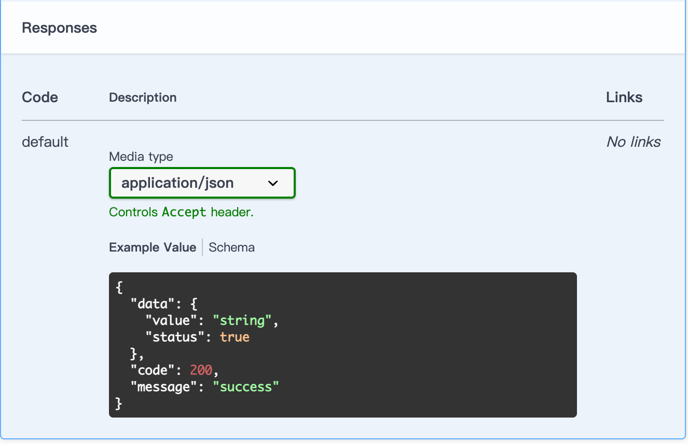
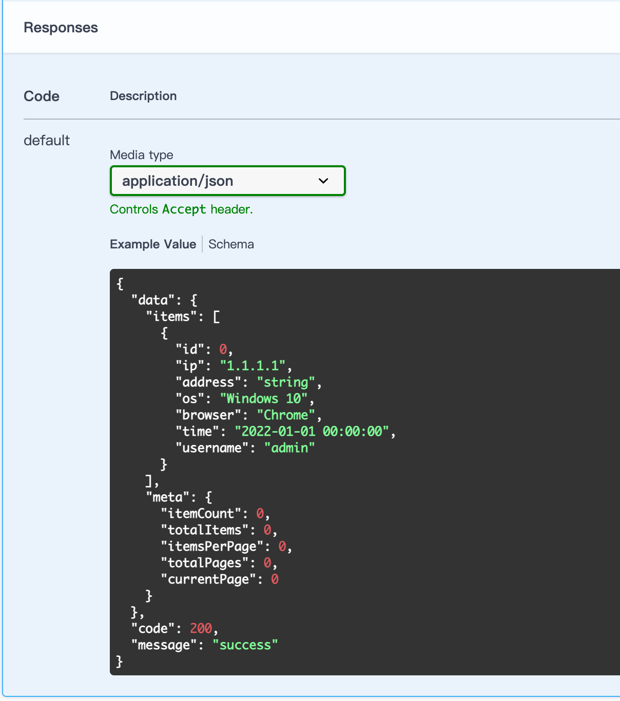
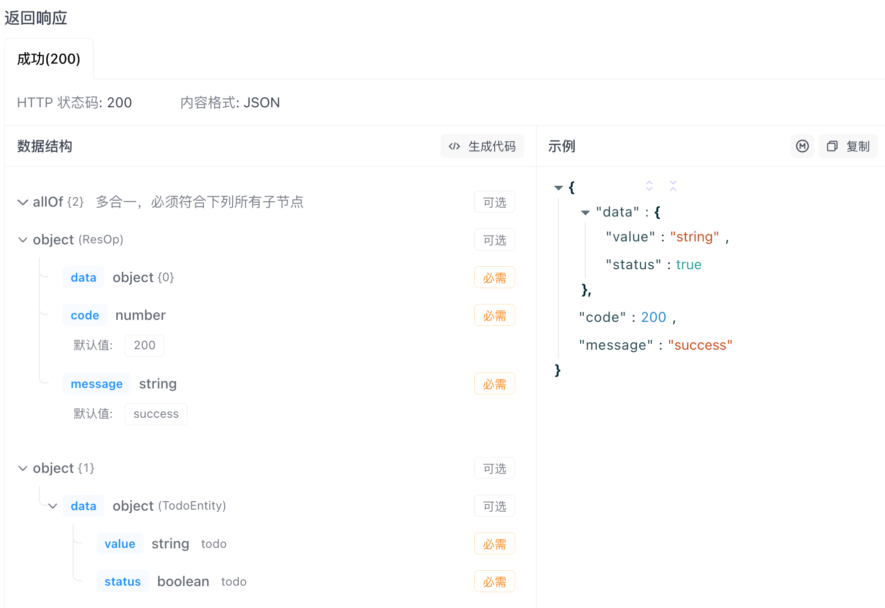

<!-- truncate -->

## 基本使用

通常情况下，在 nest.js 的 swagger 页面文档中的响应数据文档默认如下


此时要为这个控制器添加响应数据文档的话，只需要先声明 数据的类型，然后通过@ApiResponse 装饰器添加到该控制器上即可，举例说明

```typescript title="todo.entity.ts"
@Entity('todo')
export class TodoEntity {
  @Column()
  @ApiProperty({ description: 'todo' })
  value: string

  @ApiProperty({ description: 'todo' })
  @Column({ default: false })
  status: boolean
}
```

```typescript title="todo.controller.ts"
  @Get()
  @ApiOperation({ summary: '获取Todo详情' })
  @ApiResponse({ type: [TodoEntity] })
  async list(): Promise<TodoEntity[]> {
    return this.todoService.list();
  }


  @Get(':id')
  @ApiOperation({ summary: '获取Todo详情' })
  @ApiResponse({ type: TodoEntity })
  async info(@IdParam() id: number): Promise<TodoEntity> {
    return this.todoService.detail(id);
  }
```

此时对应的文档数据如下显示


如果你想要自定义返回的数据，而不是用 entity 对象的话，可以按照如下定义

```typescript title="todo.model.ts"
export class Todo {
  @ApiProperty({ description: 'todo' })
  value: string

  @ApiProperty({ description: 'todo' })
  status: boolean
}
```

然后将 `@ApiResponse({ type: TodoEntity })` 中的 `TodoEntity` 替换 `Todo` 即可。

## 自定义返回数据

然而通常情况下，都会对返回数据进行一层包装，如

```json
{
  "data": [
    {
      "name": "string"
    }
  ],
  "code": 200,
  "message": "success"
}
```

其中 data 数据就是原始数据。要实现这种数据结构字段，首先定义一个自定义类用于包装，如

```typescript title="res.model.ts"
export class ResOp<T = any> {
  @ApiProperty({ type: 'object' })
  data?: T

  @ApiProperty({ type: 'number', default: 200 })
  code: number

  @ApiProperty({ type: 'string', default: 'success' })
  message: string

  constructor(code: number, data: T, message = 'success') {
    this.code = code
    this.data = data
    this.message = message
  }
}
```

接着在定义一个拦截器，将 data 数据用 ResOp 包装，如下拦截器代码如下

```typescript title="transform.interceptor.ts"
export class TransformInterceptor implements NestInterceptor {
  constructor(private readonly reflector: Reflector) {}

  intercept(
    context: ExecutionContext,
    next: CallHandler<any>,
  ): Observable<any> {
    return next.handle().pipe(
      map(data => {
        const response = context.switchToHttp().getResponse<FastifyReply>()
        response.header('Content-Type', 'application/json; charset=utf-8')
        return new ResOp(HttpStatus.OK, data ?? null)
      }),
    )
  }
}
```

此时返回的数据都会转换为 `{ "data": { }, "code": 200, "message": "success" }` 的形式，这部分不为就本文重点，就不赘述了。

回到 Swagger 文档中，只需将 `@ApiResponse({ type: TodoEntity })` 改写成 `@ApiResponse({ type: ResOp<TodoEntity> })`，就可以实现下图需求。



## 自定义 Api 装饰器

然而对于庞大的业务而言，使用 `@ApiResponse({ type: ResOp<TodoEntity> })`的写法，肯定不如 `@ApiResponse({ type: TodoEntity })`来的高效，有没有什么办法能够用后者的写法，却能达到前者的效果，答案是肯定有的。

这里需要先自定义一个装饰器，命名为 `ApiResult`，完整代码如下

```typescript title="api-result.decorator.ts"
import { Type, applyDecorators, HttpStatus } from '@nestjs/common'
import { ApiExtraModels, ApiResponse, getSchemaPath } from '@nestjs/swagger'

import { ResOp } from '@/common/model/response.model'

const baseTypeNames = ['String', 'Number', 'Boolean']

/**
 * @description: 生成返回结果装饰器
 */
export const ApiResult = <TModel extends Type<any>>({
  type,
  isPage,
  status,
}: {
  type?: TModel | TModel[]
  isPage?: boolean
  status?: HttpStatus
}) => {
  let prop = null

  if (Array.isArray(type)) {
    if (isPage) {
      prop = {
        type: 'object',
        properties: {
          items: {
            type: 'array',
            items: { $ref: getSchemaPath(type[0]) },
          },
          meta: {
            type: 'object',
            properties: {
              itemCount: { type: 'number', default: 0 },
              totalItems: { type: 'number', default: 0 },
              itemsPerPage: { type: 'number', default: 0 },
              totalPages: { type: 'number', default: 0 },
              currentPage: { type: 'number', default: 0 },
            },
          },
        },
      }
    } else {
      prop = {
        type: 'array',
        items: { $ref: getSchemaPath(type[0]) },
      }
    }
  } else if (type) {
    if (type && baseTypeNames.includes(type.name)) {
      prop = { type: type.name.toLocaleLowerCase() }
    } else {
      prop = { $ref: getSchemaPath(type) }
    }
  } else {
    prop = { type: 'null', default: null }
  }

  const model = Array.isArray(type) ? type[0] : type

  return applyDecorators(
    ApiExtraModels(model),
    ApiResponse({
      status,
      schema: {
        allOf: [
          { $ref: getSchemaPath(ResOp) },
          {
            properties: {
              data: prop,
            },
          },
        ],
      },
    }),
  )
}
```

其核心代码就是在 `@ApiResponse` 上进行扩展，这一部分代码在官方文档: [advanced-generic-apiresponse](https://docs.nestjs.com/openapi/operations#advanced-generic-apiresponse) 中提供相关示例，这里我简单说明下：

`{ $ref: getSchemaPath(ResOp) }` 表示原始数据，要被“塞”到那个类下，而第二个参数 `properties: { data: prop }` 则表示 `ResOp` 的 `data` 属性要如何替换，替换的部分则由 `prop` 变量决定，只需要根据实际需求构造相应的字段结构。

由于有些 类 没有被任何控制器直接引用， SwaggerModule 目前还无法生成相应的模型定义，所以需要 @ApiExtraModels(model) 将其额外导入。

此时只需要将 `@ApiResponse({ type: TodoEntity })` 改写为 `@ApiResult({ type: TodoEntity })`，就可达到最终目的。

不过我还对其进行扩展，使其能够返回分页数据格式，具体根据实际数据而定，演示效果如下图：



## 导入第三方接口管理工具

通过上述的操作后，此时记下项目的 swagger-ui 地址，例如 [http://127.0.0.1:5001/api-docs](http://127.0.0.1:5001/api-docs), 此时再后面添加`-json`，即 [http://127.0.0.1:5001/api-docs-json ](http://127.0.0.1:5001/api-docs-json) 所得到的数据便可导入到第三方的接口管理工具，就能够很好的第三方的接口协同，接口测试等功能。




