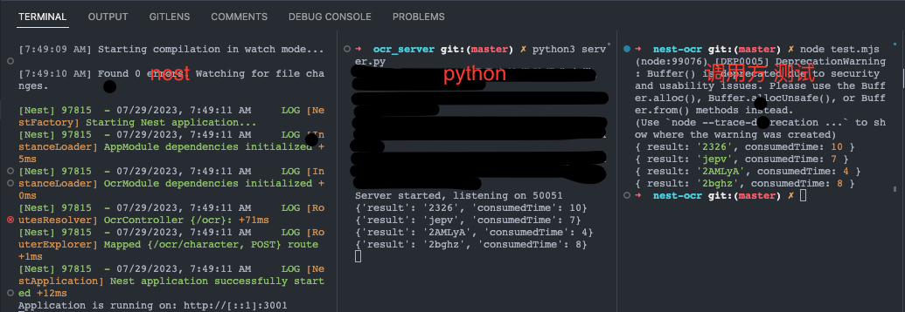
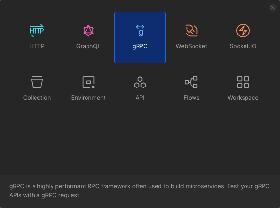
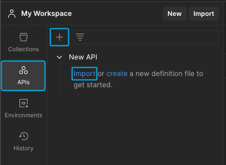
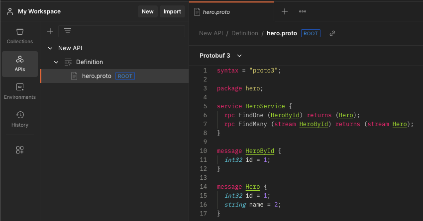
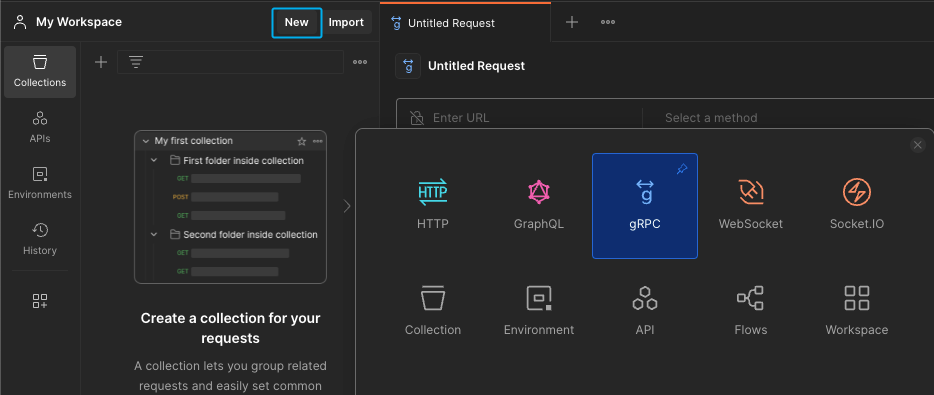
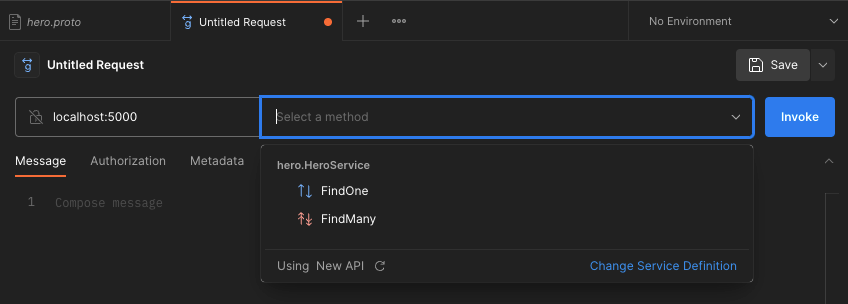
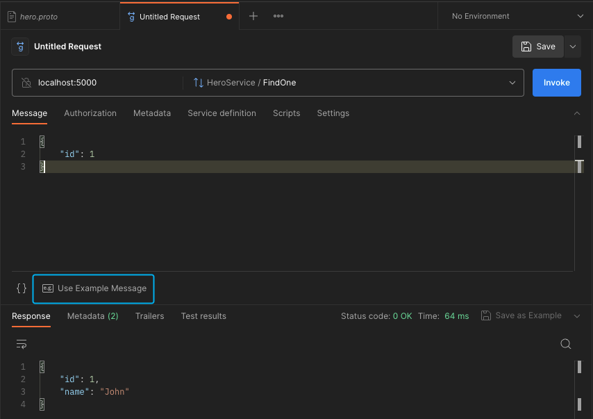
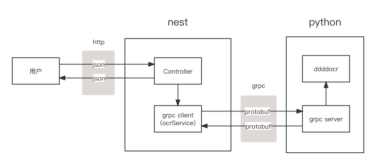
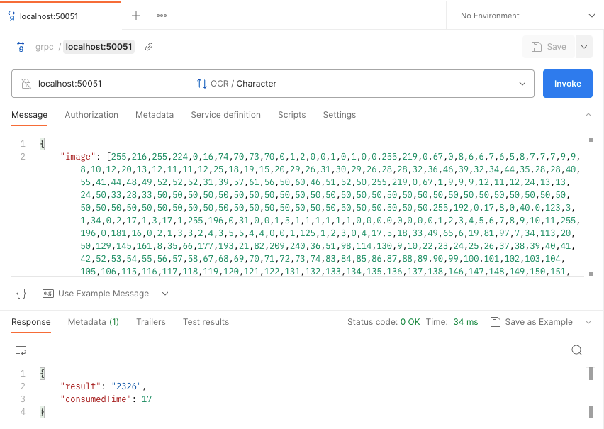
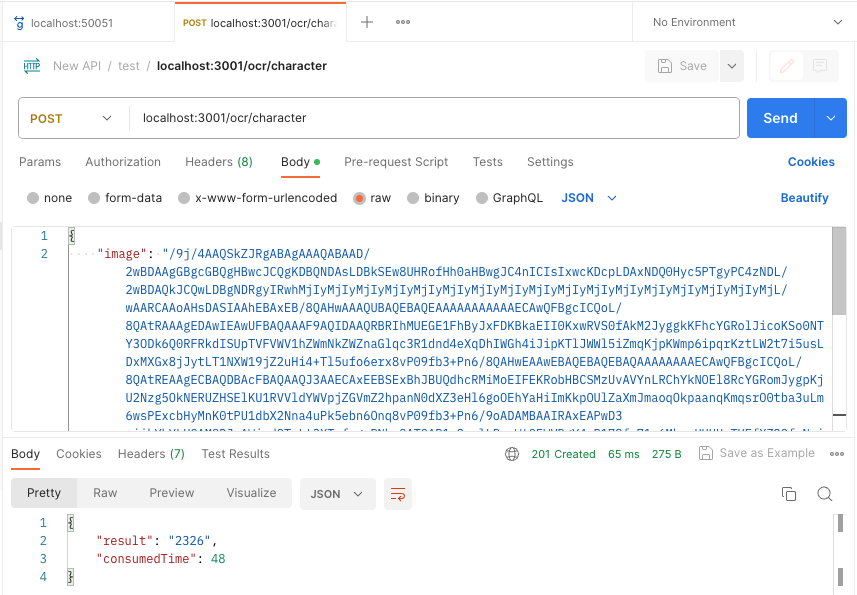

我曾经写过一个项目 [ddddocr_server](https://github.com/ydaydayup/ddddocr_server)，使用 fastapi 提供 http 接口，以此来调用 [ddddocr](https://github.com/sml2h3/ddddocr) 库。

其他语言想要调用的话，则是通过 http 协议的方式来调用。然而 http 协议的开销不小，而 Websocket 调用又不灵活，此时针对这种应用场景的最佳选择就是 rpc（Remote Procedure Call 远程过程调用），而这次所要用的技术便是 grpc。

早闻 [gRPC](https://grpc.io/) 大名，所以这次将使用 nest 通过 grpc 的方式来调用 python 的 ddddocr 库来识别验证码。

<!-- truncate -->

## 效果图



本文源码 [nest-ocr](https://github.com/ydaydayup/nest-ocr)

## 简单熟悉下 grpc

由于我们的调用方是 nest，因此就很有必要熟悉一下 nest 要如何创建

官方提供了一个 [样例](https://github.com/nestjs/nest/tree/master/sample/04-grpc)，本文便在此基础上进行更改。

首先，在 nest 中 grpc 是以微服务的方式启动的，从代码上也就 3 行便可实现。

```jsx
const app = await NestFactory.create(AppModule)

app.connectMicroservice <
  MicroserviceOptions >
  {
    transport: Transport.GRPC,
    options: {
      package: 'hero',
      protoPath: join(__dirname, './hero/hero.proto'),
    },
  }

await app.startAllMicroservices()
```

既然服务有了，那么要如何调用呢？或者说有没有像 http 接口调试工具能够调用 grpc 服务，有很多种 grpc 客户端工具，但这里选择 Postman。



### 创建 API

不过这里先别急着调用，为了后续调试，建议先到工作区的 APIs 中添加一个 API，然后将样例中的 hero.proto 中导入进来



导入完毕后将显示如下页面



### 创建 gRPC 客户端

点击工作区旁边的 New 按钮（不是 + 按钮），选择 gRPC



在 Enter URL 输入框填写 [localhost:5000](http://localhost:5000) (nest grpc 默认地址)，这里你也可以选择第一个官方的 gRPC 测试服务，用于看看效果。


填写完毕后，你会发现在右侧 Select a method 中并没有看到所定义的两个方法：FindOne，FindMang，这时候我们需要将 hero.proto 文件导入进来，如果你完成了 创建 API 那一步骤，你在右侧便能看到那两个方法



此时不妨选择一下 FindOne，然后点击下方 Use Example Message，将 id 填为 1，点击 Invoke，得到的效果图如下。



到这里我们就已经搞定了如何调用 grpc 服务，接下来就要自己去实现标题的需求。

## Protobuf 消息编码

**在 grpc 中，数据传输部分通过 Protobuf（Protocol Buffers）定义**

因为从上面服务调用来看，貌似与 http 协议调用不相上下。

其实不然，protobuf 不同于 JSON、XML 数据，是以二进制数据流传输，数据在经 protobuf 序列化后的消息体积很小（传输内容少，传输相对就快）。同时在加上 HTTP/2 协议的加持（底层传输协议，可替换为其他协议），使得 gRPC 的传输性能要优于传统 Restful。

protobuf 对于数据传输的优点有很多，如 \***\*支持流式传输，不过这就不是本文所述的内容了。总之你只要知道 grpc 性能高的原因就是因为 protobuf。\*\***

首先来看 `hero.proto` 这个文件的内容

```protobuf
syntax = "proto3";

package hero;

service HeroService {
  rpc FindOne (HeroById) returns (Hero);
  rpc FindMany (stream HeroById) returns (stream Hero);
}

message HeroById {
  int32 id = 1;
}

message Hero {
  int32 id = 1;
  string name = 2;
}
```

不难看出，package 定义包名，service 定义服务，而 message 则是定义数据传输的类型。

客户端与服务端将根据 protobuf 来生成双方交互方式，其中包名决定了双方传输的作用域，service 下的函数就是双方之间的预先定义好要以什么样的数据发送，又以什么样的数据返回。

我个人是觉得没什么特别重点的部分，根据自己的需求然后修改基本数据结构便可。

## 实践

首先，要**明确谁是客户端，谁是服务端。**

从 标题 上来看，不难看出是 js(client) ⇒ python(server)，也就是 nest 调用 ddddocr 这个库，那么 nest 就应该作为客户端，而 python 作为服务端。

先将整个流程先捋一遍，如图下图示意。



用户想要调用 ddddocr 库，最理想的肯定是让用户直接和 python 打交道，但应用（这里指 Web）通常不会使用 python 进行编写，而其他语言(js)想要跨语言调用，这时 rpc 就再适合不过了。

可能会有人说这么操作多此一举，我只能说根据性能和业务为主。相比将 nest 后端服务迁移到 python 上，和在 nest 与 python 之间多层 grpc，在两者的工作量之下我肯定毫不疑问的选择后者。

### protobuf 定义

```protobuf
syntax = "proto3";

package ocr;

service OCR {
  rpc Character (CharacterBody) returns (CharacterReply) {}

  // TODO: Add other type, e.g. select, slide, etc.
}

message CharacterBody {
  bytes image = 1;
}

message CharacterReply {
  string result = 1;
  int32 consumedTime = 2;
}
```

这部分没什么特别好说的，就图片数据以字节数组的方式传递。

### nest 部分

由于 nest 作为客户端，事实上示例部分的很多代码都无关了，就比如 main.ts 中用于启动 gRPC 服务的代码，都可以注释掉，因为在这里我们并不打算将 nest 作为服务端。

```typescript
// app.connectMicroservice<MicroserviceOptions>(grpcClientOptions);
// await app.startAllMicroservices();
```

最核心的代码，就是定义 client, 如下

```typescript
@Client({
  transport: Transport.GRPC,
  options: {
    package: ['ocr'],
    protoPath: join(__dirname, './ocr.proto'),
    url: 'localhost:50051', // 这里所定义的是 grpc 服务端地址
  },
})
client: ClientGrpc
```

> 这一部分也可以通过构造函数的方式注入，因人而异。 `constructor(@**Inject**('OCR_PACKAGE') private readonly client: ClientGrpc) {}`

有了这个 client 就能够获取 ocrService 了，完整 ocr.controller.ts 代码如下

```typescript
import { Body, Controller, OnModuleInit, Post } from '@nestjs/common'
import { Client, ClientGrpc } from '@nestjs/microservices'
import { Observable } from 'rxjs'
import { Character } from './interfaces/character.interface'
import { Reply } from './interfaces/reply.interface'
import { grpcClientOptions } from 'src/grpc-client.options'
import { CharacterDto } from './dtos/character.dto'

interface OCRService {
  Character(image: Character): Observable<Reply>

  // TODO: Add other type, e.g. select, slide, etc.
}

@Controller('ocr')
export class OcrController implements OnModuleInit {
  private ocrService: OCRService

  @Client(grpcClientOptions)
  client: ClientGrpc

  onModuleInit() {
    this.ocrService = this.client.getService('OCR')
  }

  @Post('character')
  character(@Body() dto: CharacterDto): Observable<Reply> {
    // 这里多一步 Base64 将文本解码成图片的操作
    // 主要是根据接口易用性而定，最佳的做法肯定是类似上传文件，直接得到图片二进制数据，省去数据操作步骤
    const buffer = Buffer.from(dto.image, 'base64')

    return this.ocrService.Character({ image: buffer })
  }

  // TODO: Add other type, e.g. select, slide, etc.
}
```

而在之前 http 的方式实现的话，这里 `this.ocrService.Character({ image: dto.image });` 所对应的就是例如 `fetch(’http://localhost:3002/ocr/character’)` ，这里 3002 端口对应的是 python 的 http 服务。

### python 部分

服务端部分其实还稍微有些复杂，可能是因为我太久没写 python 的缘故。

在之前是通过 python 来启动一个 http 服务来供其他语言调用，现在有了 gRPC 就完全没必要启动 http 服务。

可以在 **[这里](https://grpc.io/docs/languages/python/quickstart/#download-the-example) 下载官方的 python 示例。**

先安装 grpc_tools

```bash
python3 -m pip install grpcio-tools
```

接着执行下方指令

```bash
python3 -m grpc_tools.protoc -I . --python_out=. --grpc_python_out=. ocr.proto
```

它将会在下方根据 ocr.proto 生成 ocr_pb2.py 与 ocr_pb2_grpc.py 两个文件，事实上这两个文件都无需改动，你只需要每次修改 .proto 文件后再重新执行上方代码将新的内容复写到文件上便可。

不过要搞清流程，还要是在意这些文件便可。其中在 ocr_pb2_grpc.py \*\*\*\*文件中，你会找到 OCRServicer 类的接口定义。

```python
class OCRServicer(object):
    """Missing associated documentation comment in .proto file."""

    def Character(self, request, context):
        """Missing associated documentation comment in .proto file."""
        context.set_code(grpc.StatusCode.UNIMPLEMENTED)
        context.set_details('Method not implemented!')
        raise NotImplementedError('Method not implemented!')
```

很显然这是一个接口类，因此我们需要实现它。

而 ocr_pb2.py 内容就不必细看，但后续也需要用到，主要通过 `ocr_pb2.CharacterReply` 将数据封装返回给客户端。

最终完整的 [server.py](http://server.py) 内容如下

```python
from concurrent import futures
import time

import grpc
import ocr_pb2
import ocr_pb2_grpc

import ddddocr

ocr = ddddocr.DdddOcr(beta=True)

class OCRServicer(ocr_pb2_grpc.OCRServicer):

    # 这里实现 英数验证码 识别
    def Character(self, request, context):

        t = time.perf_counter()

        result = ocr.classification(request.image)
        consumed_time = int((time.perf_counter() - t)*1000)

        print({'result': result, 'consumedTime': consumed_time})

        # 根据 ocr.proto 的 message CharacterReply 生成的类
        response = ocr_pb2.CharacterReply(
            result=result, consumedTime=consumed_time)
        return response

def serve():
    port = '50051'
    server = grpc.server(futures.ThreadPoolExecutor(max_workers=10))
    ocr_pb2_grpc.add_OCRServicer_to_server(OCRServicer(), server)
    server.add_insecure_port('[::]:' + port)
    server.start()
    print("Server started, listening on " + port)
    server.wait_for_termination()

if __name__ == '__main__':
    serve()
```

此时整个代码的核心流程就已经搞通了，你可以到 [nest-ocr](https://github.com/ydaydayup/nest-ocr) 查看源码，先看看用 postman grpc 方式调用，这里 image 为 字节数组（图片的二进制数据）



用户以 http 方式访问的效果。



## 结语

时间因素，因此本文最终代码都仅实现 **英数字符识别**，ddddocr 还支持点选、滑块，如有时间再补充相关代码。

从 http 方式转到 gRPC 无非就是围绕 protobuf 展开，预先定义好 protobuf，然后在此基础上去编写 grpc 客户端(调用方)与服务端(提供方) 的代码。虽然引入了一丝复杂性，但可以有效提高性能。

有时候，为了优化性能，又不想增加硬件开销，我们不得不在代码层面做出一些改进，更换高性能框架便是其中之一。然而事实上，提高性能最快捷的方式就是升级硬件。并发数不足，增加服务器数量是最直接有效的办法。

为了偏薄的性能提升，开发者总能想出诸多的解决方案。
