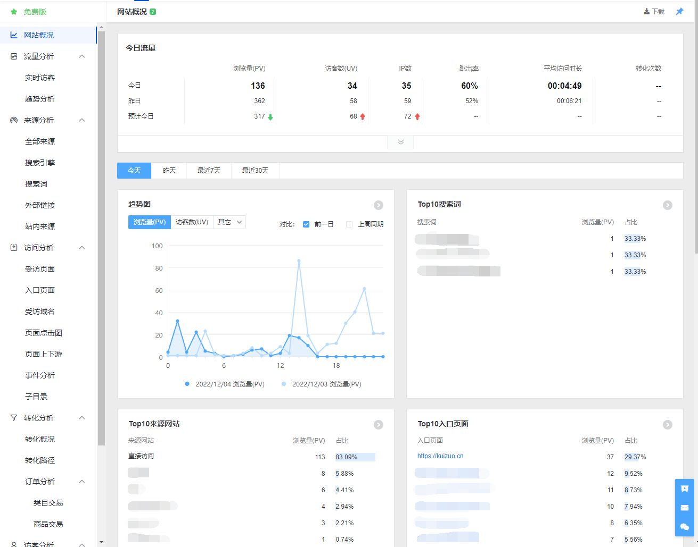
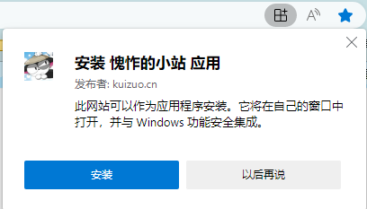

在 `docusaurus.config.js` 下的 plugins，可以看到所有插件以及插件配置。

```json title='docusaurus.config.js'
plugins: [
    'docusaurus-plugin-image-zoom',
    'docusaurus-plugin-sass',
    path.resolve(__dirname, './src/plugin/plugin-baidu-tongji'),
    path.resolve(__dirname, './src/plugin/plugin-baidu-push'),
    [
      path.resolve(__dirname, './src/plugin/plugin-content-blog'), {
        path: 'blog',
        routeBasePath: '/',
        editUrl: ({ locale, blogDirPath, blogPath, permalink }) =>
          `https://github.com/ydaydayup/myblog/edit/main/${blogDirPath}/${blogPath}`,
        editLocalizedFiles: false,
        blogSidebarCount: 10,
        postsPerPage: 10,
        showReadingTime: true,
        readingTime: ({ content, frontMatter, defaultReadingTime }) =>
          defaultReadingTime({ content, options: { wordsPerMinute: 300 } }),
        feedOptions: {
          type: 'all',
          title: 'Ray',
          copyright: `Copyright © ${new Date().getFullYear()} Ray Built with Docusaurus.<p><a href="http://beian.miit.gov.cn/" class="footer_lin">${beian}</a></p>`,
        },
      }
    ],
    // ...
]
```

这里我会列举我所用到的插件（包括自定义），更多插件可看[社区精选 | Docusaurus](https://docusaurus.io/zh-CN/community/resources#community-plugins)

## plugin-baidu-tongji

[百度统计](https://tongji.baidu.com/web/welcome/login)

这样你就能看到你的站点访客主要都在看哪些页面，以及行为记录，如下图所示。

## plugin-baidu-push

[百度收录](https://ziyuan.baidu.com/dailysubmit/index)

主动推送代码，用于网站收录，这部分代码无需变动。

```javascript
;(function () {
  var bp = document.createElement('script')
  var curProtocol = window.location.protocol.split(':')[0]
  if (curProtocol === 'https') {
    bp.src = 'https://zz.bdstatic.com/linksubmit/push.js'
  } else {
    bp.src = 'http://push.zhanzhang.baidu.com/push.js'
  }
  bp.defer = true
  var s = document.getElementsByTagName('script')[0]
  s.parentNode.insertBefore(bp, s)
})()
```

## plugin-matomo

[Matomo Analytics](https://matomo.org/) 站点统计，分析用户行为，停留时间。

与百度统计类似，不过这个需要自行部署 matomo 服务，不需要的可直接删除。

## [plugin-pwa](https://docusaurus.io/zh-CN/docs/api/plugins/@docusaurus/plugin-pwa)

创建支持离线模式和应用安装的 PWA 文档站点，就像下图这样。



## [plugin-image-zoom](https://github.com/flexanalytics/plugin-image-zoom)

适用于 Docusaurus 的图像缩放插件。

## plugin-sass

支持 sass 预处理器

## plugin-content-blog

由于官方的 [plugin-content-blog](https://docusaurus.io/zh-CN/docs/api/plugins/@docusaurus/plugin-content-blog) 插件没有将博客的所有**标签**数据传递给博客列表组件，也就是导致博客列表页面 `BlogListPage` 获取不到全局标签信息，所以这里对 `plugin-content-blog` 进行魔改，将 blog 信息添加至全局数据中，可在任意页面中都访问到所有博文的信息。

::: caution

这些数据可能会占据比较大的空间，不过这点影响并不是什么特别大的问题。

:::
