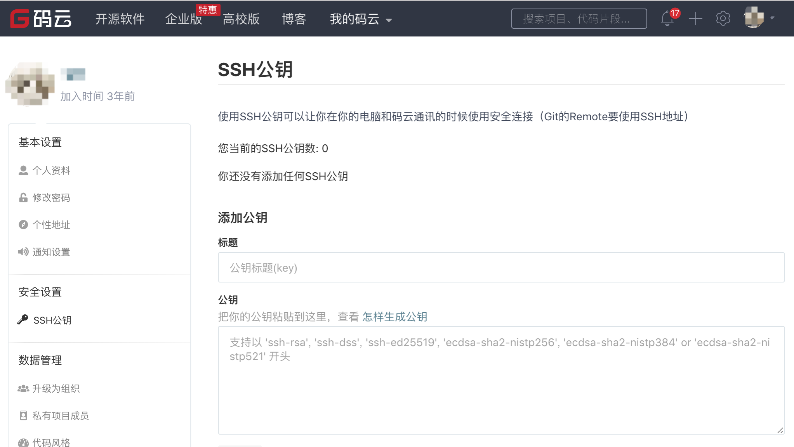
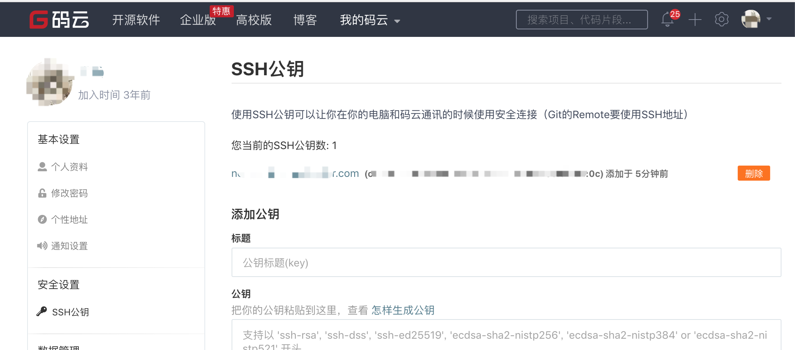
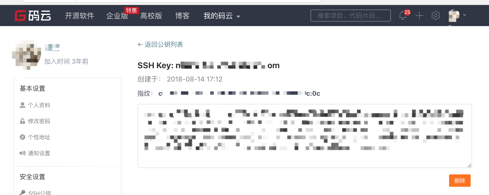

Gitee 提供了基于 SSH 协议的 Git 服务，在使用 SSH 协议访问仓库仓库之前，需要先配置好账户 SSH 公钥。

> 仓库公钥（部署公钥）请移步 [添加部署公钥](https://help.gitee.com/repository/ssh-key/generate-and-add-ssh-public-key)

## 生成 SSH 公钥[​](https://help.gitee.com/base/account/SSH%E5%85%AC%E9%92%A5%E8%AE%BE%E7%BD%AE#%E7%94%9F%E6%88%90-ssh-%E5%85%AC%E9%92%A5 "标题的直接链接")

> Windows 用户建议使用 **Windows PowerShell** 或者 **Git Bash**，在 **命令提示符** 下无 `cat` 和 `ls` 命令。

1、通过命令 `ssh-keygen` 生成 SSH Key：

```
ssh-keygen -t ed25519 -C "Gitee SSH Key"
```

- `-t` key 类型
- `-C` 注释

输出，如：

```
Generating public/private ed25519 key pair.Enter file in which to save the key (/home/git/.ssh/id_ed25519):Enter passphrase (empty for no passphrase):Enter same passphrase again:Your identification has been saved in /home/git/.ssh/id_ed25519Your public key has been saved in /home/git/.ssh/id_ed25519.pubThe key fingerprint is:SHA256:ohDd0OK5WG2dx4gST/j35HjvlJlGHvihyY+Msl6IC8I Gitee SSH KeyThe key's randomart image is:+--[ED25519 256]--+|    .o           ||   .+oo          ||  ...O.o +       ||   .= * = +.     ||  .o +..S*. +    ||. ...o o..+* *   ||.E. o . ..+.O    || . . ... o =.    ||    ..oo. o.o    |+----[SHA256]-----+
```

- 中间通过三次**回车键**确定

2、查看生成的 SSH 公钥和私钥：

```
ls ~/.ssh/
```

输出：

```
id_ed25519  id_ed25519.pub
```

- 私钥文件 `id_ed25519`
- 公钥文件 `id_ed25519.pub`

3、读取公钥文件 `~/.ssh/id_ed25519.pub`：

```
cat ~/.ssh/id_ed25519.pub
```

输出，如：

```
ssh-ed25519 AAAA***5B Gitee SSH Key
```

复制终端输出的公钥。

## 设置账户 SSH 公钥[​](https://help.gitee.com/base/account/SSH%E5%85%AC%E9%92%A5%E8%AE%BE%E7%BD%AE#%E8%AE%BE%E7%BD%AE%E8%B4%A6%E6%88%B7-ssh-%E5%85%AC%E9%92%A5 "标题的直接链接")

用户可以通过主页右上角 **「个人设置」->「安全设置」->「SSH 公钥」->「[添加公钥](https://gitee.com/profile/sshkeys)」** ，添加生成的 public key 添加到当前账户中。

> 需要注意： **添加公钥需要验证用户密码**



通过 `ssh -T` 测试，输出 SSH Key 绑定的**用户名**：

```
$ ssh -T git@gitee.comHi USERNAME! You've successfully authenticated, but GITEE.COM does not provide shell access.
```

在添加完公钥后，用户可以在 **「个人设置」->「安全设置」->「[SSH 公钥](https://gitee.com/profile/sshkeys)」** 浏览查看当前账户已经添加的 SSH 公钥，并对公钥进行管理/删除操作。





## 仓库的 SSH Key 和账户 SSH Key 的区别？[​](https://help.gitee.com/base/account/SSH%E5%85%AC%E9%92%A5%E8%AE%BE%E7%BD%AE#%E4%BB%93%E5%BA%93%E7%9A%84-ssh-key-%E5%92%8C%E8%B4%A6%E6%88%B7-ssh-key-%E7%9A%84%E5%8C%BA%E5%88%AB "标题的直接链接")

账户的 SSH Key 和账户绑定，当账户具有 **推送/拉取** 权限时可通过 SSH 方式 **推送/拉取** 的仓库。

通过 `ssh -T` 测试时，输出 SSH Key 绑定的用户名：

```
$ ssh -T git@gitee.comHi USERNAME! You've successfully authenticated, but GITEE.COM does not provide shell access.
```

仓库的 SSH key 只针对仓库，且我们仅对仓库提供了部署公钥，即仓库下的公钥仅能**拉取**仓库，这通常用于生产服务器拉取仓库的代码。

通过 `ssh -T` 测试时，输出 Anonymous：

```
ssh -T git@gitee.comHi Anonymous! You've successfully authenticated, but GITEE.COM does not provide shell access.
```