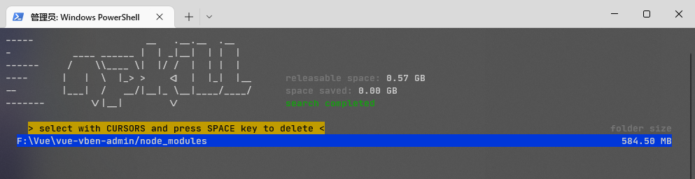
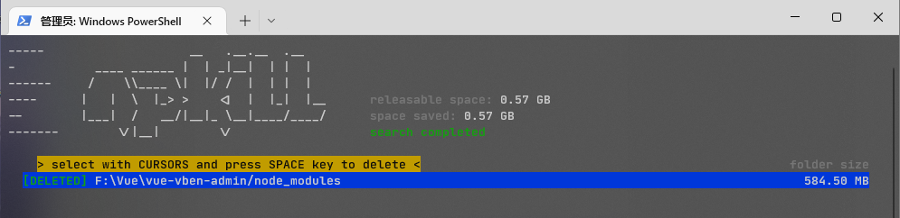
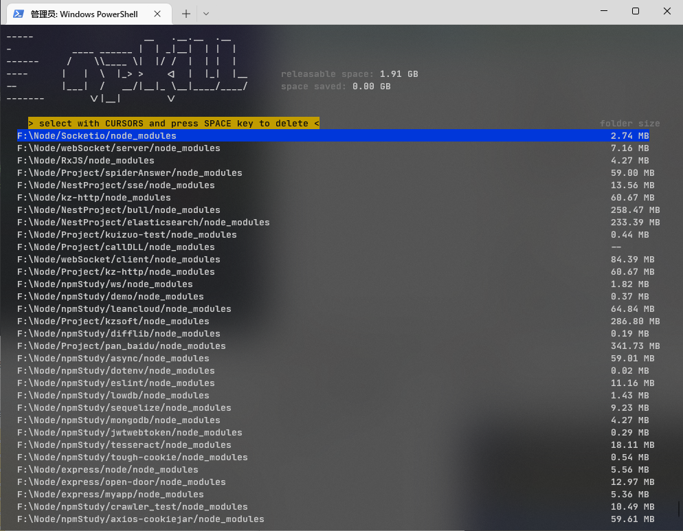

官网地址 [npkill](https://npkill.js.org/)

### 安装

```
npm i -g npkill
```

无需安装也可通过`npx npkill`来运行

### 使用

在指定目录下，输入`npkill`，如下结果



提示该目录共存在一个 node_modules，占用空间为 584.50 MB，如果有多个 node_modules，可以通过上下键来选择。按下 SPACE（空格键）后，便会删除该 node_modules。删除结果如下



该库最强大的一点是可以直接遍历你指定目录下所有的 node_modules，其效果如下。



更多详细配置见官方文档。
