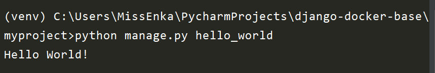
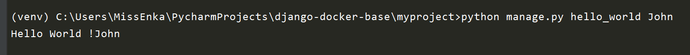
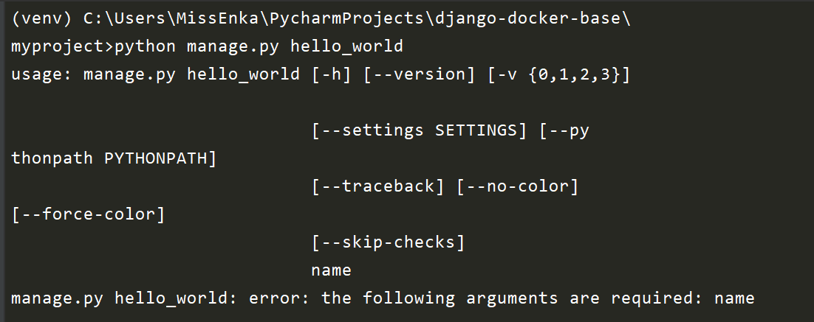
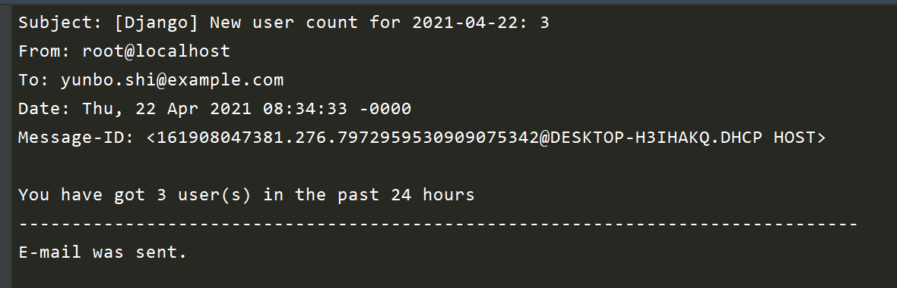

# 自定义Django-admin管理命令


## 目录


1. TOC
{:toc}

---
每次在启动Django服务之前，我们都会在终端运行`python manage.py xxx`的管理命令。其实我们还可以自定义管理命令，这对于执行独立的脚本或任务非常有用，比如清除缓存、导出用户邮件清单或发送邮件等等。


自定义的管理命令不仅可以通过`manage.py`运行，还可以通过Linux或Celery的crontab服务将其设成定时任务。本文主要讲解如何自定义Django-admin命令，并提供一些演示案例。

自定义Django-admin命令一共分三步：创建文件夹布局、编写命令代码和测试使用。

## 创建文件夹布局
自定义的Django-admin管理命令本质上是一个python脚本文件，它的存放路径必须遵循一定的规范，一般位于`app/management/commands`目录。整个文件夹的布局如下所示：

```bash
app01/
    __init__.py
    models.py
    management/
        __init__.py
        commands/
            __init__.py
            _private.py # 以下划线开头文件不能用作管理命令
            my_commands.py # 这个就是自定义的管理命令脚本，文件名即为命令名
    tests.py
    views.py
```

**注意**：

- `management`和`commands`每个目录下都必须有个`__init__.py`空文件，表明这是一个python包。另外以下划线开头的文件名不能用作管理命令脚本。
- `management/commands`目录可以位于任何一个app的目录下，Django都能找到它。
- 一般建议每个python脚本文件对应一条管理命令。

## 编写命令代码

每一个自定义的管理命令本质是一个`Command`类, 它继承了Django的`Basecommand`或其子类, 主要通过重写`handle()`方法实现自己的业务逻辑代码，而`add_arguments()`则用于帮助处理命令行的参数，如果运行命令时不需要额外参数，可以不写这个方法。

```python
from django.core.management.base import BaseCommand

class Command(BaseCommand):
    # 帮助文本, 一般备注命令的用途及如何使用。
    help = 'Some help texts'

    # 处理命令行参数，可选
    def add_arguments(self, parser):
       pass

    # 核心业务逻辑
    def handle(self, *args, **options):
        pass

```

我们现在来看一个最简单的例子，希望定义一个名为`hello_world`的命令。这样当我们运行`python manage.py hello_world`命令时，控制台会打印出`Hello World!`字样。在`app/management/commands`目录下新建`hello_world.py`, 添加如下代码：

    from django.core.management.base import BaseCommand
    
    class Command(BaseCommand):
        # 帮助文本, 一般备注命令的用途及如何使用。
        help = "Print Hello World!"
    
        # 核心业务逻辑
        def handle(self, *args, **options):
            self.stdout.write('Hello World!')
**注意**：当你使用管理命令并希望在控制台输出指定信息时，你应该使用`self.stdout`和`self.stderr`方法，而不能直接使用python的`print`方法。另外，你不需要在消息的末尾加上换行符，它将被自动添加。

此时当你进入项目文件夹运行`python manage.py hello_world`命令时，你将得到如下输出结果：



现在我们来增加点难度，来通过命令行给`hello_world`命令传递参数，以实现运行`python manage.py helloworld John`命令时 打印出`Hello World! John`。

现在修改我们的`hello_world.py`, 添加`add_arguments`方法，该方法的作用是给自定义的handle方法添加1个或多个参数。

    from django.core.management.base import BaseCommand
    
    class Command(BaseCommand):
        # 帮助文本, 一般备注命令的用途及如何使用。
        help = "Print Hello World!"
    
        # 给命令添加一个名为name的参数
        def add_arguments(self, parser):
            parser.add_argument('name')
    
        # 核心业务逻辑，通过options字典接收name参数值，拼接字符串后输出
        def handle(self, *args, **options):
            msg = 'Hello World ! '+ options['name']
            self.stdout.write(msg)
此时当你再次运行`python manage.py hello_world John`命令时，你将得到如下输出结果：



如果你直接运行命令而不携带参数，将会报错，如下所示：



## 实际应用场景

前面的案例过于简单，我们现在来看两个自定义管理命令的实际应用案例。

### 案例1： 检查数据库连接是否已就绪

无论你使用常规方式还是Docker在生产环境中部署Django项目，你需要确保数据库连接已就绪后才进行数据库迁移(migrate)的命令(Docker-compose的depends选项并不能确保这点)，否则Django应用程序会出现报错。

这时你可以自定义一个`wait_for_db`的命令，如下所示：

```python
# app/management/commands/wait_for_db.py

import time
from django.db import connections
from django.db.utils import OperationalError
from django.core.management import BaseCommand


class Command(BaseCommand):
    help = 'Run data migrations until db is available.'

    def handle(self, *args, **options):
        self.stdout.write('Waiting for database...')
        db_conn = None
        while not db_conn:
            try:
                # 尝试连接
                db_conn = connections['default']
            except OperationalError:
                # 连接失败，就等待1秒钟
                self.stdout.write('Database unavailable, waiting 1 second...')
                time.sleep(1)

        self.stdout.write(self.style.SUCCESS('Database available!'))
```

定义好这个命令后每次在运行`python manage.py migrate `命令前先运行`python manage.py wait_for_db`即可。

### 案例2：周期性发送邮件
如果你是网站管理员，你肯定希望知道每天有多少新用户已注册，这时你可以自定义一条`mail_admin`的管理命令，将每天新注册用户数量以邮件形式发给自己，如下所示：

```python
# app/management/commands/mail_admin.py

#-*- coding:utf-8 -*-
from datetime import timedelta, time, datetime
from django.core.mail import mail_admins
from django.core.management import BaseCommand
from django.utils import timezone
from django.contrib.auth import get_user_model

User = get_user_model()

today = timezone.now()
yesterday = today - timedelta(1)


class Command(BaseCommand):
    help = "Send The Daily Count of New Users to Admins"

    def handle(self, *args, **options):
        # 获取过去一天注册用户数量
        user_count =User.objects.filter(date_joined__range=(yesterday, today)).count()
        
        # 当注册用户数量多余1个，才发送邮件给管理员
        if user_count >= 1:
            message = "You have got {} user(s) in the past 24 hours".format(user_count)

            subject = (
                f"New user count for {today.strftime('%Y-%m-%d')}: {user_count}"
            )

            mail_admins(subject=subject, message=message, html_message=None)

            self.stdout.write("E-mail was sent.")
        else:
            self.stdout.write("No new users today.")
```

如果你在终端运行`python manage.py mail_admin `命令，你将得到如下输出结果：



**注意**：真正发送邮件成功需要设置Email后台及管理员，测试环境下可以使用如下简单配置：

```python
EMAIL_BACKEND = "django.core.mail.backends.console.EmailBackend"
DEFAULT_FROM_EMAIL = "noreply@example.com"
ADMINS = [("大江狗", "yunbo.shi@example.com"), ]
```

但是如果每天都要进入终端运行这个命令实在太麻烦了，我们完全可以使用Linux的crontab服务或Celery-Beat将其设成周期性定时任务task，这时只需要调用Django的`call_command`方法即可。

```python
# app/tasks.py, 可以任一app目录下新建task
from celery import shared_task
from django.core.management import call_command

@shared_task
def mail_admin():
    call_command("mail_admin", )
```

关于Django项目中如何使用Celery执行异步和周期性任务，请参加Django进阶-异步和周期任务篇。

## 小结

本文总结了如何自定义Django-admin管理命令并提供了两个应用场景，更多好的使用案例等你去发现哦。

原创不易，转载请注明来源。我是大江狗，一名Django技术开发爱好者。您可以通过搜索【<a href="https://blog.csdn.net/weixin_42134789">CSDN大江狗</a>】、【<a href="https://www.zhihu.com/people/shi-yun-bo-53">知乎大江狗</a>】和搜索微信公众号【Python Web与Django开发】关注我！

