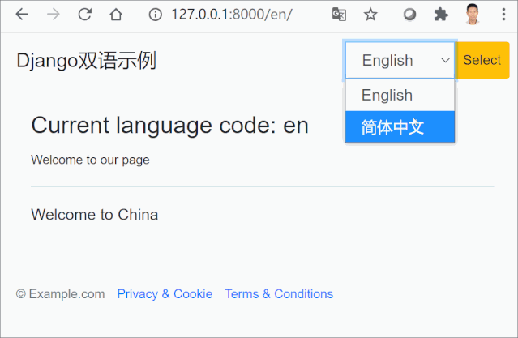
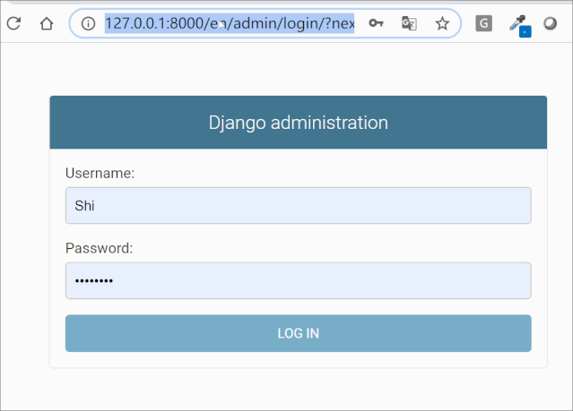
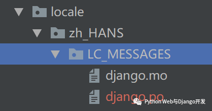

# Django国际化


## 目录


1. TOC
{:toc}

---
很多时候我们的读者或客户遍布全球, 这时就需要对网站或APP进行国际化，让其支持多种语言。虽然Django的功能强大，但真正实现国际化，让网站根据用户的语言喜好来显示不同的内容并不是一件容易的事。本文将以一个最简单的例子，教你如何设置让Django支持多语种网站。


## 展示效果

本例展示效果如下，用户选择不同语言，网站即显示翻译过后的内容, 包括footer部分的文本。本例基于Python 3.7和Django 3.0开发，前端boostrap 4, 无需额外的第三方库支持。



到此你只需记住一点：我们实现了中英对照翻译，但这个翻译不是浏览器翻译的，Django也不会帮你翻译。这个需要你自己事先手动翻译好，存放在专门翻译文件中，Django只是事后调用而已。

## 第一步 修改settings.py配置

假设你已经创建了一个`myproject`的项目，那么为了支持国际化/多语种，你首先应做两件事：

- 在myproject目录下新建`locale`文件夹，用于保存翻译消息文件(.po和.mo格式的)
- 修改配置文件`settings.py`

`settings.py`主要设置如下所示：

```python
from django.utils.translation import ugettext_lazy as _

# 默认语言
LANGUAGE_CODE = 'en-us'

# 设置I18n和L10N为True
USE_I18N = True
USE_L10N = True

# 指定支持语言。这里为了简化只支持简体中文和英文
LANGUAGES = (
    ('en', _('English')),
    ('zh-hans', _('Simplified Chinese')),
)

# 用于存放django.po和django.mo编译过的翻译文件
PROJECT_ROOT = os.path.dirname(os.path.realpath(__name__))
LOCALE_PATHS = (
    os.path.join(PROJECT_ROOT, 'locale'),
)
```

在这里我们使用了`ugettext_lazy`这个方法，**它的作用是在.py文件文件中标记需要翻译的字符串，对其进行惰性参照存储，而不是对字符串进行真正的翻译**。我们经常会在`models.py`中定义字段时用到它，也会在`views.py`中用到它，指定需要翻译的字符串。然而在模板html文件中我们并不能直接使用`ugettext_lazy`这个方法，而是使用`,  `这两个标签来标记需要翻译的字符串。

注意：这两个标签也不是对字符串进行真正的翻译，只是标记而已。使用这两个模板标签前需要在模板的最开始地方加入``。

最后别忘了加入`LocaleMiddleware`这个中间件。它的位置也很重要，应于`SessionMiddleware`之后，`CommonMiddleware`之前。

```python
MIDDLEWARE = [
    'django.middleware.security.SecurityMiddleware',
    'django.contrib.sessions.middleware.SessionMiddleware',
    'django.middleware.locale.LocaleMiddleware', # 新增多语支持
    'django.middleware.common.CommonMiddleware',
    'django.middleware.csrf.CsrfViewMiddleware',
    'django.contrib.auth.middleware.AuthenticationMiddleware',
    'django.contrib.messages.middleware.MessageMiddleware',
    'django.middleware.clickjacking.XFrameOptionsMiddleware',
]
```

*小知识*：

`i18n`是国际化(Internationalization)的缩写。i 和 n 之间有 18 个字母，简称 I18N,。l10n是本地化(localization)的缩写。l 和 n 之间有 10 个字母，简称 L10N。

## 第二步 修改项目的urls.py

本步动作是为了增加对国际化i18n的支持，具体代码如下所示(注意：这里是项目目录下urls.py, 不是app下urls.py)。`i18n_patterns`的作用是让每个url前面自动加上所选语言的代码，比如`/en/`, `/zh-hans/`等等。

```python
from django.contrib import admin
from django.urls import path, include
from django.conf.urls.i18n import i18n_patterns


urlpatterns = [
    path('i18n/', include('django.conf.urls.i18n')),
]


urlpatterns += i18n_patterns(
    path('admin/', admin.site.urls),
    path('', include('myapp.urls')),
)
```

实际上现在你已经可以通过访问Django自带的admin来检验你的国际化设置是否成功了。分别访问http://127.0.0.1:8000/en/admin/和http://127.0.0.1:8000/zh-hans/admin/你将看到不同语言版本，如下所示：



## 第三步 在.py, .html和.txt文件中标记需要翻译的字符串

Django支持在python文件，html和txt文本文件中标记需要翻译的字符串。在python文件中使用`ugettext_lazy`方法或则简写的`_`，在html和txt文件中使用`trans`和`blocktrans`标签, 使用前还需在文件开头加入 ``。重要的话多说几遍也无妨。

本例中我们不需要使用到模型，只需开发一个url，所以只需要一个视图(index)和模板(index.html)。相应内容如下所示：

```python
# myapp/urls.py
from django.urls import path
from . import views

app_name = 'myapp'
urlpatterns = (
    path('', views.index, name='index'),
)
```

在视图中我们使用`ugettext_lazy`方法标记了一个需要翻译的字符串"Welcome to China"。

```python
# myapp/views.py
from django.shortcuts import render
from django.utils.translation import ugettext_lazy as _

# Create your views here.
def index(request):
    context = {'msg': _("Welcome to China")}
    return render(request, 'myapp/index.html', context)
```

模板文件较长，请全文复制，解读在后面。模板路径为`myapp/templates/myapp/index.html`。

```html

<!DOCTYPE html>



<html lang="en">
  <head>
   <meta charset="utf-8">
   <meta name="viewport" content="width=device-width, initial-scale=1, shrink-to-fit=no">
   <meta name="description" content="">
   <title>Django房产网</title>
   <link rel="canonical" href="https://getbootstrap.com/docs/4.5/examples/">
   <!-- Bootstrap core CSS -->
   <link href="https://stackpath.bootstrapcdn.com/bootstrap/4.5.0/css/bootstrap.min.css" rel="stylesheet" integrity="sha384-9aIt2nRpC12Uk9gS9baDl411NQApFmC26EwAOH8WgZl5MYYxFfc+NcPb1dKGj7Sk" crossorigin="anonymous">
      <style>
   body {
      overflow-x: hidden; /* Prevent scroll on narrow devices */
     font-family: 'Inter', Arial, sans-serif;
     background: #F6F8FF;
     padding-top: 56px;
   }
</style>
  </head>
  <body>
     <nav class="navbar navbar-expand-md fixed-top navbar-light box-shadow bg-white">
     <div class="container">
       <a class="navbar-brand align-items-md-center" href="index.html">Django双语示例</a>
           <form class="form-inline ml-3-md" action="" method="post">
               
               <div class="input-group">
                    <input name="next" type="hidden" value="{{ redirect_to }}" />
                    <select name="language" class="form-control">
                        
                        
                        
                        
                            <option value="{{ language.code }}" selected>
                                {{ language.name_local }}
                            </option>
                        
                    </select>
                   <div class="input-group-append">
                    <button type="submit" class="btn btn-inline btn-sm bg-warning">
                        
                    </button>
                   </div>
               </div>
        </form>
     </div>
    </nav>
  
<div class="py-4 px-3 bg-light">
     <div class="container">
         
         <h4>: {{ LANGUAGE_CODE }}</b> </h4>
         <p><small></small></p>
         <hr/>
         <p> {{ msg }} </p>
     </div>
</div>



<footer class="bd-footer bg-light">
    <div class="container pt-3 pb-2 px-3 px-md-2">
      <ul class="bd-footer-links list-unstyled text-muted list-inline pb-2">
        <li class="list-inline-item">
        <small>&#169; Example.com</small>
        </li>
        <li class="list-inline-item right"><a href="https://twitter.com/getbootstrap"><small></small></a></li>
        <li class="list-inline-item right"><a href="/docs/4.5/examples/"><small></small></a></li>
      </ul>
   </div>
</footer>
  <script src="https://code.jquery.com/jquery-3.5.1.slim.min.js" integrity="sha384-DfXdz2htPH0lsSSs5nCTpuj/zy4C+OGpamoFVy38MVBnE+IbbVYUew+OrCXaRkfj" crossorigin="anonymous"></script>
<script src="https://cdn.jsdelivr.net/npm/popper.js@1.16.0/dist/umd/popper.min.js" integrity="sha384-Q6E9RHvbIyZFJoft+2mJbHaEWldlvI9IOYy5n3zV9zzTtmI3UksdQRVvoxMfooAo" crossorigin="anonymous"></script>
<script src="https://stackpath.bootstrapcdn.com/bootstrap/4.5.0/js/bootstrap.min.js" integrity="sha384-OgVRvuATP1z7JjHLkuOU7Xw704+h835Lr+6QL9UvYjZE3Ipu6Tp75j7Bh/kR0JKI" crossorigin="anonymous"></script>
</html> 
```

模板文件中最重要的一段代码如下所示。

```html


<div class="py-4 px-3 bg-light">
     <div class="container">
    
         <h4>: {{ LANGUAGE_CODE }}</b> </h4>
         <p><small></small></p>
         <hr/>
         <p> {{ msg }} </p>
     </div>
</div>
 
```

``以后，你可以使用`get_current_language`标签获得当前语言。我们还在模板中分别使用``和` `标签来标记了两个需要翻译的字符串，一个是模板中已存在的字符串，一个是视图函数传递过来的变量。

另外模板中还有一段通过session用于切换语言的标准代码，大家可以随时拿去用。

```xml

<form class="form-inline ml-3-md" action="" method="post">
      
      <div class="input-group">
           <input name="next" type="hidden" value="{{ redirect_to }}" />
             <select name="language" class="form-control">
                
                    
                     
                      
                        <option value="{{ language.code }}" selected>
                            {{ language.name_local }}
                         </option>
                       
                    </select>
                   <div class="input-group-append">
                    <button type="submit" class="btn btn-inline btn-sm bg-warning">
                 
                    </button>
                   </div>
               </div>
</form>
```

此时你启动测试服务器，应该能看到页面已经能正确显示。但是当你切换不同语言时，页面显示的内容还是一样的，这是因为我们还没对那些字符串进行翻译啊。

## 第四步 生成.po和.mo编译消息文件

现在到了关键步骤了，也是最后一步。我们需要对前面标记的字符串进行手动翻译，并生成编译过后的消息文件供Django使用。新手最容易犯的错误就是以为`trans`标签能实现自动翻译，以为国际化就到此为止了。整个过程一共有3步, 请仔细阅读别走错。

第一步： 进入项目文件夹，使用`django-admin makemessages -l zh_HANS`命令提取所有前面标记需要翻译的字符串。该命令会自动生成一个名为`django.po`的文件，地址如下所示：



注意：这里是`zh_HANS`是下划线的形式，而不是语言代码简写`zh-hans`。

`django.po`文件刚开始内容如下所示。你可以看到需要翻译的字符串，但翻译内容为空。

```bash
#: .\house\templates\house\index.html:27
msgid "Welcome to our page"
msgstr ""


#: .\house\templates\house\index.html:29 .\house\templates\house\index1.html:65
#, python-format
msgid " %(msg)s "
msgstr ""


#: .\house\templates\house\index1.html:48
msgid "Select"
msgstr ""


#: .\house\templates\house\index1.html:60
#, fuzzy
msgid "Welcome to our website"
msgstr ""
```

第二步：修改`django.po`文件，添加手动翻译的字符串。

```bash
#: .\house\templates\house\index.html:27
msgid "Welcome to our page"
msgstr "欢迎来到我们主页"

#: .\house\templates\house\index.html:29 .\house\templates\house\index1.html:65
#, python-format
msgid " %(msg)s "
msgstr ""

#: .\house\templates\house\index1.html:48
msgid "Select"
msgstr "选择"

#: .\house\templates\house\index1.html:60
#, fuzzy
msgid "Welcome to our website"
msgstr "欢迎来到我们网站"
```

第三步：使用`python manage.py compilemessages`命令生成翻译编译文件。

该命令会生成一个`django.mo`的文件，内容如下所示。这个就是Django最后需要调用的翻译文件，里面包含了翻译过后的字符串列表。

```xml
Report-Msgid-Bugs-To: 
PO-Revision-Date: YEAR-MO-DA HO:MI+ZONE
Last-Translator: FULL NAME <EMAIL@ADDRESS>
Language-Team: LANGUAGE <LL@li.org>
Language: 
MIME-Version: 1.0
Content-Type: text/plain; charset=UTF-8
Content-Transfer-Encoding: 8bit
Plural-Forms: nplurals=1; plural=0;
 当前语言代码 英语 隐私与Cookie 选择 简体中文 服务条款与协议 欢迎来到中国 欢迎来到我们主页
```

 现在你重新启动服务器就应该可以看到文初展示的效果了，神不神奇?

## Windows用户注意事项

windows系统下使用`makemessages`和`compilemessages`命令时会出现错误，这是因为windows缺少基于GNU的`gettext`模块。安装方式如下：

1. https://mlocati.github.io/articles/gettext-iconv-windows.html下载相应版本，安装或解压缩到C盘或D盘, 比如C:\Program Files (x86)\gettext
2. 把gettex下的bin地址，比如C:\Program Files (x86)\gettext\bin加入到系统PATH的环境变量(在控制面板>系统>高级>环境变量中添加)。
3. 如果pycharm的terminal中运行两个命令有问题，请直接在windows的cmd窗口运行。

Linux系统如果缺少可以使用`sudo apt-get install gettext`安装。

## 小结

本文以实例展示了如何让Django开发的网站支持多语种，其中技能你get到了吗? 你是不是也曾经以为`ugettext_lazy`方法, `trans`和`blocktrans`标签会自动帮你翻译文本呢？

原创不易，转载请注明来源。我是大江狗，一名Django技术开发爱好者。您可以通过搜索【<a href="https://blog.csdn.net/weixin_42134789">CSDN大江狗</a>】、【<a href="https://www.zhihu.com/people/shi-yun-bo-53">知乎大江狗</a>】和搜索微信公众号【Python Web与Django开发】关注我！


