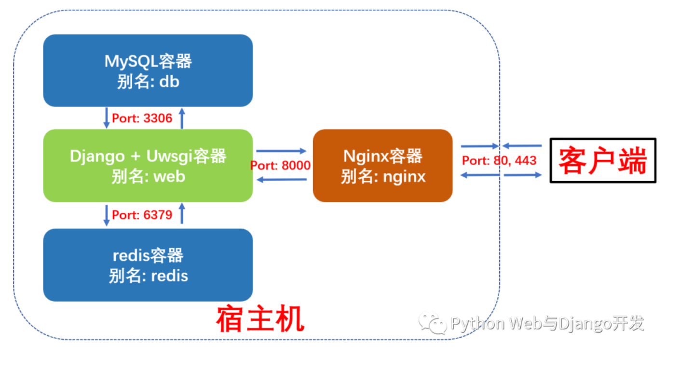
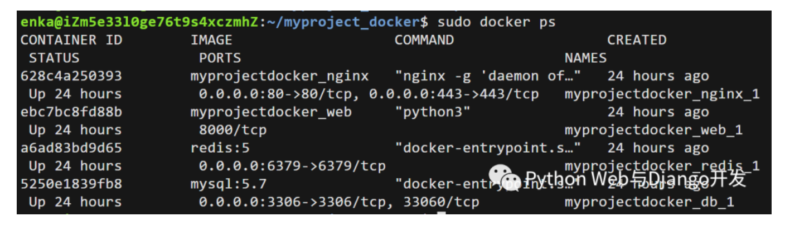

# Docker部署Django


## 目录


1. TOC
{:toc}

Django在生产环境的部署还是比较复杂的, 令很多新手望而生畏, 幸运的是使用Docker容器化技术可以大大简化我们Django在生产环境的部署并提升我们应用的可移植性。*Docker* 是一个开源的应用容器引擎，让开发者可以打包他们的应用以及依赖包到一个可移植的镜像中，然后发布到任何流行的 Linux机器上。本文将详细介绍如何使用docker-compose八步部署Django + Uwsgi + Nginx + MySQL + Redis (多容器组合)。


本文假设Django, MySQL, Redis和Nginx都是部署到同一台服务器上，支持最新Django 3.2、MySQL 8和Python 3.9版本，其中很多配置文件有非常大的参考价值，建议先收藏再阅读。

注意：本文侧重于Docker技术在部署Django时的实际应用，而不是Docker基础教程。对Docker命令不熟悉的读者们建议先学习下Python Web工具篇的Docker及Docker-compose基础命令。

## Docker及Docker-Compose的安装

学习本教程前首先我们要在Linux服务器上安装Docker及Docker-Compose。菜鸟教程上总结了Docker在各个平台和系统上的安装，大家可以参考。这里总结了下Docker及Docker-compose在阿里云Ubuntu系统上的安装过程。步骤看似很多且复杂，但大家只需要一步一步copy和paste命令就行了，整个安装过程很流畅。

```bash
# 以Ubuntu为例
# Step 1: 移除之前docker版本并更新更新 apt 包索引
sudo apt-get remove docker docker-engine docker.io
sudo apt-get update

# Step 2: 安装 apt 依赖包，用于通过HTTPS来获取仓库
sudo apt-get install apt-transport-https ca-certificates curl software-properties-common

# Step 3: 添加 Docker 的官方 GPG 密钥
curl -fsSL https://mirrors.aliyun.com/docker-ce/linux/ubuntu/gpg | sudo apt-key add -

# Step 4: 设置docker稳定版仓库，这里使用了阿里云仓库
sudo add-apt-repository "deb [arch=amd64] https://mirrors.aliyun.com/docker-ce/linux/ubuntu $(lsb_release -cs) stable"
sudo apt-get update

# Step 5: 安装免费的docker Community版本docker-ce
sudo apt-get -y install docker-ce
# sudo apt-get install -y docker-ce=<VERSION> #该命令可以选择docker-ce版本

# Step 6: 查看docker版本及运行状态
sudo docker -v
sudo systemctl status docker

# Step 7：本步非必需。使用阿里云设置Docker镜像加速，注意下面链接请使用阿里云给自己的URL
sudo mkdir -p /etc/docker 
sudo tee /etc/docker/daemon.json <<-'EOF' 
{  "registry-mirrors": ["https://ua3456xxx.mirror.aliyuncs.com"] } 
EOF 
sudo systemctl daemon-reload 
sudo systemctl restart docker

# Step 8: 以ubuntu为例，下载docker-compose
$ sudo curl -L https://github.com/docker/compose/releases/download/1.17.0/docker-compose-`uname -s`-`uname -m` -o /usr/local/bin/docker-compose

# Step 9: 给予docker-compose可执行权限
$ sudo chmod +x /usr/local/bin/docker-compose

# Step 10: 查看docker-compose版本
$ docker-compose --version
```

## Django + Uwsgi + Nginx + MySQL + Redis组合容器示意图

本例中我们将使用docker-compose编排并启动4个容器，这个更接近于实际生成环境下的部署。
1. **Django + Uwsgi容器**：核心应用程序，处理动态请求
2. **MySQL 容器**：数据库服务
3. **Redis 容器**：缓存服务
4. **Nginx容器**：反向代理服务并处理静态资源请求

这四个容器的依赖关系是：Django+Uwsgi 容器依赖 Redis 容器和 MySQL 容器，Nginx 容器依赖Django+Uwsgi容器。为了方便容器间的相互访问和通信，我们使用docker-compose时可以给每个容器取个别名，这样访问容器时就可以直接使用别名访问，而不使用Docker临时给容器分配的IP了。

这四个容器的别名及通信端口如下图所示：




## Docker-compose部署Django项目布局树形图

我们新建了一个compose文件夹，专门存放用于构建其它容器镜像的Dockerfile及配置文件。compose文件夹与django项目的根目录myproject同级。这样做的好处是不同的django项目可以共享compose文件夹。

```bash
myproject_docker # 项目根目录
├── compose # 存放各项容器服务的Dockerfile和配置文件
│   ├── mysql
│   │   ├── conf
│   │   │   └── my.cnf # MySQL配置文件
│   │   └── init
│   │       └── init.sql # MySQL启动脚本
│   ├── nginx
│   │   ├── Dockerfile # 构建Nginx镜像所的Dockerfile
│   │   ├── log # 挂载保存nginx容器内日志log目录
│   │   ├── nginx.conf # Nginx配置文件
│   │   └── ssl # 如果需要配置https需要用到
│   ├── redis
│   │   └── redis.conf # redis配置文件
│   └── uwsgi # 挂载保存django+uwsgi容器内uwsgi日志
├── docker-compose.yml # 核心编排文件
└── myproject # 常规Django项目目录
    ├── Dockerfile # 构建Django+Uwsgi镜像的Dockerfile
    ├── apps # 存放Django项目的各个apps
    ├── manage.py
    ├── myproject # Django项目配置文件
    │   ├── asgi.py
    │   ├── __init__.py
    │   ├── settings.py
    │   ├── urls.py
    │   └── wsgi.py
    ├── pip.conf # 非必需。pypi源设置成国内，加速pip安装
    ├── requirements.txt # Django项目依赖文件
    ├── .env # 环境变量文件
    ├── start.sh # 启动Django+Uwsgi容器后要执行的脚本
    ├── media # 用户上传的媒体资源，如果没有需手动创建
    ├── static #搜集项目的静态文件夹，如果没有需手动创建
    └── uwsgi.ini # uwsgi配置文件
```

下面我们开始正式部署。

## 第一步：编写docker-compose.yml文件

修改过的docker-compose.yml的核心内容如下。我们定义了4个数据卷，用于挂载各个容器内动态生成的数据，比如MySQL的存储数据，redis生成的快照、django+uwsgi容器中收集的静态文件以及用户上传的媒体资源。这样即使删除容器，容器内产生的数据也不会丢失。

我们还定义了3个网络，分别为`nginx_network`(用于nginx和web容器间的通信)，`db_network`(用于db和web容器间的通信)和`redis_network`(用于redis和web容器间的通信)。

整个编排里包含4项容器服务，别名分别为`redis`, `db`, `nginx`和`web`，接下来我们将依次看看各个容器的Dockerfile和配置文件。

```bash
version: "3"

volumes: # 自定义数据卷
  db_vol: #定义数据卷同步存放容器内mysql数据
  redis_vol: #定义数据卷同步存放redis数据
  media_vol: #定义数据卷同步存放web项目用户上传到media文件夹的数据
  static_vol: #定义数据卷同步存放web项目static文件夹的数据

networks: # 自定义网络(默认桥接), 不使用links通信
  nginx_network:
    driver: bridge
  db_network:
    driver: bridge
  redis_network: 
    driver: bridge

services:
  redis:
    image: redis:latest
    command: redis-server /etc/redis/redis.conf # 容器启动后启动redis服务器
    networks:
      - redis_network
    volumes:
      - redis_vol:/data # 通过挂载给redis数据备份
      - ./compose/redis/redis.conf:/etc/redis/redis.conf # 挂载redis配置文件
    ports:
      - "6379:6379"
    restart: always # always表容器运行发生错误时一直重启

  db:
    image: mysql
    env_file:  
      - ./myproject/.env # 使用了环境变量文件
    networks:  
      - db_network
    volumes:
      - db_vol:/var/lib/mysql:rw # 挂载数据库数据, 可读可写
      - ./compose/mysql/conf/my.cnf:/etc/mysql/my.cnf # 挂载配置文件
      - ./compose/mysql/init:/docker-entrypoint-initdb.d/ # 挂载数据初始化sql脚本
    ports:
      - "3306:3306" # 与配置文件保持一致
    restart: always

  web:
    build: ./myproject
    expose:
      - "8000"
    volumes:
      - ./myproject:/var/www/html/myproject # 挂载项目代码
      - static_vol:/var/www/html/myproject/static # 以数据卷挂载容器内static文件
      - media_vol:/var/www/html/myproject/media # 以数据卷挂载容器内用户上传媒体文件
      - ./compose/uwsgi:/tmp # 挂载uwsgi日志
    networks:
      - nginx_network
      - db_network  
      - redis_network 
    depends_on:
      - db
      - redis
    restart: always
    tty: true
    stdin_open: true

  nginx:
    build: ./compose/nginx
    ports:
      - "80:80"
      - "443:443"
    expose:
      - "80"
    volumes:
      - ./compose/nginx/nginx.conf:/etc/nginx/conf.d/nginx.conf # 挂载nginx配置文件
      - ./compose/nginx/ssl:/usr/share/nginx/ssl # 挂载ssl证书目录
      - ./compose/nginx/log:/var/log/nginx # 挂载日志
      - static_vol:/usr/share/nginx/html/static # 挂载静态文件
      - media_vol:/usr/share/nginx/html/media # 挂载用户上传媒体文件
    networks:
      - nginx_network
    depends_on:
      - web
    restart: always
```

## 第二步：编写Web (Django+Uwsgi)镜像和容器所需文件

构建Web镜像(Django+Uwsgi)的所使用的Dockerfile如下所示:

```bash
# 建立 python 3.9环境
FROM python:3.9

# 安装netcat
RUN apt-get update && apt install -y netcat

# 镜像作者大江狗
MAINTAINER DJG

# 设置 python 环境变量
ENV PYTHONDONTWRITEBYTECODE 1
ENV PYTHONUNBUFFERED 1

# 可选：设置镜像源为国内
COPY pip.conf /root/.pip/pip.conf

# 容器内创建 myproject 文件夹
ENV APP_HOME=/var/www/html/myproject
RUN mkdir -p $APP_HOME
WORKDIR $APP_HOME

# 将当前目录加入到工作目录中（. 表示当前目录）
ADD . $APP_HOME

# 更新pip版本
RUN /usr/local/bin/python -m pip install --upgrade pip

# 安装项目依赖
RUN pip install -r requirements.txt

# 移除\r in windows
RUN sed -i 's/\r//' ./start.sh

# 给start.sh可执行权限
RUN chmod +x ./start.sh

# 数据迁移，并使用uwsgi启动服务
ENTRYPOINT /bin/bash ./start.sh
```

本Django项目所依赖的`requirements.txt`内容如下所示：

```bash
# django
django==3.2
# uwsgi
uwsgi==2.0.18
# mysql
mysqlclient==1.4.6
# redis
django-redis==4.12.1
redis==3.5.3
# for images
Pillow==8.2.0 
```

`start.sh`启动脚本文件内容如下所示。最重要的是最后一句，使用uwsgi.ini配置文件启动Django服务。

```bash
#!/bin/bash
# 从第一行到最后一行分别表示：
# 1. 等待MySQL服务启动后再进行数据迁移。nc即netcat缩写
# 2. 收集静态文件到根目录static文件夹，
# 3. 生成数据库可执行文件，
# 4. 根据数据库可执行文件来修改数据库
# 5. 用 uwsgi启动 django 服务
# 6. tail空命令防止web容器执行脚本后退出
while ! nc -z db 3306 ; do
    echo "Waiting for the MySQL Server"
    sleep 3
done

python manage.py collectstatic --noinput&&
python manage.py makemigrations&&
python manage.py migrate&&
uwsgi --ini /var/www/html/myproject/uwsgi.ini&&
tail -f /dev/null

exec "$@"
```

`uwsgi.ini`配置文件如下所示：

```bash
[uwsgi]

project=myproject
uid=www-data
gid=www-data
base=/var/www/html

chdir=%(base)/%(project)
module=%(project).wsgi:application
master=True
processes=2

socket=0.0.0.0:8000
chown-socket=%(uid):www-data
chmod-socket=664

vacuum=True
max-requests=5000

pidfile=/tmp/%(project)-master.pid
daemonize=/tmp/%(project)-uwsgi.log

#设置一个请求的超时时间(秒)，如果一个请求超过了这个时间，则请求被丢弃
harakiri = 60
post buffering = 8192
buffer-size= 65535
#当一个请求被harakiri杀掉会，会输出一条日志
harakiri-verbose = true

#开启内存使用情况报告
memory-report = true

#设置平滑的重启（直到处理完接收到的请求）的长等待时间(秒)
reload-mercy = 10

#设置工作进程使用虚拟内存超过N MB就回收重启
reload-on-as= 1024
```

## 第三步：编写Nginx镜像和容器所需文件

构建Nginx镜像所使用的Dockerfile如下所示：

```bash
# nginx镜像compose/nginx/Dockerfile

FROM nginx:latest

# 删除原有配置文件，创建静态资源文件夹和ssl证书保存文件夹
RUN rm /etc/nginx/conf.d/default.conf \
&& mkdir -p /usr/share/nginx/html/static \
&& mkdir -p /usr/share/nginx/html/media \
&& mkdir -p /usr/share/nginx/ssl

# 设置Media文件夹用户和用户组为Linux默认www-data, 并给予可读和可执行权限,
# 否则用户上传的图片无法正确显示。
RUN chown -R www-data:www-data /usr/share/nginx/html/media \
&& chmod -R 775 /usr/share/nginx/html/media

# 添加配置文件
ADD ./nginx.conf /etc/nginx/conf.d/

# 关闭守护模式
CMD ["nginx", "-g", "daemon off;"]
```

Nginx的配置文件如下所示：

```bash
# nginx配置文件
# compose/nginx/nginx.conf

upstream django {
    ip_hash;
    server web:8000; # Docker-compose web服务端口
}

# 配置http请求，80端口
server {
    listen 80; # 监听80端口
    server_name 127.0.0.1; # 可以是nginx容器所在ip地址或127.0.0.1，不能写宿主机外网ip地址

    charset utf-8;
    client_max_body_size 10M; # 限制用户上传文件大小

    access_log /var/log/nginx/access.log main;
    error_log /var/log/nginx/error.log warn;

    location /static {
        alias /usr/share/nginx/html/static; # 静态资源路径
    }

    location /media {
        alias /usr/share/nginx/html/media; # 媒体资源，用户上传文件路径
    }

    location / {
        include /etc/nginx/uwsgi_params;
        uwsgi_pass django;
        uwsgi_read_timeout 600;
        uwsgi_connect_timeout 600;
        uwsgi_send_timeout 600;

        proxy_set_header X-Forwarded-For $proxy_add_x_forwarded_for;
        proxy_redirect off;
        proxy_set_header X-Real-IP  $remote_addr;
       # proxy_pass http://django;  # 使用uwsgi通信，而不是http，所以不使用proxy_pass。
    }
}
```

## 第四步：编写Db (MySQL)容器配置文件

启动MySQL容器我们直接使用官方镜像即可，不过我们需要给MySQL增加配置文件。

```bash
# compose/mysql/conf/my.cnf
[mysqld]
user=mysql
default-storage-engine=INNODB
character-set-server=utf8
secure-file-priv=NULL # mysql 8 新增这行配置
default-authentication-plugin=mysql_native_password  # mysql 8 新增这行配置

port            = 3306 # 端口与docker-compose里映射端口保持一致
#bind-address= localhost #一定要注释掉，mysql所在容器和django所在容器不同IP

basedir         = /usr
datadir         = /var/lib/mysql
tmpdir          = /tmp
pid-file        = /var/run/mysqld/mysqld.pid
socket          = /var/run/mysqld/mysqld.sock
skip-name-resolve  # 这个参数是禁止域名解析的，远程访问推荐开启skip_name_resolve。

[client]
port = 3306
default-character-set=utf8

[mysql]
no-auto-rehash
default-character-set=utf8
```

我们还需设置MySQL服务启动时需要执行的脚本命令, 注意这里的用户名和password必需和myproject目录下`.env`文件中的环境变量保持一致。

```bash
# compose/mysql/init/init.sql
Alter user 'dbuser'@'%' IDENTIFIED WITH mysql_native_password BY 'password';
GRANT ALL PRIVILEGES ON myproject.* TO 'dbuser'@'%';
FLUSH PRIVILEGES;
```

`.env`文件内容如下所示：

```bash
MYSQL_ROOT_PASSWORD=123456
MYSQL_USER=dbuser
MYSQL_DATABASE=myproject
MYSQL_PASSWORD=password
```

## 第五步：编写Redis 容器配置文件

启动redis容器我们直接使用官方镜像即可，不过我们需要给redis增加配置文件。大部分情况下采用默认配置就好了，这里我们只做出了如下几条核心改动：

```bash
# compose/redis/redis.conf
# Redis 5配置文件下载地址
# https://raw.githubusercontent.com/antirez/redis/5.0/redis.conf

# 请注释掉下面一行，变成#bind 127.0.0.1,这样其它机器或容器也可访问
bind 127.0.0.1

# 取消下行注释，给redis设置登录密码。这个密码django settings.py会用到。
requirepass yourpassword
```

## 第六步：修改Django项目settings.py 

在你准备好docker-compose.yml并编排好各容器的Dockerfile及配置文件后，请先不要急于使用Docker-compose命令构建镜像和启动容器。这时还有一件非常重要的事情要做，那就是修改Django的`settings.py`, 提供mysql和redis服务的配置信息。最重要的几项配置如下所示：

```bash
# 生产环境设置 Debug = False
Debug = False

# 设置ALLOWED HOSTS
ALLOWED_HOSTS = ['your_server_IP', 'your_domain_name']

# 设置STATIC ROOT 和 STATIC URL
STATIC_ROOT = os.path.join(BASE_DIR, 'static')
STATIC_URL = "/static/"

# 设置MEDIA ROOT 和 MEDIA URL
MEDIA_ROOT = os.path.join(BASE_DIR, 'media')
MEDIA_URL = "/media/"

# 设置数据库。这里用户名和密码必需和docker-compose.yml里mysql环境变量保持一致
DATABASES = {
    'default': {
        'ENGINE': 'django.db.backends.mysql',
        'NAME': 'myproject', # 数据库名
        'USER':'dbuser', # 你设置的用户名 - 非root用户
        'PASSWORD':'password', # # 换成你自己密码
        'HOST': 'db', # 注意：这里使用的是db别名，docker会自动解析成ip
        'PORT':'3306', # 端口
    }
}

# 设置redis缓存。这里密码为redis.conf里设置的密码
CACHES = {
    "default": {
        "BACKEND": "django_redis.cache.RedisCache",
        "LOCATION": "redis://redis:6379/1", #这里直接使用redis别名作为host ip地址
        "OPTIONS": {
            "CLIENT_CLASS": "django_redis.client.DefaultClient",
            "PASSWORD": "yourpassword", # 换成你自己密码
        },
    }
}
```

## 第七步：使用docker-compose 构建镜像并启动容器组服务

现在我们可以使用docker-compose命名构建镜像并启动容器组了。

```bash
# 进入docker-compose.yml所在文件夹，输入以下命令构建镜像
sudo docker-compose build
# 查看已生成的镜像
sudo docker images
# 启动容器组服务
sudo docker-compose up
```

如果一切顺利，此时你应该可以看到四个容器服务都已经成功运行了。此时打开你的浏览器，输入你服务器的ip地址或域名指向地址，你就应该可以看到网站已经上线啦。



## 第八步：排错

初学者使用Docker或Docker-compose部署会出现各种各样的错误，本文教你如何排错。

### Nginx容器排错

容器已启动运行，网站打不开，最有用的是查看Nginx的错误日志error.log。由于我们对容器内Nginx的log进行了挂载，你可以在宿主机的/compose/nginx/log目录里直接查看相关日志。

```bash
# 进入nginx日志目录，一个access.log, 一个error.log
cd compose/nginx/log
# 查看日志文件
sudo cat error.log 
```

绝大部分网站打不开，Nginx日志显示nginx: connect() failed (111: Connection refused) while connecting to upstream或Nginx 502 gateway的错误都不是因为nginx自身的原因，而是Web容器中Django程序有问题或则uwsgi配置文件有问题。

在进入Web容器排错前，你首先要检查下Nginx转发请求的方式(`proxy_pass`和`uwsgi_pass`)以及转发端口与uwsgi里面的监听方式以及端口是否一致。

uWSGI和Nginx之间有3种通信方式unix socket，TCP socket和http如果Nginx以proxy_pass方式转发请求，uwsgi需要使用http协议进行通信。如果Nginx以`uwsgi_pass`转发请求，uwsgi建议配置socket进行通信。

### Web容器排错

Web容器也就是Django+UWSGI所在的容器，是最容易出现错误的容器。如果Nginx配置没问题，你应该进入web容器查看运行脚本命令时有没有报错，并检查uwsgi的运行日志。uwsgi的日志非常有用，它会记录Django程序运行时发生了哪些错误或异常。一旦发生了错误，uwsgi的进程虽然不会停止，但也无法正常工作，自然也就不能处理nginx转发的动态请求从而出现nginx报错了。

```bash
# 查看web容器日志
$ docker-compose logs web
# 进入web容器执行启动命令，查看有无报错
$ docker-compose exec web /bin/bash start.sh
# 或则进入web柔情其，逐一执行python manage.py命令
$ docker-compose exec web /bin/bash 
# 进入web容器，查看uwsgi是否正常启动
$ ps aux | grep uwsgi 
# 进入uwsgi日志所在目录，查看Django项目是否有报错
cd /tmp
```
另外一个常发生的错误是 docker-compose生成的web容器执行脚本命令后立刻退出(exited with code 0), 这时的解决方案是在`docker-compose.yml`中包含以下2行,  另外脚本命令里加入`tail -f /dev/null`是容器服务持续运行。
```bash
stdin_open: true
tty: true
```

有时web容器会出现不能连接到数据库的报错，这时需要检查`settings.py`中的数据库配置信息是否正确(比如host为db)，并检查web容器和db容器是否通过`db_network`正常通信(比如进入db容器查看数据表是否已经生成)。在进行数据库迁移时web容器还会出现if table exists or failed to open the referenced table 'users_user',  inconsistent migration history的错误, 可以删除migrations目录下文件并进入MySQL容器删除`django_migrations`数据表即可。

### 数据库db容器排错

我们还需要经常进入数据库容器查看数据表是否已生成并删除一些数据，这时可以使用如下命令：

```bash
# 进入db容器
$ docker-compose exec db /bin/bash
# 登录
mysql -u username -p;
# 选择数据库
USE dbname;
# 显示数据表
SHOW tables;
# 清空数据表
DELETE from tablename;
# 删除数据表
DROP TABLE tablename;
```

## 小结

本文详细地介绍了如何使用docker-compose工具分八步在生产环境下部署`Django + Uwsgi + Nginx + MySQL + Redis`。过程看似很复杂，但很多Dockerfile，项目布局及`docker-compose.yml`都是可以复用的。花时间学习并练习本章内容是非常值得的，一但你学会了，基本上可以10分钟内完成一个正式Django项目的部署，而且可以保证在任何一台Linux机器上顺利地运行。本文最后的排错经验更会助你一臂之力。

注意：整个部署过程如果遇到问题，可以关注我们的微信公众号，给我们留言或发信息，可以节省你的时间。

原创不易，转载请注明来源。我是大江狗，一名Django技术开发爱好者。您可以通过搜索【<a href="https://blog.csdn.net/weixin_42134789">CSDN大江狗</a>】、【<a href="https://www.zhihu.com/people/shi-yun-bo-53">知乎大江狗</a>】和搜索微信公众号【Python Web与Django开发】关注我！


