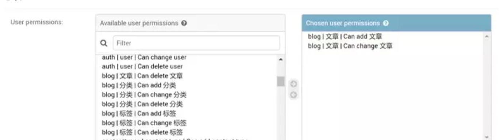

# Django权限详解


## 目录


1. TOC
{:toc}

---

如果你只是利用Django开发个人博客，大部分用户只是阅读你的文章而已，你可能根本用不到本文内容。但是如果你想开发一个内容管理系统或用户管理系统，你必需对用户的权限进行管理和控制。Django自带的权限机制(permissions)与用户组(group)可以让我们很方便地对用户权限进行管理。小编我今天就尝试以浅显的语言来讲解下如何使用Django自带的权限管理机制，并详细介绍如何使用Django-guardian实现对象级别的权限管理。

## 什么是权限?

权限是能够约束用户行为和控制页面显示内容的一种机制。一个完整的权限应该包含3个要素: 用户，对象和权限，即什么用户对什么对象有什么样的权限。

假设我们有一个应用叫blog，其包含一个叫Article(文章)的模型。那么一个超级用户一般会有如下4种权限，而一个普通用户可能只有1种或某几种权限，比如只能查看文章，或者能查看和创建文章但是不能修改和删除。

- 查看文章(view)

- 创建文章(add)

- 更改文章(change)
- 删除文章(delete) 

我们在Django的管理后台(admin)中是可以很轻易地给用户分配权限的。

## Django Admin中的权限分配

Django中的用户权限分配，主要通过Django自带的Admin界面进行维护的。当你编辑某个user信息时, 你可以很轻易地在User permissions栏为其设置对某些模型查看, 增加、更改和删除的权限(如下图所示)。



Django的权限permission本质是`djang.contrib.auth`中的一个模型, 其与User的`user_permissions`字段是多对多的关系。当我们在`INSTALLED_APP`里添加好auth应用之后，Django就会为每一个你安装的app中的模型(Model)自动创建4个可选的权限：view, add,change和delete。(注: Django 2.0前没有view权限)。随后你可以通过admin将这些权限分配给不同用户。

## 查看用户的权限

权限名一般有app名(app_label)，权限动作和模型名组成。以blog应用为例，Django为Article模型自动创建的4个可选权限名分别为:

- 查看文章(view): `blog.view_article`

- 创建文章(add): `blog.add_article`

- 更改文章(change): `blog.change_article`

- 删除文章(delete): `blog.delete_article`

在前例中，我们已经通过Admin给用户A(user_A)分配了创建文章和修改文章的权限。我们现在可以使用`user.has_perm()`方法来判断用户是否已经拥有相应权限。下例中应该返回True。

```python
user_A.has_perm('blog.add_article')
user_A.has_perm('blog.change_article')
```

如果我们要查看某个用户所在用户组的权限或某个用户的所有权限(包括从用户组获得的权限)，我们可以使用`get_group_permissions()`和`get_all_permissions()`方法。

```python
user_A.get_group_permissions()
user_A.get_all_permissions()
```

## 新增自定义权限

有时django创建的4种可选权限满足不了我们的要求，这时我们需要自定义权限。实现方法主要有两种。下面我们将分别使用2种方法给Article模型新增了两个权限，一个是`publish_article`, 一个是`comment_article`。

### 方法1. 在Model的meta属性中添加权限

```python
class Article(models.Model):
    ...
    class Meta:
        permissions = (
            ("publish_article", "Can publish article"),
            ("comment_article", "Can comment article"),
        )
```

### 方法2. 使用ContentType程序化创建权限

```python
from blog.models import Article
from django.contrib.auth.models import Permission
from django.contrib.contenttypes.models import ContentType

content_type = ContentType.objects.get_for_model(article)
permission1 = Permission.objects.create(
    codename='publish_article',
    name='Can publish articles',
    content_type=content_type,
)

permission2 = Permission.objects.create(
    codename='comment_article',
    name='Can comment articles',
    content_type=content_type,
)
```


当你使用`python manage.py migrate`命令后，你会发现Django admin的`user permissions`栏又多了两个可选权限。

 ## 手动分配权限

如果你不希望总是通过admin来给用户设置权限，你还可以通过视图函数手动给用户分配权限。这里也有两种实现方法。

### 方法1. 使用user_permissions.add方法增加权限

```python
myuser.user_permissions.add(permission1, permission2, ...)
```

### 方法2. 通过用户组(group)给用户增加权限

```python
mygroup.permissions.add(permission1, permission2, ...)
```

### 方法3. 通过remove或如clear方法移除权限

如果你希望在代码中移除一个用户的权限，你可以使用`remove`或`clear`方法。

```python
myuser.user_permissions.remove(permission1, permission2, ...)
myuser.user_permissions.clear()
```

## 注意权限的缓存机制

Django会缓存每个用户对象，包括其权限`user_permissions`。当你在代码中手动改变一个用户的权限后，你必须重新获取该用户对象，才能获取最新的权限。比如下例在代码中给用户手动增加了`change_blogpost`的权限，如果不重新载入用户，那么将显示用户还是没有`change_blogpost`的权限。

```python
from django.contrib.auth.models import Permission, User
from django.contrib.contenttypes.models import ContentType
from django.shortcuts import get_object_or_404

from myapp.models import BlogPost

def user_gains_perms(request, user_id):
    user = get_object_or_404(User, pk=user_id)
    # any permission check will cache the current set of permissions
    user.has_perm('myapp.change_blogpost') 
    
content_type = ContentType.objects.get_for_model(BlogPost)
permission = Permission.objects.get(
    codename='change_blogpost',
    content_type=content_type,
)
user.user_permissions.add(permission)
 
# Checking the cached permission set
user.has_perm('myapp.change_blogpost')  # False
 
# Request new instance of User
# Be aware that user.refresh_from_db() won't clear the cache.
user = get_object_or_404(User, pk=user_id)
 
# Permission cache is repopulated from the database
user.has_perm('myapp.change_blogpost')  # True
```

## 用户权限的验证

我们前面讲解了用户权限的创建和设置，现在我们将进入关键一环，用户权限的验证。我们在分配好权限后，我们还需要在视图`views.py`和模板里验证用户是否具有相应的权限，否则前面设置的权限形同虚设。这就是为什么我们前面很多django实战案例里，没有给用户分配某个模型的add和change权限，用户还是还能创建和编辑对象的原因。

### 视图中验证

在视图中你当然可以使用`user.has_perm`方法对一个用户的权限进行直接验证。当然一个更好的方法是使用`@permission_required`这个装饰器。

```python
permission_required(perm, login_url=None, raise_exception=False)
```

你如果指定了`login_url`, 用户会被要求先登录。如果你设置了`raise_exception=True`, 会直接返回403无权限的错误，而不会跳转到登录页面。使用方法如下所示:

```python
from django.contrib.auth.decorators import permission_required

@permission_required('polls.can_vote')
def my_view(request):
    ...
```


如果你使用基于类的视图(Class Based View), 而不是函数视图，你需要混入`PermissionRequiredMixin`这个类或使用`method_decorator`装饰器，如下所示:

```python
from django.contrib.auth.mixins import PermissionRequiredMixin

class MyView(PermissionRequiredMixin, View):
    permission_required = 'polls.can_vote'
    # Or multiple of permissions:
    permission_required = ('polls.can_open', 'polls.can_edit')
    
from django.utils.decorators import method_decorator
from django.core.urlresolvers import reverse_lazy
from django.contrib.auth.decorators import user_passes_test

@method_decorator(user_passes_test(lambda u: Group.objects.get(name='admin') in u.groups.all()),name='dispatch')
class ItemDelete(DeleteView):
    model = Item
    success_url = reverse_lazy('items:index')
```

### 模板中验证

在模板中验证用户权限主要需要学会使用`perms`这个全局变量。perms对当前用户的`user.has_module_perms`和`user.has_perm`方法进行了封装。当我们需要判断当前用户是否拥有blog应用下的所有权限时，我们可以使用:

```python
{{ perms.blog }}
```


我们如果判断当前用户是否拥有blog应用下发表文章讨论的权限，则使用:

```python
{{ perms.blog.comment_article }}
```


这样结合template的if标签，我们可以通过判断当前用户所具有的权限，显示不同的内容了.

```html


    <p>You have permission to do something in this blog app.</p>
	
       <p>You can add articles.</p>
    

    
        <p>You can comment articles!</p>
    

    <p>You don't have permission to do anything in the blog app.</p>

```

### 用户组(Group)

用户组(Group)和User模型是多对多的关系。其作用在权限控制时可以批量对用户的权限进行管理和分配，而不用一个一个用户分配，节省工作量。将一个用户加入到一个Group中后，该用户就拥有了该Group所分配的所有权限。例如，如果一个用户组`editors`有权限`change_article`, 那么所有属于editors组的用户都会有这个权限。

将用户添加到用户组或者给用户组(group)添加权限，一般建议直接通过django admin进行。如果你希望手动给group添加或删除权限，你可以使用如下方法:

```python
mygroup.permissions = [permission_list]
mygroup.permissions.add(permission1, permission2, ...)
mygroup.permissions.remove(permission1, permission2, ...)
mygroup.permissions.clear()
```

如果你要将某个用户移除某个用户组，可以使用如下方法:

```python
myuser.groups.remove(group1, group2, ...) 
myuser.groups.clear()
```

## Django自带权限机制的不足

Django自带的权限机制是针对模型的，这就意味着一个用户如果对Article模型有change的权限，那么该用户获得对所有文章对象进行修改的权限。如果我们希望实现对单个文章对象的权限管理，我们需要借助于第三方库比如`django-guardian`。具体扩展方式见下文。

## Django-guardian的使用

### 安装与配置

```bash
pip install django-guardian
```

安装完成后，我们可以将`django-guardian`加入到我们的项目。首先在`settings`里将guardian加入到`INSTALLED_APPS`。

```
INSTALLED_APPS = ( 
    # ... 
    'guardian',
)
```

然后加入到身份验证后端`AUTHENTICATION_BACKENDS`

```
AUTHENTICATION_BACKENDS = ( 
    'django.contrib.auth.backends.ModelBackend', 
    'guardian.backends.ObjectPermissionBackend', # 添加
) 
```

注意：一旦我们将`django-guardian`配置进我们的项目，当我们调用migrate命令将会创建一个匿名用户的实例（名为`AnonymousUser` ）。guardian的匿名用户与Django的匿名用户不同。Django匿名用户在数据库中没有条目，但是Guardian匿名用户有，这意味着以下代码将返回意外的结果。

```python
request.user.is_anonymous = True
```

如果你希望关闭匿名用户面向对象的权限，可以设置`ANONYMOUS_USER_NAME=None`。

### 权限分配
加入我们有如下一个Task模型，我们自定义了一条`assign_task`的权限。
```python

class Task(models.Model):
    summary = models.CharField(max_length=32)
    content = models.TextField()
    reported_by = models.ForeignKey(User, on_delete=models.CASCADE)
    created_at = models.DateTimeField(auto_now_add=True)

    class Meta:
        permissions = (
            ('assign_task', 'Assign task'),
        )
```

#### 为用户分配权限

```python
# 创建用户，本来权限为False
>>> from django.contrib.auth.models import User
>>> boss = User.objects.create(username='Big Boss')
>>> joe = User.objects.create(username='joe')
>>> task = Task.objects.create(summary='Some job', content='', reported_by=boss)
>>> joe.has_perm('assign_task', task)
False

# 使用gaurdian的assign_perm方法新增taks对象的权限
>>> from guardian.shortcuts import assign_perm
>>> assign_perm('assign_task', joe, task)
>>> joe.has_perm('assign_task', task)
True
```

#### 为用户组分配权限
同样使用`assign_perm`方法即可。
```python
>>> from django.contrib.auth.models import Group
>>> group = Group.objects.create(name='employees')
>>> assign_perm('change_task', group, task)
>>> joe.has_perm('change_task', task)
False
>>> # Well, joe is not yet within an *employees* group
>>> joe.groups.add(group)
>>> joe.has_perm('change_task', task)
True
```

#### 通过信号分配权限
下例展示了通过信号为新增用户分配了编辑个人资料的权限。
```python
@receiver(post_save, sender=User)
def user_post_save(sender, **kwargs):
    """
    Create a Profile instance for all newly created User instances. We only
    run on user creation to avoid having to check for existence on each call
    to User.save.
    """
    user, created = kwargs["instance"], kwargs["created"]
    if created and user.username != settings.ANONYMOUS_USER_NAME:
        from profiles.models import Profile
        profile = Profile.objects.create(pk=user.pk, user=user, creator=user)
        assign_perm("change_user", user, user)
        assign_perm("change_profile", user, profile)
```

###  删除权限
使用`remove_perm`方法即可删除一个用户或用户组的权限。
```python
>>> from guardian.shortcuts import remove_perm
>>> remove_perm('change_site', joe, site)
>>> joe = User.objects.get(username='joe')
>>> joe.has_perm('change_site', site)
False
```

### 权限验证

#### has_perm方法

```python
# 分配对象权限前
>>> site = Site.objects.get_current()
>>> joe.has_perm('sites.change_site', site)

# 分配对象权限后
>>> from guardian.shortcuts import assign_perm
>>> assign_perm('sites.change_site', joe, site)
<UserObjectPermission: example.com | joe | change_site>
>>> joe = User.objects.get(username='joe')
>>> joe.has_perm('sites.change_site', site)
True
```

#### get_perms方法

```python
>>> from guardian.shortcuts import get_perms
>>>
>>> joe = User.objects.get(username='joe')
>>> site = Site.objects.get_current()
>>>
>>> 'change_site' in get_perms(joe, site)
True
```

#### get_objects_for_user方法

该方法可以获取用户具有权限操作的对象列表

```python
from guardian.shortcuts import get_objects_for_user

def user_dashboard(request, template_name='projects/dashboard.html'):
    projects = get_objects_for_user(request.user, 'projects.view_project')
```

#### ObjectPermissionChecker

该方法可以缓存用户对一个对象的全部权限，减少数据库查询次数。

```
>>> from guardian.core import ObjectPermissionChecker
>>> checker = ObjectPermissionChecker(joe) # 检查joe的对象权限并缓存
>>> checker.has_perm('change_site', site)
True
>>> checker.has_perm('add_site', site) # 无需再次查询数据库
False
```

#### 使用装饰器

标准的`permission_required`的装饰器不能用来检查对象权限，guardian提供了自己的装饰器。

```python
>>> from guardian.decorators import permission_required_or_403
>>> from django.http import HttpResponse
>>>
>>> @permission_required_or_403('auth.change_group',
>>>     (Group, 'name', 'group_name'))
>>> def edit_group(request, group_name):
>>>     return HttpResponse('some form')
```

#### 模板中校验

模板中校验对象级别权限时需要用到`guardian`提供的`get_obj_perms`模板标签。

```html

```

模板中可以使用如下方法获取一个用户或用户组对一个对象的权限。

```python

```

示例代码如下所示：

```python



    <a href="/pages/delete?target={{ article.url }}">Remove article</a>

```

### 与Django-admin的集成
使用`GuardedModelAdmin`，而不是Django的`ModelAdmin`。
```python
from django.contrib import admin
from posts.models import Post
from guardian.admin import GuardedModelAdmin

class PostAdmin(GuardedModelAdmin):
    prepopulated_fields = {"slug": ("title",)}
    list_display = ('title', 'slug', 'created_at')
    search_fields = ('title', 'content')
    ordering = ('-created_at',)
    date_hierarchy = 'created_at'

admin.site.register(Post, PostAdmin)
```

### 使用定制User模型

如果你使用定制User模型，建议设置`GUARDIAN_MONKEY_PATCH = False`并将其继承`GuardianUserMixin`, 如下所示：

```python
class User(GuardianUserMixin, AbstractUser):
    name = models.CharField(blank=True, max_length=50)
```

## 小结

本文详细总结了Django的权限管理机制，包括权限的分配、删除与校验，并详细介绍了如何使用Django-Guardian实现对象级别的权限控制。


原创不易，转载请注明来源。我是大江狗，一名Django技术开发爱好者。您可以通过搜索【<a href="https://blog.csdn.net/weixin_42134789">CSDN大江狗</a>】、【<a href="https://www.zhihu.com/people/shi-yun-bo-53">知乎大江狗</a>】和搜索微信公众号【Python Web与Django开发】关注我！

