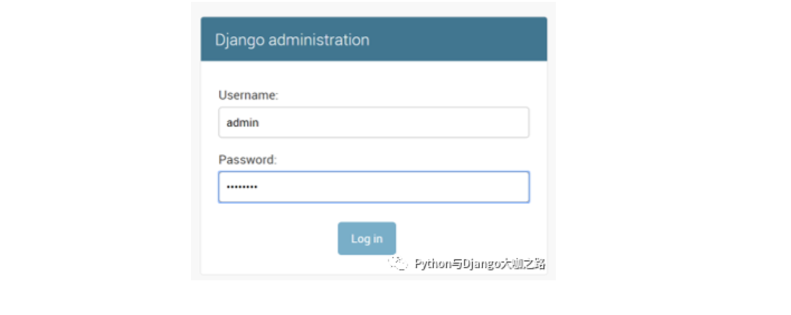
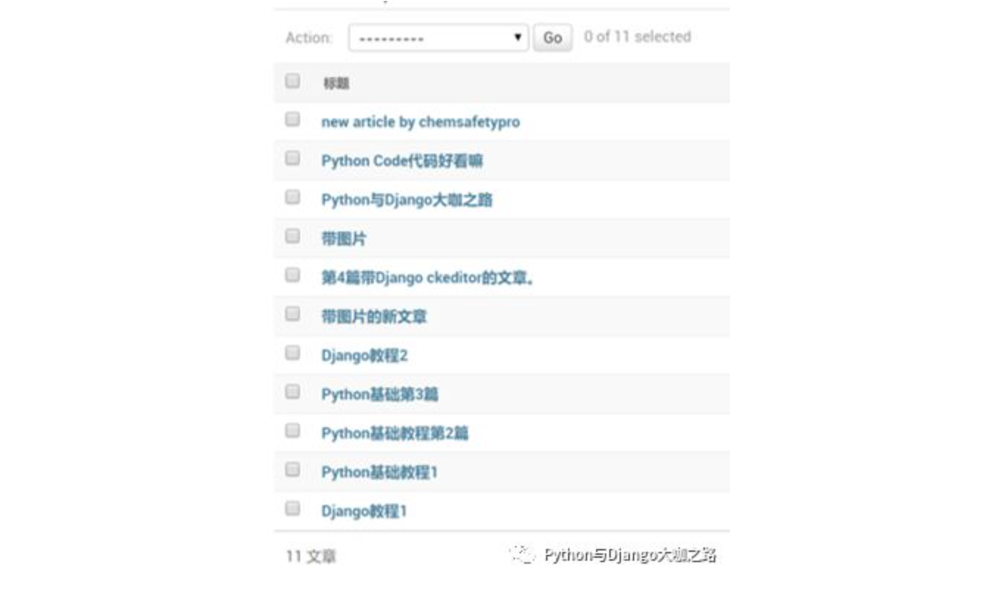
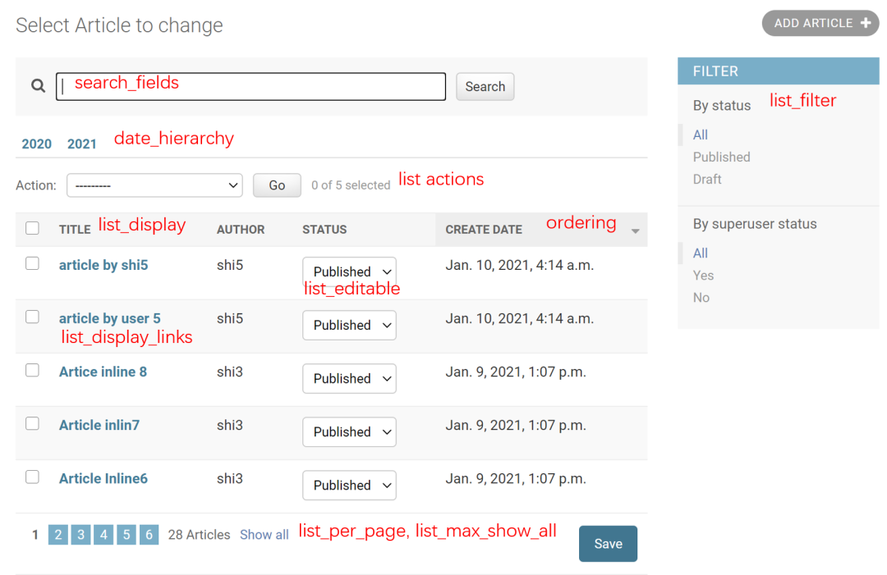
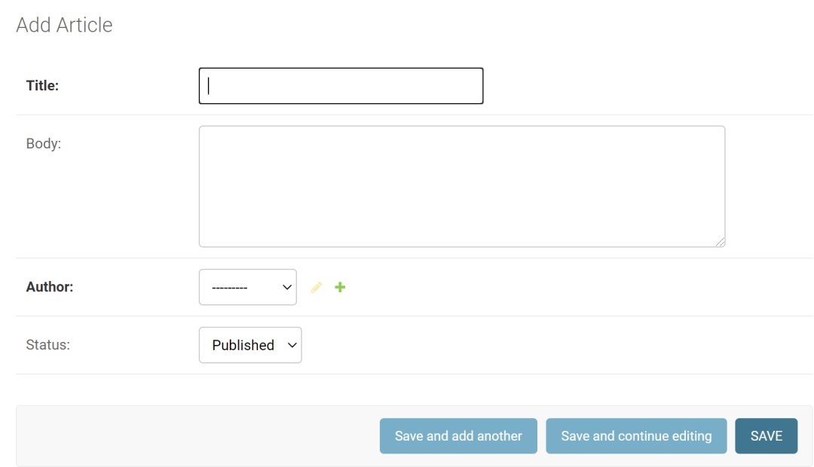
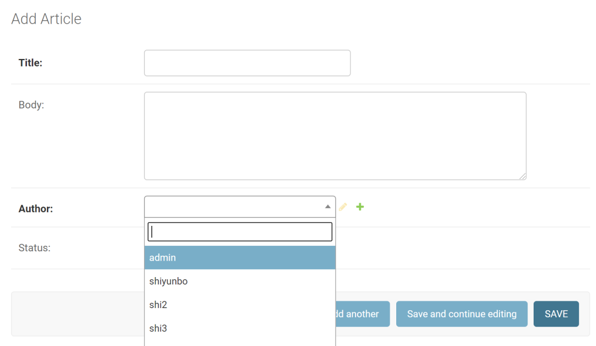
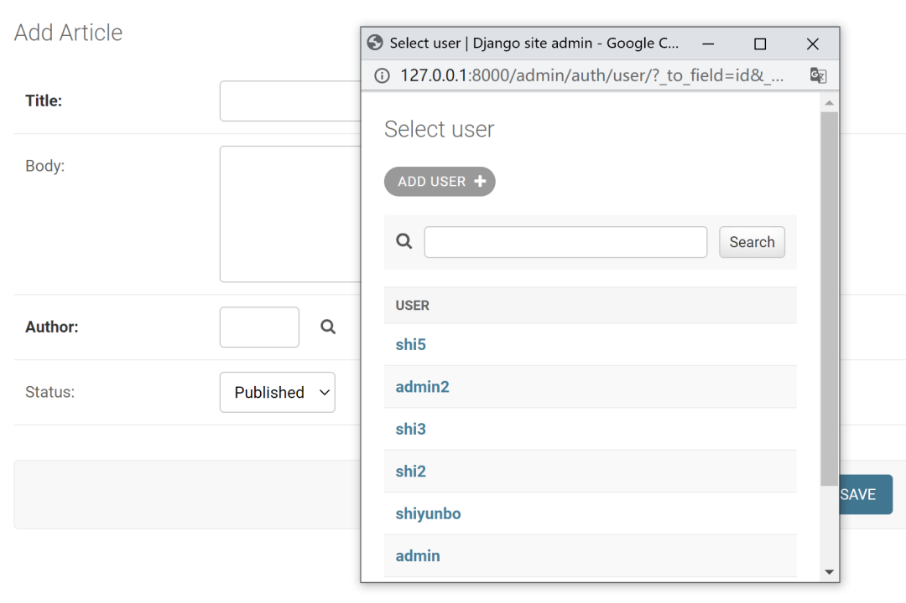
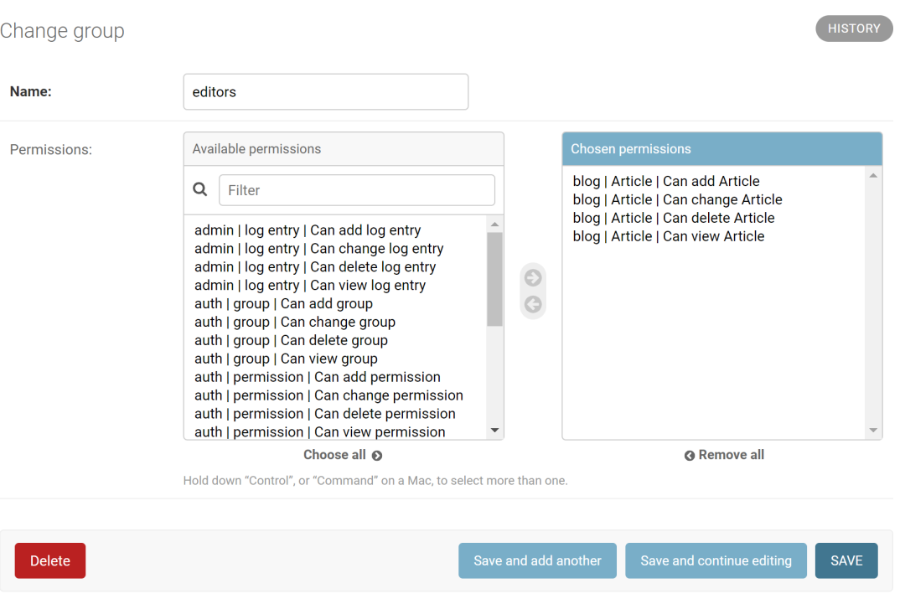
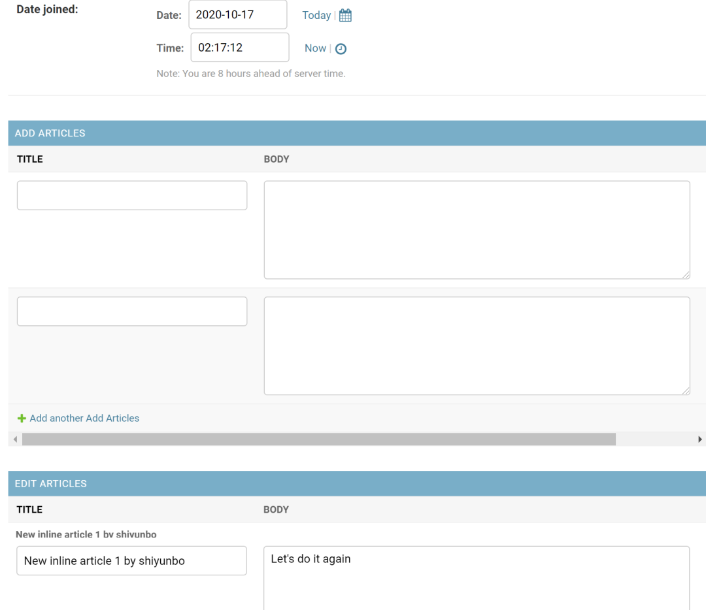

# Django管理后台(Admin)入门


## 目录


1. TOC
{:toc}

---
Django提供了一个开箱即用的专业、多功能的管理后台 (admin)。仅需几行代码，你就可以根据你的模型创建专业的管理后台，让受信任的用户可以管理您网站上的数据和内容。


## 为什么要使用Django Admin

Django自带的admin管理后台就像诸葛亮的媳妇黄月英，虽然不漂亮，但却拥有和诸葛亮一样的才华。使用Django Admin，一行代码即可增加对一个模型(数据表)的增删查改。试想如果你要自己手动编写后台对一个模型进行增删查改，你一般需要4个urls, 4个视图函数或通用视图和4个模板。当一个项目比较大包含多个app时，而每个app又包含多个模型(数据表)时, 那么编写和维护整个项目管理后台的工作量可想而知。如果你的管理后台主要是内部人员使用，你完全不需要太过在意它的外观。

## 如何使用Django Admin
### 创建超级用户superuser
使用Django admin的第一步是创建超级用户(superuser)。进入你的项目文件夹, 使用如下命名，输入用户名和密码即可创建管理员。

```
$ python manage.py createsuperuser
```
此时你访问http://127.0.0.1:8000/admin/, 你就可以使用用户名和密码登录了。



### 注册模型
假设你有一个叫`blog`的APP, 里面包含了一个叫`Article`的模型, 你想对文章进行管理, 你只需找到blog目录下的`admin.py`，使用`admin.site.register`方法注册`Article`模型。代码如下所示:

```python
#blog/admin.py
from django.contrib import admin
from .models import Article

# Register your models here.
admin.site.register(Article)
```

此时你登录admin后点击Article模型，你会看到如下管理界面，点击标题即可对文章进行修改。不过只有文章的标题title被显示，太简单，没有显示作者，没有显示发布日期，也没有分页，也没有过滤条件。



### 自定义数据表显示选项

我们需要自定义数据表中哪些字段可以显示，哪些字段可以编辑，并对数据表中的条目进行排序，同时定义过滤选项。Django的ModelAdmin自带的`list_display`, `list_filter`, `list_per_page`, `list_editable`, `date_hierarchy`和`ordering`选项可以轻松帮我们做到。

要自定义数据表显示字段，我们只需对上述代码做出如下改进。我们先定义`ArticleAdmin`类，然后使用`admin.site.register(Article, ArticleAdmin)`方法即可。

```
# blog/admin.py
from django.contrib import admin
from .models import Article
from django.utils.html import format_html

class ArticleAdmin(admin.ModelAdmin):
    # 定制哪些字段需要展示
    list_display = ('title', 'author', 'status', 'create_date', )
    
    # list_display_links = ('title', ) # 默认
    # sortable_by # 排序

    '''定义哪个字段可以编辑'''
    list_editable = ('status', )

    '''分页：每页10条'''
    list_per_page = 5

    '''最大条目'''
    list_max_show_all = 200 #default

    '''搜索框 ^, =, @, None=icontains'''
    search_fields = ['title']

    '''按日期分组'''
    date_hierarchy = 'create_date'

    '''默认空值'''
    empty_value_display = 'NA'

    '''过滤选项'''
    list_filter = ('status', 'author__is_superuser', ) 

admin.site.register(Article, ArticleAdmin)
```

此时登录django后台访问Article模型你将看到如下基础显示效果。我们将从这里开始展示django自带admin后台更高级的用法。



### 自定义list_display显示字段

目前文章列表中的文章创建日期是英文字段，不是我们想要的。我们可以自定义一个时间格式(比如以2020-11-09 15:00)展示，并以红色标注。

此时修改我们的`admin.py`, 在ArticleAdmin类中新增一个`custom_date`方法，把其加入`list_display`选项，如下所示：

```python
# Register your models here.
class ArticleAdmin(admin.ModelAdmin):


    # Custom admin list view
    list_display = ('title', 'author', 'status', 'create_date', 'custom_date', )
    '''中间省略'''    
    '''custom field on list view'''
    def custom_date(self, obj):
        return format_html(
            '<span style="color: red;">{}</span>',
            obj.create_date.strftime("%Y-%m-%d %H:%M:%S")
        )


    custom_date.short_description = '定制格式及颜色'
```
新的展示效果如下所示：


### 优化ForeignKey或多对多字段的选择

Django admin中添加或修改一个对象时，对ForeignKey字段默认使用下拉菜单显示。例如本例中文章模型的`author`是一个ForeignKey外键。当你在admin中创建新的文章时，你将看到如下界面。当作者很少的时候，你可以轻松选择文章作者。当用户非常多的时候，下拉菜单变得非常长，此时通过下拉菜单选择作者非常不方便，效率低下。



一个更好的方式是使用`autocomplete_fields`或者`raw_id_fields`。前者使用基于jquery select2带搜索框的下拉菜单，适合中等数量的选项。后者使用弹出窗口搜索对象，适合数量非常多的选项。

*修改admin.py，添加autocomplete_fields*
```python
# Register your models here.
class ArticleAdmin(admin.ModelAdmin):

    list_display = ('title', 'author', 'status', 'create_date', 'custom_date', )
    '''中间省略'''
    autocomplete_fields = ['author'] # use select2 to select user    
```
`autocomplete_fields`的展示效果如下所示，效果好得惊人。



*再修改admin.py, 使用raw_id_fields*

```python
# Register your models here.
class ArticleAdmin(admin.ModelAdmin):

    list_display = ('title', 'author', 'status', 'create_date', 'custom_date', )
    '''中间省略'''    
    raw_id_fields = ("author",) # use a pop-out search window for a foreign key   
```

`raw_id_fields`展示效果如下所示。ForeinKey字段旁多了个放大镜，展示效果也相当不错。



本例模型中不涉及多对多字段，但在实际应用中django admin对于多对多字段使用多选下拉菜单，也非常不方便，建议选择使用`filter_horizontal`或`filter_vertical`设置，其展示效果为双向穿梭选择器，如下所示：



###  使用Inline表单

本例中author和article是单对多的关系，前面案例中文章都是逐一添加的。如果我们希望在创建或编辑用户的时候，就一次性添加多篇文章怎么操作呢? 答案是使用inline表单。

我们首先用Article模型创建两个Inline类，一个用于展示和编辑已创建的文章列表，一个用于一次性添加多篇文章。由于Article模型可能有多个ForeignKey(比如category或author), 我们这里必需通过fk_name选项指定在那个ForeinKey的模型里使用创建的inlines类。

```python
from django.contrib.auth import get_user_model
User = get_user_model()


class ArticleListInline(admin.TabularInline):
    model = Article
    # Article模型可能有多个外键，这里指定使用author这个外键，
    fk_name = "author"
    # readonly_fields = ('title', 'body', 'status')
    # can_delete = False
    max_num = 3

    verbose_name = _('Edit Articles')
    verbose_name_plural = _('Edit Articles')
    extra = 2 # 

    """ 不允许这个inline类增加记录  """
    def has_add_permission(self, request, obj=None):
        return False

class ArticleAddInline(admin.TabularInline):
    model = Article
    fk_name = "author"
    extra = 2
    can_delete = False

    verbose_name = _('Add Articles')
    verbose_name_plural = _('Add Articles')

    """ 这时仅用于添加数据的Inline，返回空的queryset """
    def get_queryset(self, request):
        queryset = super().get_queryset(request)
        return queryset.none()
```

然后将创建的`ArticleInline类与UserAdmin`相关联。

```python
class UserAdmin(admin.ModelAdmin):
    search_fields = ['username']

    inlines = [
        ArticleAddInline,
        ArticleListInline,
    ]

admin.site.unregister(User)
admin.site.register(User, UserAdmin)
```

此时当你创建或编辑用户时，你可以看到或编辑该用户已创建的文章。你还可以一次性为该用户添加多篇文章，如下所示：



## 小结

本文以实例展示了如何自定义admin。在Django Admin进阶篇，我们会介绍如何重写`save_model`, `get_queryset`等多种方法以及如何自定义`list_filter`和`actions`。在接下来的入门教程里，我们会陆续介绍发送邮件、session、分页、图片和文件的上传和下载等基础知识。

原创不易，转载请注明来源。我是大江狗，一名Django技术开发爱好者。您可以通过搜索【<a href="https://blog.csdn.net/weixin_42134789">CSDN大江狗</a>】、【<a href="https://www.zhihu.com/people/shi-yun-bo-53">知乎大江狗</a>】和搜索微信公众号【Python Web与Django开发】关注我！


