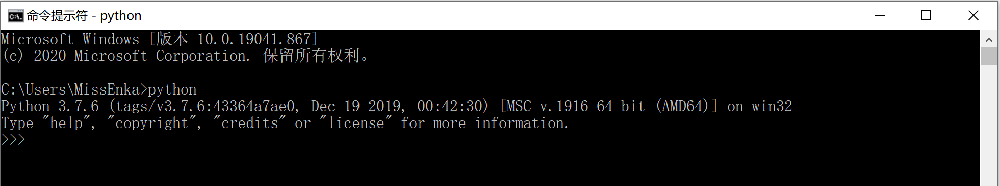
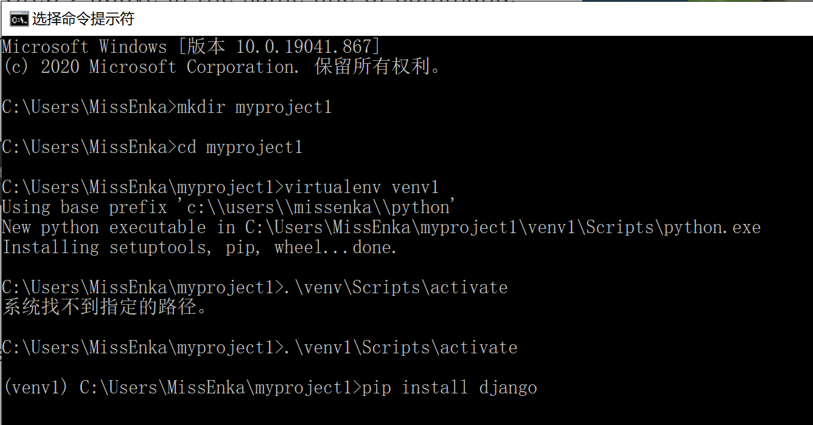
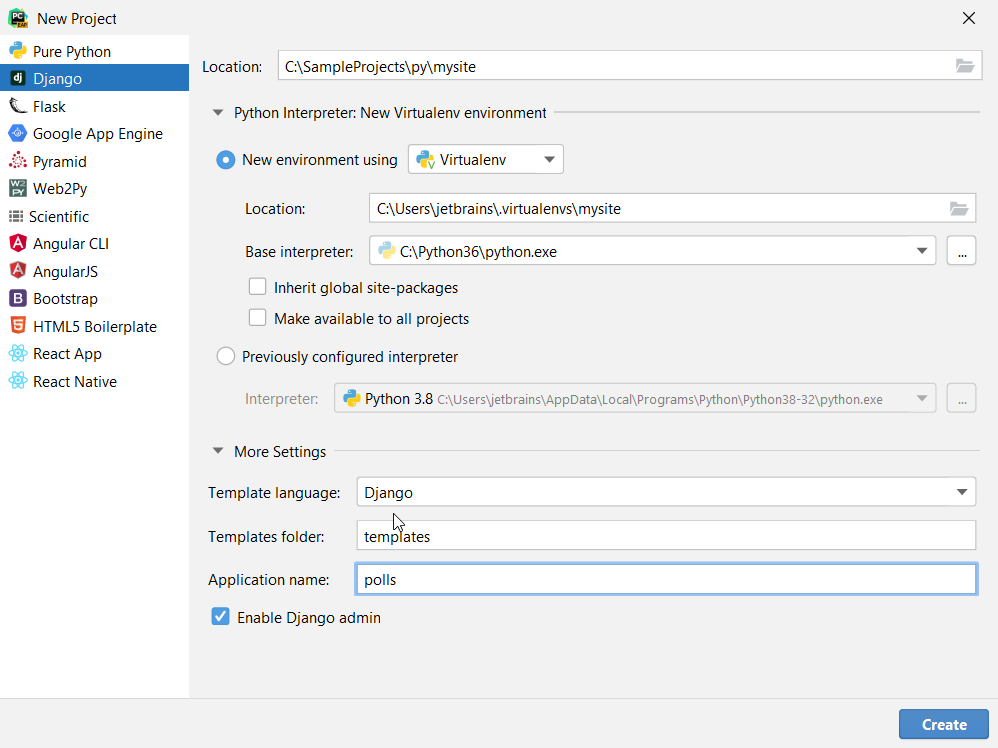
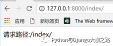

# Django的安装及第一个项目


## 目录


1. TOC
{:toc}

---

Django是一个强大的Python Web框架。本教程将教你如何安装虚拟环境和指定Django版本并通过一个简单的案例演示如何使用它。


## 如何安装Django

### 检查Python版本

安装Django前先确保你的电脑或服务器上已经安装了Python的开发环境, 查看Python版本。这是因为Django版本可能与已安装的Python版本不兼容，比如Django 3.1仅支持Python 3.6、3.7、3.8或更高版本。

要查看已安装Python版本，Linux上可以直接在命令行输入Python，Windows系统下需要通过CMD进入终端后输入python命令查看python的版本，如下所示：



### 创建虚拟环境
如果你在一台电脑上创建多个Python Web项目，每个项目会依赖不同版本的Python及第三方库，允许多个项目时大概率存在依赖冲突。更好的方式每个项目都有自己独立的开发环境，然后把项目所有依赖安装到隔离的环境中去，这就是虚拟环境的作用。

你可以通过Virtualenv或Pipenv创建虚拟环境，这里我们使用virtualenv。在linux和windows系统下，你均可以通过pip命令安装它。

```bash
# virtualenv的安装
pip install virtualenv
# 创建虚拟环境
virtualenv venv1
# 激活虚拟环境
.\venv1\Scripts\activate
# 退出虚拟环境
deactivate
```

接下来我们要创建一个存放Django项目代码的文件夹(这里为`myproject1`)，cd进入`myproject1`后使用`virtualenv venv1`命令创建一个名为`venv1`的虚拟环境，最后使用`.\venv1\Scripts\activate`激活虚拟环境（注意虚拟环境名别输错了)。当你看到项目文件夹的路径前面多了`(venv1)`括号时，说明你已进入虚拟环境了。



以上创建和激活虚拟环境的过程有些繁琐。如果你使用PyCharm创建Django项目的话，可以省去很多麻烦，只需在创建Django项目勾选使用Virtualenv创建虚拟环境，并选择合适的Python编译器版本即可。



### Django的安装及测试

进入虚拟环境或PyCharm提供的terminal终端，输入如下命令即可安装最新Django版本。当然你还可以通过`==`指定所需的Django版本。

```bash
pip install django
pip install django==3.1.6 # 安装指定版本
```

在Linux系统的命令行或windows的CMD终端中输入python即进入Python交互环境(shell)，然后可通过查看已安装的Django版本来确定Django已安装成功。

```bash
>>> import django
>>> print(django.get_version())
3.1.6
```

## 第一个Django项目

进入`myproject1`的虚拟环境, 使用如下命令创建一个名为`mysite`的项目。

```bash
 django-admin startproject mysite
```

你会看到`myproject1`目录下增加了一个名为`mysite'的文件夹和多个文件。每个文件夹和文件的作用如下所示：

```bash
mysite/ # 根目录
    manage.py # Django命令行工具
    mysite/ # 项目配置目录
        __init__.py # 空文件，告诉python这个目录是python包
        settings.py # 项目配置文件
        urls.py # 项目所有urls声明汇总
        asgi.py # ASGI服务器的入口文件
        wsgi.py # WSGI服务器的入口文件
```

现在进入命令终端使用如下命令启动测试服务器：

```
python manage.py runserver
```

此时打开浏览器访问http://127.0.0.1:8000/，你将看到熟悉的火箭标志页面(图片来源于网络)，如下所示：


## 编写自己的首页打印请求地址

前面展示的主页是Django自带的，现在我们要开始编写自己的首页，打印出当前请求路径。不过我们首先要创建一个新的应用(app)来实现这个功能。Django的一个项目(project)是可以包含多个应用(app)。
### 创建新的app
使用`python manage.py startapp demo`命令创建一个名为demo的应用，然后把其加入项目配置文件`settings.py`的INSTALLED_APPS中去, 如下所示。这是你会发现`mysite`目录下多了`demo`文件夹，专门存放与应用相关的文件比如视图`views.py`和`urls.py`。

```python
INSTALLED_APPS = [
    'django.contrib.admin',
    'django.contrib.auth',
    'django.contrib.contenttypes',
    'django.contrib.sessions',
    'django.contrib.messages',
    'django.contrib.staticfiles',
    'demo', # 注册app
]
```

然后编辑`mysite/urls.py`, 把demo应用的urls也加入到项目的urls中去，如下所示：

```python
from django.contrib import admin
from django.urls import path, include

urlpatterns = [
    path('admin/', admin.site.urls),
    path('', include('demo.urls')) # 加入app对应urls
]
```

### 编写视图函数和 URL 配置

编辑`demo/views.py`, 新增一个名为index的视图函数。每个视图函数的第一个默认参数都必需是`request`, 它是一个全局变量。Django把每个用户请求封装成了`request`对象，它包含里当前请求的所有信息，比如请求路径`request.path`, 当前用户`request.user`以及用户通过POST提交的数据`request.POST`。

index视图函数通过调用`HttpReponse`方法打印输出当前的请求路径`request.path`。

```python
# demo/views.py
from django.http import HttpResponse

def index(request):
    return HttpResponse("请求路径:{}" .format(request.path))
```

接下来我们要进行URL配置。新建`demo/urls.py`, 添加如下代码，其作用是将用户请求的地址与实际需要执行的视图函数相关联。下例中当用户在浏览器中访问index/时，Django将解析url，并调用执行views.py中的index视图函数。

```python
# demo/urls.py

from django.urls import path
from . import views

app_name = "demo"
urlpatterns = [
    path('index/', views.index, name='index'),
]
```

### 测试访问

使用`python manage.py runserver`命令重新启动测试服务器，并访问http://127.0.0.1:8000/index/, 你将看到如下页面：




## 小结

本文介绍了如何安装Django并使用它，并提供了一个打印当前请求路径的演示案例。然而演示案例中没有用到数据库，而输出的内容也没有美化格式。实际应用中我们向客户端输出的数据大多来自数据库，会通过漂亮的模板或客户端向用户展示数据，这就涉及到模型和模板的使用了。我们后面会做详细介绍。

原创不易，转载请注明来源。我是大江狗，一名Django技术开发爱好者。您可以通过搜索【<a href="https://blog.csdn.net/weixin_42134789">CSDN大江狗</a>】、【<a href="https://www.zhihu.com/people/shi-yun-bo-53">知乎大江狗</a>】和搜索微信公众号【Python Web与Django开发】关注我！


