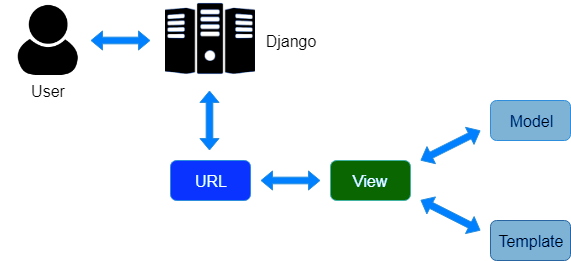
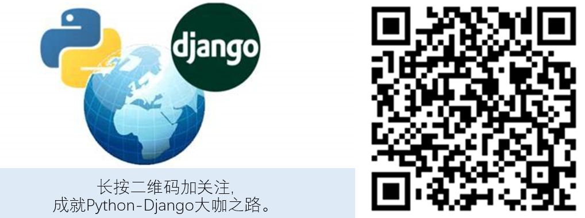

# Django的MVT设计模式


## 目录


1. TOC
{:toc}

---

本章我们将介绍下经典的软件开发所遵循的MVC (Model-View-Controller, 模型-视图-控制器) 设计模式以及Django的MVT设计模式(Model-View-Template)是如何遵循这种设计理念的。


## 经典的MVC设计模式及其优点

MVC即 Model-View-Controller(模型-视图-控制器) ，是经典的软件开发设计模式。

- **Model (模型) **： 简而言之即数据模型。模型不是数据本身（比如数据库里的数据），而是抽象的描述数据的构成和逻辑关系。通常模型包括了数据表的各个字段（比如人的年龄和出生日期）和相互关系（单对单，单对多关系等)。Web开发框架会根据模型的定义来自动生成数据表。
- **View (视图)**： 主要用于显示数据，用来展示用户可以看到的内容或提供用户可以输入或操作的界面。数据来源于哪里？当然是数据库啦。那么用户输入的数据给谁? 当然是给控制器啦。
- **Controller(控制器)**：应用程序中处理用户交互的部分。通常控制器负责从视图读取数据，控制用户输入，并向模型发送数据（比如增加或更新数据表）。

如果把MVC比喻成一个粽子，那么View就是最外面一层的绿色玉米叶，是吃货们可以直接看到的。Controller就是中间那层熟糯米，而粽子的核心自然是最里面那一层的肉馅Model模型了。现在大家知道中学和大学数学建模的重要性了吧?

MVC最大的优点是实现了软件或网络应用开发过程中数据、业务逻辑和用户界面的分离，使软件开发更清晰，也是维护变得更容易。这与静态网页设计中使用html和css实现了内容和样式的分离是同一个道理。

## Django是如何遵循MVC设计模式的?
Django的MVT设计模式由Model(模型), View(视图) 和Template(模板)三部分组成，分别对应单个app目录下的models.py, views.py和templates文件夹。它们看似与MVC设计模式不太一致，其实本质是相同的。Django的MVT设计模式与经典的MVC对应关系如下。

- **Django Model(模型)**: 这个与经典MVC模式下的模型Model差不多。
- **Django View(视图)**: 这个与MVC下的控制器Controller更像。视图不仅负责根据用户请求从数据库读取数据、指定向用户展示数据的方式(网页或json数据), 还可以指定渲染模板并处理用户提交的数据。
- **Django Template(模板)**: 这个与经典MVC模式下的视图View一致。模板用来呈现Django view传来的数据，也决定了用户界面的外观。Template里面也包含了表单，可以用来搜集用户的输入内容。

Django MVT设计模式中最重要的是视图(view), 因为它同时与模型(model)和模板(templates)进行交互。当用户发来一个请求(request)时，Django会对请求头信息进行解析，解析出用户需要访问的url地址，然后根据路由urls.py中的定义的对应关系把请求转发到相应的视图处理。视图会从数据库读取需要的数据，指定渲染模板，最后返回响应数据。这个过程如下图所示：



## 示例

现在我们以示例演示Django的MVT三部分是如何工作的。

### 新建app并注册

假如你有一个`mysite`项目，希望新增一个任务管理小应用，你首先要使用`python manage.py startapp tasks`的命令创建一个名为tasks的app，将它加入到`settings.py`中的INSTALLED_APP中去。

```
# mysite/settings.py

INSTALLED_APPS = [
    'django.contrib.admin',
    'django.contrib.auth',
    'django.contrib.contenttypes',
    'django.contrib.sessions',
    'django.contrib.messages',
    'django.contrib.staticfiles',
    'tasks',
]
```

然后把tasks应用的urls添加到到项目的urls中去。

```python
# mysite/urls.py

from django.contrib import admin
from django.urls import path, include

urlpatterns = [
    path('admin/', admin.site.urls),
    path('tasks/', include('tasks.urls'))
]

```

### 创建模型(M)

编辑tasks目录下`models.py`创建Task模型, Task模型包含里名称name和状态status两个字段。当你使用`python manage.py makemigrations`和`python manage.py migrate`命令时，Django会自动为你在数据库创建数据表(默认使用的数据库是免费的sqlite)，表名为`tasks_task`。

```python
    # tasks/models.py
    
    from django.db import models
    
    class Status(models.TextChoices):
        UNSTARTED = 'u', "Not started yet"
        ONGOING = 'o', "Ongoing"
        FINISHED = 'f', "Finished"
    
    # Task模型
    class Task(models.Model):
        name = models.CharField(verbose_name="Task name", max_length=65, unique=True)
        status = models.CharField(verbose_name="Task status", max_length=1, choices=Status.choices)
    
        def __str__(self):
            return self.name
```

### 编写视图并配置路由URL(V)
接下来我们要编辑视图`views.py`，并新增一个视图函数 `task_list`, 用于展示任务清单。该视图函数从数据库读取了Task对象列表，指定了渲染模板并向模板传递了数据。

```python
# tasks/views.py
from django.shortcuts import render
from .models import Task

# 任务清单
def task_list(request):
    # 从数据库获取Task对象列表
    tasks = Task.objects.all()
    # 指定渲染模板并向模板传递数据
    return render(request, "tasks/task_list.html", { "tasks": tasks,})
```

光编写视图(views.py)还不够，我们还得为写好的视图函数配置路由，这样才能将视图函数与用户的请求地址建立好对应关系。编辑或创建`tasks/urls.py`, 添加如下代码：

```python
# tasks/urls.py
from django.urls import path
from . import views

# namespace
app_name = 'tasks'

urlpatterns = [
    # Retrieve task list
    path('', views.task_list, name='task_list'),
]
```

这样当用户访问/tasks/时，Django将调用`task_list`视图函数。这个视图函数将同时与数据库和模板进行交互。

### 编辑模板(T)
最后我们要创建`task_list.html`用于展示视图传来的任务列表数据。这个文件的完整路径为`tasks/templates/tasks/task_list.html`。至于模板为什么放这里，我们后续会专门介绍。Django还提供了自己的模板语言，包括常见的判断和循环，专门用来渲染模板。

```html

# tasks/templates/tasks/task_list.html
<!DOCTYPE html>
<html lang="en">
<head>
    <meta charset="UTF-8">
    <title>Task List</title>
</head>
<body>
<h3>Task List</h3>

    <p>{{ forloop.counter }}. {{ task.name }} - {{ task.get_status_display }}
    </p>

</body>
</html>

```

当然此时如果你通过浏览器访问/tasks/, 还看不到任何内容，这是因为你的数据表里还没有任何数据。你可以通过django的admin添加或新增`task_create`视图实现。

## 小结

Django的MVT设计模式也遵循了软件设计经典的MVC设计模式。事实上我们在日常Django项目开发过程中一般也是先编写M，再编写V，最后才写T。下篇文章中我们将按MVT的顺序编写一个完整的CRUD(增删查改)小应用。

原创不易，转载请注明来源。我是大江狗，一名Django技术开发爱好者。您可以通过搜索【<a href="https://blog.csdn.net/weixin_42134789">CSDN大江狗</a>】、【<a href="https://www.zhihu.com/people/shi-yun-bo-53">知乎大江狗</a>】和搜索微信公众号【Python Web与Django开发】关注我！



