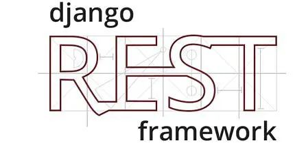

# 为什么要学习Django REST Framework (DRF), 什么是符合RESTful规范的API?


## 目录


1. TOC
{:toc}

---
Django的未来与Web开发未来发展趋势紧密相关。Django这种基于MVC开发模式的传统框架，非常适合开发基于PC的传统网站，因为它同时包括了后端的开发(逻辑层、数据库层) 和前端的开发(如模板语言、样式)。然而最近几年及未来几年更流行的开发模式肯定是前后端分离, Django也需要做出自己的改变来适应这种开发模式。现代网络应用Web APP或大型网站一般是一个后台，然后对应各种客户端(iOS, android, 浏览器)。由于客户端的开发语言与后台的开发语言经常不一样，这时需要后台能够提供可以跨平台跨语言的一种标准的资源或数据(如json或xml)供前后端沟通，这就是Web API(网络应用程序接口)的作用了。

## 为什么要学习Django REST Framework (DRF)？

Django本身并不是为了开发符合REST规范的Web API而设计, 不过借助Django REST Framework (DRF)这个神器我们可以快速开发出优秀而且规范的Web API来。Django REST framework 给Django提供了用于构建Web API 的强大而灵活的工具包, 包括序列化器、认证、权限、分页、过滤和限流。所以我们这里要感谢DRF，因为它，Django的应用前景更广了，减少了被淘汰的风险。


## Django REST Framework的安装

Django REST framework (DRF)是基于Django实现的一个RESTful风格API框架，能够帮助我们快速开发RESTful风格的API，文档地址如下所示:

- 官网：https://www.django-rest-framework.org/

DRF可以使用pip安装，安装前请确保你已经安装了Django。

```bash
pip install djangorestframework
```

如果想要获取一个图形化的页面来操作API，需要将 `rest_framework `注册到项目的`INSTALL_APPS`中，如下所示：

```bash
INSTALLED_APPS = [
    'django.contrib.admin',
    'django.contrib.auth',
    'django.contrib.contenttypes',
    'django.contrib.sessions',
    'django.contrib.messages',
    'django.contrib.staticfiles',
    'rest_framework',
    'your_app', # 你自己的app
]
```

现在我们已经安装好DRF了，但在正式使用它开发API前我们还需要了解两件事情。什么是数据的序列化(Serialization)以及什么是RESTful规范的API, 这对于理解DRF中的序列化serializers类和每个API端点对应的url设计至关重要。

## 序列化基础知识

每种编程语言都有各自的数据类型, 将属于自己语言的数据类型或对象转换为可通过网络传输或可以存储到本地磁盘的数据格式（如：XML、JSON或特定格式的字节串）的过程称为序列化(seralization)；反之则称为反序列化。

API开发的本质就是各种后端语言的自己的数据类型序列化为通用的可读可传输的数据格式，比如常见的JSON类型数据。

### Python数据序列化

举个简单例子。Python自带json模块的dumps方法可以将python常用数据格式（比如列表或字典)转化为json格式,如下所示。你注意到了吗? 生成的json格式数据外面都加了单引号，这说明dict类型数据已经转化成了json字符串。

```bash
>>> import json
>>> json.dumps({"name":"John", "score": 112})
'{"name": "John", "score": 112}'
```

### Django查询集序列化

Django编程就是是python编程，以上所介绍的序列化方法对django也是适用的。不同的是Django还有自己专属的数据类型比如查询集QuerySet和ValueQuerySet类型数据，还提供了自带的serializers类。使用Django自带的serializers类也可以轻易将QuerySet格式的数据转化为json格式。

```python
# Django Queryset数据 to Json
from django.core import serializers
data = serializers.serialize("json", SomeModel.objects.all())
data1 = serializers.serialize("json", SomeModel.objects.all(), fields=('name','id'))
data2 = serializers.serialize("json", SomeModel.objects.filter(field = some_value))
```
有时候我们只需要查询结果集的部分字段，可以使用`values('字段名','字段名2')`来要求返回所需要的数据，可以提升些性能，但是返回来的结果需要先转换成列表格式，再用` json.dumps()`方法序列化成json格式。示例代码如下所示:

```python
import json
from django.core.serializers.json import DjangoJSONEncoder

queryset = myModel.objects.filter(foo_icontains=bar).values('f1', 'f2', 'f3')
data4 = json.dumps(list(queryset), cls=DjangoJSONEncoder)
```
尽管Django自带的serializers类也能将Django的查询集QuerySet序列化成json格式数据，Django REST Framework才是你真正需要的序列化工具。与django自带的serializers类相比，DRF的序列化器更强大，可以根据模型生成序列化器，还能对客户端发送过来的数据进行验证。

## 什么是符合RESTful规范的API?

REST是REpresentational State Transfer三个单词的缩写，由Roy Fielding于2000年论文中提出。简单来说，就是用URI表示资源，用HTTP方法(GET, POST, PUT, DELETE)表征对这些资源进行增删查改的操作。而如果你自己开发的API被称为RESTful API，就需要遵循其规定的约束。网上有很多文章对RESTful API规范做了详细介绍, 比如阮一峰的博客和简书, 我们这里只摘取总结部分精华内容，因为我们后面会用到。

### 协议、域名和版本
尽量使用https协议，使用专属域名来提供API服务。API版本可以放在URL里面，也可以用HTTP的header进行内容协商，如下所示：

```bash
https://api.example.com/v1
https://www.example.com/api/v1 
```

### uri(统一资源标识符)

在RESTful架构中，每个网址代表一种资源（resource），这个网络地址就是uri (uniform resource identifier), 有时也被称为URL (uniform resource locator)。 因为URI对应一种资源，所以里面不能有动词，只能有名词。一般来说，数据库中的表都是同种记录的"集合"（collection），所以API中的名词也应该使用复数形式。

```bash
https://api.example.com/v1/users # 用户列表资源地址
https://api.example.com/v1/users/{id} # 用户id=5对应资源。注意：这里是users/5，而不是user/5
https://api.example.com/v1/users/{id}/articles # 用户id=5发表的文章列表
```

如果需要对一个用户信息进行编辑或删除，一个传统Django开发者可能将URL写成如下所示：

```bash
https://api.example.com/v1/users/{id}/edit/ # 编辑用户
https://api.example.com/v1/users/{id}/delete/ # 删除用户
```

上面URL设计其实是不符合RESTful规范的。一个 URI就应该是一个资源，本身不能包含任何动作 (action)。REST的规范是资源的URI地址是固定不变的，对同一资源应使用不同的HTTP请求方法进行不同的操作，比如常见的增删查改。

```bash
[POST]    https://api.example.com/v1/users   // 新增
[GET]     https://api.example.com/v1/users/1 // 查询
[PATCH]   https://api.example.com/v1/users/1 // 更新
[PUT]     https://api.example.com/v1/users/1 // 覆盖，全部更新
[DELETE]  https://api.example.com/v1/users/1 // 删除
```

有时候URL比较长，可能由多个单词组成，建议使用中划线"-"分割，而不是下划线"_"作为分隔符，另外每个url的结尾不能加斜线"/"。

```bash
https://api.example.com/v1/user-management/users/{id} # 好
https://api.example.com/v1/user_management/users/{id} # 不好
https://api.example.com/v1/user-management/users/{id}/ # 不好
```

### HTTP请求方法

常用的HTTP请求方法有下面五个（括号里是对应的SQL命令)，每个方法对应一个操作。客户端在消费服务器提供的API服务时不仅要指定请求地址，还需指定请求方法。

```sql
GET（SELECT）：从服务器取出资源（一项或多项）。
POST（CREATE）：在服务器新建一个资源。
PUT（UPDATE）：在服务器更新资源（客户端提供改变后的完整资源）。
PATCH（UPDATE）：在服务器更新资源（客户端提供改变的属性）。
DELETE（DELETE）：从服务器删除资源。
```

另外还有两个不常用方法`HEAD`和`OPTIONS`，`HEAD`和`GET`本质是一样的，区别在于`HEAD`不含有呈现数据，而仅仅是HTTP头信息。`OPTIONS`极少使用，它主要用于获取当前URL所支持的方法。

**小编注**：不像Django，DRF支持所有以上请求方法。

### 过滤（filtering）

如果记录数量很多，服务器不可能都将它们返回给用户。符合RESTful规范的API应该支持过滤。下面是一些常见的通过参数过滤的方式。

```bash
?limit=10：指定返回记录的数量
?offset=10：指定返回记录的开始位置。
?page=2&per_page=100：指定第几页，以及每页的记录数。
?sortby=name&order=asc：指定返回结果按照哪个姓名排序，以及排序顺序。
?user_type_id=1：指定筛选条件，比如用户类型
```
**小编注**：DRF与django-filter联用可以轻松实现过滤。

### 状态码（Status Codes）
服务器在处理客户端请求后还应向用户返回响应的状态码和提示信息，常见的有以下一些状态码。

```bash
200 OK - [GET]：服务器成功返回用户请求的数据，该操作是幂等的（Idempotent）
201 CREATED - [POST/PUT/PATCH]：用户新建或修改数据成功
202 Accepted - [*]：表示一个请求已经进入后台排队（异步任务）
204 NO CONTENT - [DELETE]：用户删除数据成功
400 INVALID REQUEST - [POST/PUT/PATCH]：用户发出的请求有错误，服务器没有进行新建或修改数据的操作，该操作是幂等的。
401 Unauthorized - [*]：表示用户没有权限（令牌、用户名、密码错误）。
403 Forbidden - [*] 表示用户得到授权（与401错误相对），但是访问是被禁止的。
404 NOT FOUND - [*]：用户发出的请求针对的是不存在的记录，服务器没有进行操作，该操作是幂等的。
406 Not Acceptable - [GET]：用户请求的格式不可得（比如用户请求JSON格式，但是只有XML格式）。
410 Gone -[GET]：用户请求的资源被永久删除，且不会再得到的。
422 Unprocesable entity - [POST/PUT/PATCH] 当创建一个对象时，发生一个验证错误。
500 INTERNAL SERVER ERROR - [*]：服务器发生错误
```
**小编注**：DRF给出Respone时可以指定各种各样状态码，很容易使用。

### Hypermedia API

RESTful API最好做到Hypermedia，即返回结果中提供链接，连向其他API方法，使得用户不查文档，也知道下一步应该做什么。比如，当用户向api.example.com的根目录发出请求，会得到这样一个文档。

```json
{"link": {
  "rel":   "collection https://www.example.com/zoos",
  "href":  "https://api.example.com/zoos",
  "title": "List of zoos",
  "type":  "application/vnd.yourformat+json"
}}
```
**小编注**：DRF支持HyperLinkedModel，很容易实现这点。


## 小结

本文总结了为什么要学习Django REST Framework, 什么是序列化和符合RESTful规范的API。下篇文章中我们将以一个简单的博客的实例来详细介绍DRF的使用，开发最基础的Web API，并测试API的使用，欢迎关注。


原创不易，转载请注明来源。我是大江狗，一名Django技术开发爱好者。您可以通过搜索【<a href="https://blog.csdn.net/weixin_42134789">CSDN大江狗</a>】、【<a href="https://www.zhihu.com/people/shi-yun-bo-53">知乎大江狗</a>】和搜索微信公众号【Python Web与Django开发】关注我！

