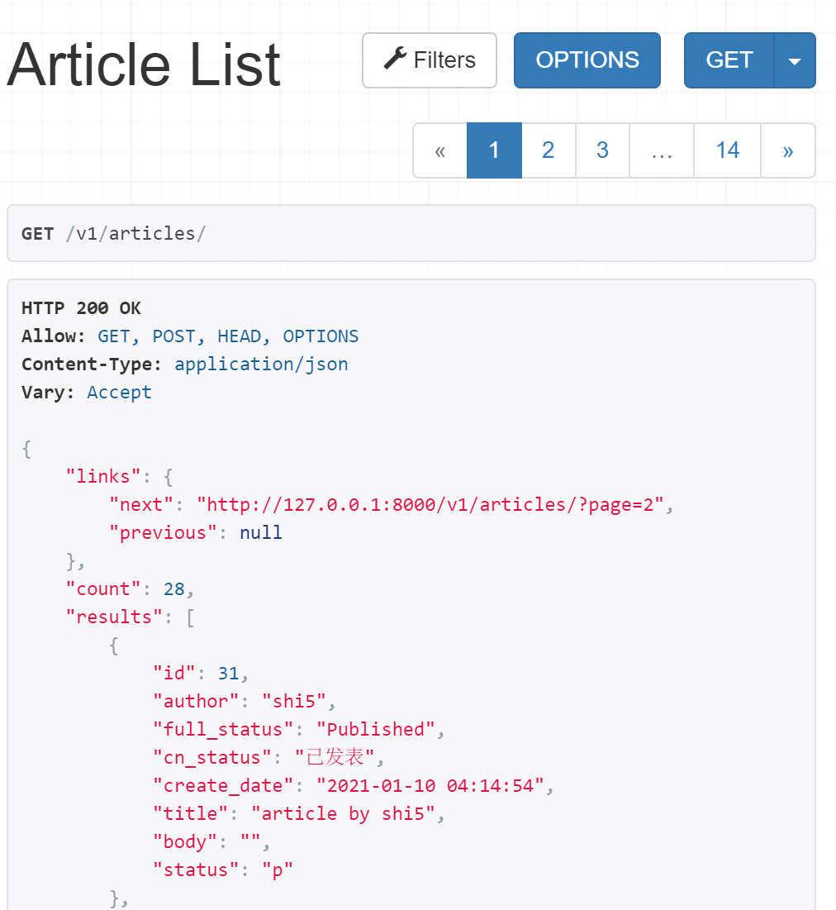
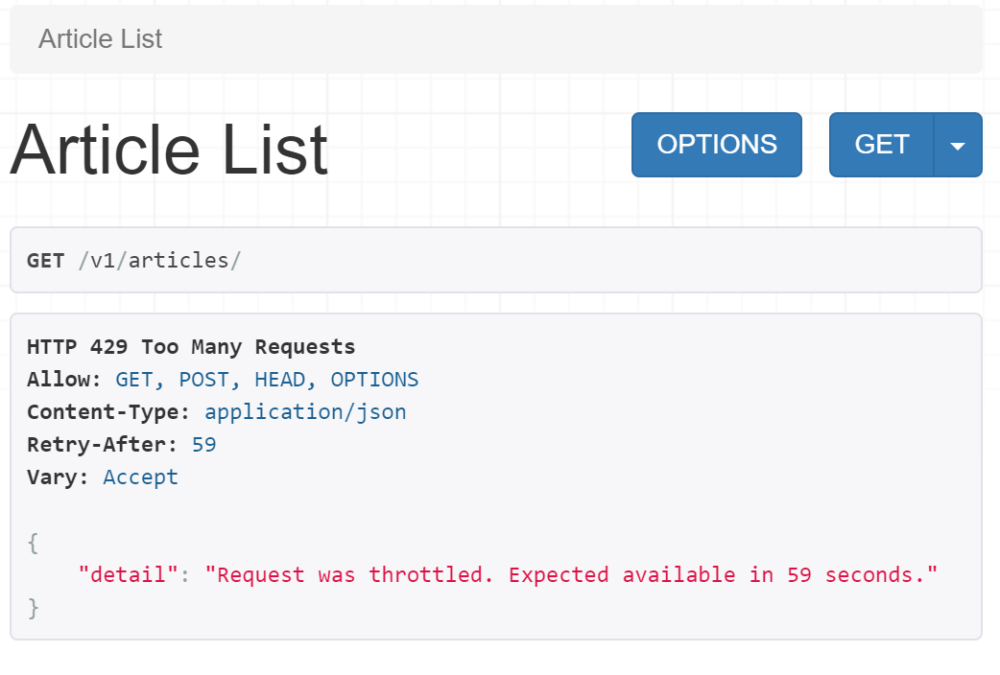

# 限流


## 目录


1. TOC
{:toc}

---
在前面的DRF系列教程中，我们以博客为例介绍了序列化器(Serializer), 并使用APIView和ModelViewSet开发了针对文章资源进行增删查改的完整API端点，并详细对权限、认证(含jwt认证)、分页和过滤进行了总结与演示。在本篇文章中我们将向你详细演示如何在Django REST Framework中对API请求进行限流(Throttle)。


## 什么是限流(Throttle)?
限流(Throttle)就是限制客户端对API 的调用频率，是API开发者必须要考虑的因素。比如个别客户端(比如爬虫程序)短时间发起大量请求，超过了服务器能够处理的能力，将会影响其它用户的正常使用。又或者某个接口占用数据库资源比较多，如果同一时间该接口被大量调用，服务器可能会陷入僵死状态。为了保证API服务的稳定性，并防止接口受到恶意用户的攻击，我们必须要对我们的API服务进行限流。

DRF中限制对API的调用频率非常简便，它为我们主要提供了3个可插拔使用的限流类，分别是`AnonRateThrottle`, `UserRateThrottle`和`ScopeRateThrottle`类。

- AnonRateThrottle 用于限制未认证用户的请求频率，主要根据用户的 IP地址来确定用户身份。
- UserRateThrottle 用于限定认证用户的请求频率，可对不同类型的用户实施不同的限流政策。
- ScopeRateThrottle可用于限制对 API 特定部分的访问。只有当正在访问的视图包含 `throttle_scope` 属性时才会应用此限制。这个与UserRateThrottle类的区别在于一个针对用户限流，一个针对API接口限流。

DRF限制频率的指定格式为 "最大访问次数/时间间隔"，例如设置为 5/min，则只允许一分钟内最多调用接口 5 次。其它常用格式包括"10/s", "100/d"等。超过限定次数的调用将抛出 `exceptions.Throttled` 异常，客户端收到 429 状态码（too many requests）的响应。

下面我们以博客API为例来看下具体使用案例。

## 全局使用限流类

在前面的案例中，当你访问/v1/articles/，你将得到如下所示文章资源列表。这个接口是没有限流的，所以在短时间内你无论刷新多少次浏览器，也不会得到报错。



现在我们要对这个接口增加限流，匿名用户请求频率限制在"2/min"，即一分钟两次，而认证用户请求频率限制在"10/min", 即一分钟10次。

最简单的使用DRF自带限流类的方法，就是在`settings.py`中进行全局配置，如下所示。一是要设置需要使用的限流类，二是要设置限流范围(scope)及其限流频率。`AnonRateThrottle`和`UserRateThrottle`默认的scope分别为"anon"和"user"。该配置会对所有API接口生效。

```python
REST_FRAMEWORK = {
    'DEFAULT_THROTTLE_CLASSES': [
        'rest_framework.throttling.AnonRateThrottle',
        'rest_framework.throttling.UserRateThrottle',

    ],
    'DEFAULT_THROTTLE_RATES': {
        'anon': '2/min',
        'user': '10/min'
    }
}
```
现在短时间内快速刷新你的浏览器或通过postman发送多个请求到/v1/articles，如果你是匿名用户，当你的每分钟请求数量累计达到2次时，你将看到如下返回信息。如果你是认证用户，你的每分钟请求数量达到10次时才会被限流。当你访问其它接口，会受到同样限流限制。



## 视图类或视图集中使用限流类

DRF中还可以在单个视图或单个视图集中进行限流配置，单个视图中的配置会覆盖全局设置。现在我们希望保留`settings.py`的限流全局配置，并专门为文章资源列表/v1/articles定制一个限流类，新的访问频率限制为匿名用户为"5/min", 认证用户为"30/min"，该配置仅对文章资源列表这个接口生效。

我们首先在app文件夹blog目录下新建`throttles.py`, 添加如下代码：

```python
from rest_framework.throttling import AnonRateThrottle, UserRateThrottle

class ArticleListAnonRateThrottle(AnonRateThrottle):
    THROTTLE_RATES = {"anon": "5/min"}

class ArticleListUserRateThrottle(UserRateThrottle):
    THROTTLE_RATES = {"user": "30/min"}
```

我们通过继承自定义了`ArticleListAnonRateThrottle`, `ArticleListUserRateThrottle`两个类，并通过THROTTLE_RATES属性设置了新的访问频率限制。现在我们可以将它们应用到views.py中对应文章资源列表的API视图类。无需重启测试服务器，你将发现新的限流设置已经生效了。

```python
from .throttles import ArticleListAnonRateThrottle, ArticleListUserRateThrottle


class ArticleList(generics.ListCreateAPIView):
    queryset = Article.objects.all()
    serializer_class = ArticleSerializer
    permission_classes = (permissions.IsAuthenticatedOrReadOnly,)
    pagination_class = MyPageNumberPagination
    throttle_classes = [ArticleListAnonRateThrottle, ArticleListUserRateThrottle]
    
```
有时对一个认证用户进行限流不仅要限制每分钟的请求次数，还需要限制每小时的请求次数，这时该如何操作呢? 我们可以自定义两个`UserRateThrottle`子类，并设置不同的scope，如下所示：

```python
from rest_framework.throttling import AnonRateThrottle, UserRateThrottle


class MinuteUserRateThrottle(UserRateThrottle):
    scope = 'limit_per_minute'

class HourUserRateThrottle(UserRateThrottle):
    scope = 'limit_per_hour'
```

然后修改我们的视图类，使用新的限流类：

```python
throttle_classes = [HourUserRateThrottle, MinuteUserRateThrottle]
```

现在我们只指定了限流类，还未设置限流频率，那么到哪里去设置呢? 你可以去settings.py中设置，也可以在自定义限流类中通过`THROTTLE_RATES`属性指定。

```python
REST_FRAMEWORK = {
    'DEFAULT_THROTTLE_CLASSES': [
        'rest_framework.throttling.AnonRateThrottle',
        'rest_framework.throttling.UserRateThrottle',
    ],
    'DEFAULT_THROTTLE_RATES': {
        'anon': '2/min',
        'user': '10/min',
        'limit_per_minute':'5/min', # 新增
        'limit_per_hour': '500/hour', # 新增
    }
}
```

## ScopeRateThrottle类

AnonRateThrottle和UserRateThrottle类都是针对单个用户请求进行限流的，而ScopeRateThrottle类是针对不同API接口资源进行限流的，限制的是所有用户对接口的访问总数之和。使用时直接在视图类里通过`throttle_scope` 属性指定限流范围(scope), 然后在settings.py对不同scope设置限流频率。例子如下所示：

```python
class ArticleListView(APIView):
    throttle_scope = 'article_list'


class ArticleDetailView(APIView):    
    throttle_scope = 'article_detail'
```

针对不同api接口设置不同限流频率。如下配置代表文章资源列表一天限1000次请求(所有用户访问数量之和)，文章详情接口限1小时100次。

```python
REST_FRAMEWORK = {
    'DEFAULT_THROTTLE_CLASSES': [
        'rest_framework.throttling.AnonRateThrottle',
        'rest_framework.throttling.UserRateThrottle',
        'rest_framework.throttling.ScopedRateThrottle',
    ],
    'DEFAULT_THROTTLE_RATES': {
        'anon': '2/min',
        'user': '10/min',
        'article_list':'1000/day', # 新增
        'article_detail': '100/hour', # 新增
    }
}
```

## 自定义限流类

有时你还需要自定义限流类。这时你需要继承BaseThrottle类、SimpleRateThrottle或者UserRateThrottle类，然后重写`allow_request(self, request, view)`或者`get_rate(self, request=none)`方法。DRF给的示例方法如下所示，该限流类10个请求中只允许一个通过。

```python
import random


class RandomRateThrottle(throttling.BaseThrottle):
    def allow_request(self, request, view):
        return random.randint(1, 10) != 1
```

## 小结

DRF主要提供了3种限流方式，你都学会了吗? 下面几章我们将介绍DRF中的缓存及如何自定义响应数据格式，欢迎关注我们的微信公众号【Python Web与Django开发】。


原创不易，转载请注明来源。我是大江狗，一名Django技术开发爱好者。您可以通过搜索【<a href="https://blog.csdn.net/weixin_42134789">CSDN大江狗</a>】、【<a href="https://www.zhihu.com/people/shi-yun-bo-53">知乎大江狗</a>】和搜索微信公众号【Python Web与Django开发】关注我！

