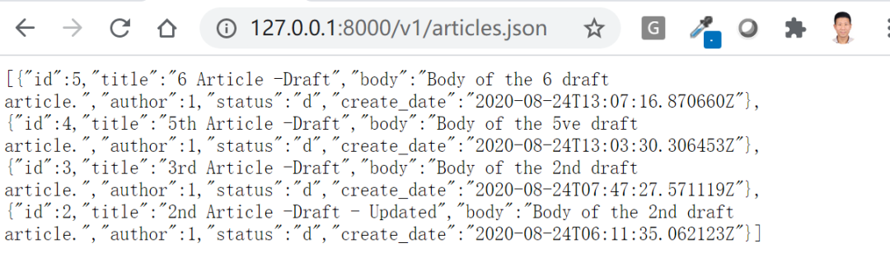
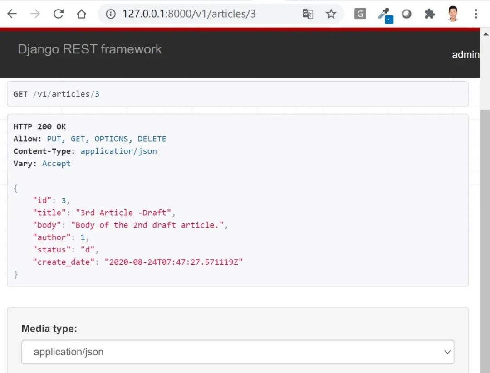
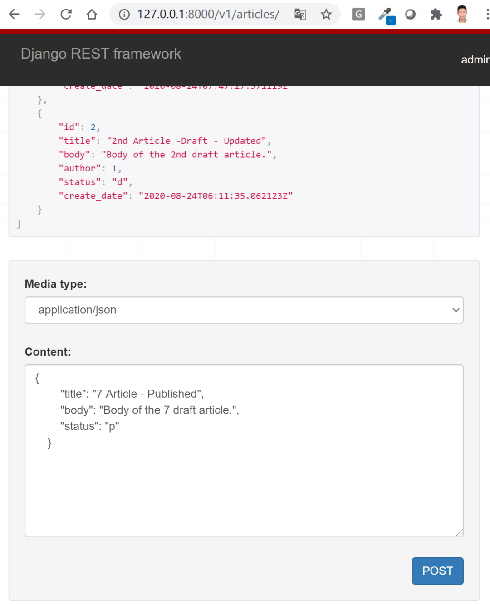
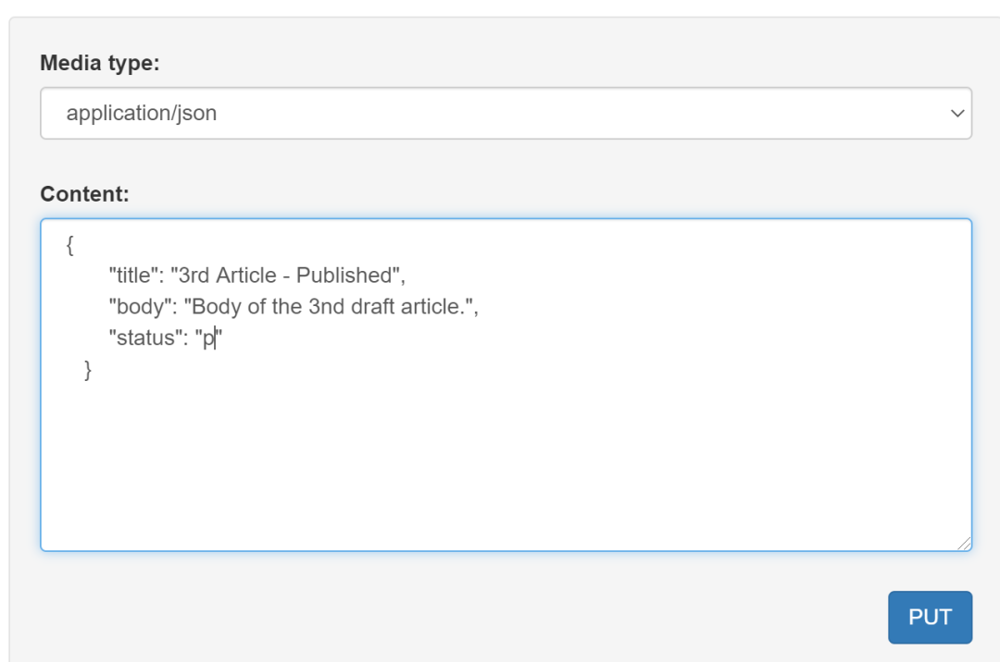

# 以博客为例使用DRF的序列化器和基于函数的视图开发API


## 目录


1. TOC
{:toc}

---

在上篇文章中，我们已经介绍了为什么要学习DRF，什么是序列化以及什么是符合RESTful规范的Web API。在本篇文章中我们将以博客为例，使用DRF提供的序列化器(Serializers类)开发两个API接口并测试。


这两个API端点的简单描述如下所示 (注意：规范的API文档需要更多信息)。

```bash
# 接口描述：文章列表资源。GET请求获取文章列表资源, POST请求提交新文章
# 接口地址: http://127.0.0.1:8000/api/v1/articles
# 请求方式：GET, POST
# 返回参数：JSON格式文章列表和状态码


# 接口描述：单篇文章资源。GET获取文章详情, PUT修改，DELETE删除
# 接口地址: http://127.0.0.1:8000/api/v1/articles/{id}
# 请求方式：GET, PUT, DELETE
# 返回参数: GET和PUT(JSON格式文章详情和状态码), DELETE(状态码)
```

## 准备工作

在正式开始前，我们先要用virtualenv创建一个新的Python虚拟环境。如果你使用PyCharm创建Django项目，它会自动为你创建好一个虚拟环境。
```bash
virtualenv env
source env/bin/activate
```
虚拟环境激活后，我们就可以安装我们需要的包了。
```bash
pip install django
pip install djangorestframework
```

接下来我们使用如下命令创建一个名为`apiproject`的项目，另外创建一个名为`blog`的app。

```bash
django-admin.py startproject apiproject # 创建项目
cd apiproject # 进入项目目录
python manage.py startapp blog # 创建应用
```

我们需要将新建的`blog`app和`rest_framework`添加到`INSTALLED_APPS`。现在可以编辑`apiproject/settings.py`文件, 如下所示：

```python
INSTALLED_APPS =(
    ...
    'rest_framework',
    'blog',
)
```

注意: 如果你使用的Django版本很低或希望避免自己的app名与第三方库的app名冲突，你需要使用`blog.apps.BlogConfig`替换`blog`。

### 创建模型 (models)

编辑`blog/models.py`文件, 创建`Article`模型，用于存储我们博客的文章数据。用户(User)与文章(Article)是单对多的关系(ForeinKey)，因为一个用户可以发表多篇文章。为了方便，用户模型我们使用了Django自带的用户模型。

```python
from django.db import models
from django.utils.translation import ugettext_lazy as _
from django.contrib.auth import get_user_model

User = get_user_model()

class Article(models.Model):
    """Article Model"""
    STATUS_CHOICES = (
        ('p', _('Published')),
        ('d', _('Draft')),
    )

    title = models.CharField(verbose_name=_('Title (*)'), max_length=90, db_index=True)
    body = models.TextField(verbose_name=_('Body'), blank=True)
    author = models.ForeignKey(User, verbose_name=_('Author'), on_delete=models.CASCADE, related_name='articles')
    status = models.CharField(_('Status (*)'), max_length=1, choices=STATUS_CHOICES, default='s', null=True, blank=True)
    create_date = models.DateTimeField(verbose_name=_('Create Date'), auto_now_add=True)

    def __str__(self):
        return self.title

    class Meta:
        ordering = ['-create_date']
        verbose_name = "Article"
        verbose_name_plural = "Articles"
```
模型创建好后，执行如下命令同步数据库并创建超级用户, Django会自动根据模型字段生成数据表。

```bash
python manage.py makemigrations
python manage.py migrate
python manage.py createsuperuser
```
之所以我们要创建超级用户是因为我们要通过Django自带的后台admin添加文章和用户信息, 以便测试我们的API接口能否正常工作。

### 配置Django后台(admin)

编辑`blog/admin.py`文件, 添加如下代码：

```python
from django.contrib import admin
from .models import Article

# Register your models here.
class ArticleAdmin(admin.ModelAdmin):
    list_display = ('title', 'author', 'status', 'create_date')
    
    '''filter options'''
    list_filter = ('status', )

    '''10 items per page'''
    list_per_page = 10
    
admin.site.register(Article, ArticleAdmin)
```
现在可以启动Django自带的测试服务器，进入admin后台添加些文章和用户(这里就不详细演示了)，接下来就可以开始我们的序列化工作了。

```bash
python manage.py runserver
```

## 自定义序列化器(serializers)

利用DRF开发Web API的第一步总是自定义序列化器(serializers)。序列化器的作用是将模型实例(比如用户、文章)序列化和反序列化为诸如`json`之类的表示形式。一个模型实例可能有许多字段属性，但一般情况下你不需要把所有字段信息以JSON格式数据返回给用户。**序列化器定义了需要对一个模型实例的哪些字段进行序列化/反序列化, 并可对客户端发送过来的数据进行验证和存储**。

就像Django提供了`Form`类和`ModelForm`类两种方式自定义表单一样，REST framework提供了`Serializer`类和`ModelSerializer`类两种方式供你自定义序列化器。前者需手动指定需要序列化和反序列化的字段，后者根据模型(model)生成需要序列化和反序列化的字段，可以使代码更简洁。

下面我们将分别展示如何使用`Serializer`类和`ModelSerializer`类自定义序列化器。

### 使用Serializer类

在`blog`的目录下创建一个名为`serializers.py`文件，并添加以下内容。

```python
from rest_framework import serializers
from .models import Article
from django.contrib.auth import get_user_model

User = get_user_model()

class ArticleSerializer(serializers.Serializer):
    id = serializers.IntegerField(read_only=True)
    title = serializers.CharField(required=True, allow_blank=True, max_length=90)
    body = serializers.CharField(required=False, allow_blank=True)
    author = serializers.ReadOnlyField(source="author.id")
    status = serializers.ChoiceField(choices=Article.STATUS_CHOICES, default='p')
    create_date = serializers.DateTimeField(read_only=True)

    def create(self, validated_data):
        """
        Create a new "article" instance
        """
        return Article.objects.create(**validated_data)

    def update(self, instance, validated_data):
        """
        Use validated data to return an existing `Article`instance。"""
        instance.title = validated_data.get('title', instance.title)
        instance.body = validated_data.get('body', instance.body)
        instance.status = validated_data.get('status', instance.status)
        instance.save()
        return instance
```

序列化器类的第一部分定义了序列化/反序列化的字段。`create()`和`update()`方法定义了在调用`serializer.save()`时如何创建和修改完整的实例。

序列化器类与Django `Form`类非常相似，并在各种字段中设置各种验证，例如`required`，`max_length`和`default`。

**注意**：定义序列化器时一定要注明哪些是仅可读字段(`read-only fields`)，哪些是普通字段。对于read-only fields，客户端是不需要也不能够通过POST或PUT请求提交相关数据进行反序列化的。

本例中ID和create_date都是由模型自动生成，每个article的author我们也希望在视图中与request.user绑定，而不是由用户通过POST或PUT自行修改，所以这些字段都是read-only。相反title，body和status是用户可以添加或修改的字段，所以未设成read-only。

### 使用ModelSerializer类

我们的`ArticleSerializer`类中重复了很多包含在`Article`模型（model）中的字段信息。使用`ModelSerializer`类可以重构我们的序列化器类，使整体代码更简洁。

再次打开`blog/serializers.py`文件，并将`ArticleSerializer`类替换为以下内容。两者作用是一样的。

```python
class ArticleSerializer(serializers.ModelSerializer):

    class Meta:
        model = Article
        fields = '__all__'
        read_only_fields = ('id', 'author', 'create_date')
```

如果你希望author不可见并让DRF根据request.user自动补全这个字段，可以按如下修改`ArticleSerializer`

```python
from rest_framework import serializers

class ArticleSerializer(serializers.ModelSerializer):
    author = serializers.HiddenField(default=serializers.CurrentUserDefault())

    class Meta:
        model = Article
        fields = '__all__'
        read_only_fields = ('id','create_date')
```

## 编写API视图(views.py)

接下来我们要使用自定义的序列化器来编写API视图，处理客户端的请求，并给出响应。与Django一样，DRF也支持使用基于函数的视图(Functional Based View, FBV)和基于类的视图(Class Based View, CBV)来编写视图(views)。

在本篇教程中，我们将编写两个基于函数的视图：`article_list`和`article_detail`。关于基于类的视图，我们会在下篇文章中介绍。

编辑`blog/views.py`文件，并且添加以下内容。

```python
from rest_framework import status
from rest_framework.decorators import api_view
from rest_framework.response import Response

from .models import Article
from .serializers import ArticleSerializer

@api_view(['GET', 'POST'])
def article_list(request):
    """
    List all articles, or create a new article.
    """
    if request.method == 'GET':
        articles = Article.objects.all()
        serializer = ArticleSerializer(articles, many=True)
        return Response(serializer.data)

    elif request.method == 'POST':
        serializer = ArticleSerializer(data=request.data)
        if serializer.is_valid():
            # Very important. Associate request.user with author
            serializer.save(author=request.user)
            return Response(serializer.data, status=status.HTTP_201_CREATED)
        return Response(serializer.errors, status=status.HTTP_400_BAD_REQUEST)
```
**注意**：由于序列化器中author是`read-only`字段，用户是无法通过POST提交来修改的，我们在创建Article实例时需手动将author和request.user绑定，如下所示：

```python
serializer.save(author=request.user)
```

以下是`views.py`模块中单个`article_detail`的视图。

```python
@api_view(['GET', 'PUT', 'DELETE'])
def article_detail(request, pk):
    """
    Retrieve，update or delete an article instance。"""
    try:
        article = Article.objects.get(pk=pk)
    except Article.DoesNotExist:
        return Response(status=status.HTTP_404_NOT_FOUND)

    if request.method == 'GET':
        serializer = ArticleSerializer(article)
        return Response(serializer.data)

    elif request.method == 'PUT':
        serializer = ArticleSerializer(article, data=request.data)
        if serializer.is_valid():
            serializer.save()
            return Response(serializer.data)
        return Response(serializer.errors, status=status.HTTP_400_BAD_REQUEST)

    elif request.method == 'DELETE':
        article.delete()
        return Response(status=status.HTTP_204_NO_CONTENT)
```

这两个函数视图看似和Django普通函数视图非常类似，但其作用大不相同。这里我们使用了DRF提供的`@api_view`这个非常重要的装饰器，实现了以下几大功能：

- 与Django传统函数视图相区分，强调这是API视图，并限定了可以接受的请求方法。
- 拓展了django原来的request对象。新的request对象不仅仅支持request.POST提交的数据，还支持其它请求方式如PUT或PATCH等方式提交的数据，所有的数据都在`request.data`字典里。这对开发Web API非常有用。

```go
request.POST  # 只处理表单数据, 只适用于'POST'方法
request.data  # 处理任意数据, 适用于'POST'，'PUT'和'PATCH'方法
```

**注意**: 我们不再显式地将请求或响应绑定到特定的内容类型比如HttpResponse和JSONResponse，我们统一使用Response方法返回响应，该方法支持内容协商，可根据客户端请求的内容类型返回不同的响应数据。

## 给URLs添加可选的格式后缀

为了充分利用我们的响应不再与单一内容类型连接，我们可以为API路径添加对格式后缀(.json或.api)的支持。使用格式后缀给我们明确指定了给定格式的URL，能让我们的API将能够处理诸如`http://example.com/api/items/4.json`之类的URL。

首先要给视图函数添加一个`format=None`关键字参数。

```python
def article_list(request, format=None):
def article_detail(request, pk, format=None):
```

接着更新`blog/urls.py`文件，给现有的`urlpatterns`加上`format_suffix_patterns`。

```go
from django.urls import re_path
from rest_framework.urlpatterns import format_suffix_patterns
from . import views

urlpatterns = [
    re_path(r'^articles/$', views.article_list),
    re_path(r'^articles/(?P<pk>[0-9]+)$', views.article_detail),]

urlpatterns = format_suffix_patterns(urlpatterns)
```

最后我们还需要把app的urls加入到项目URL配置`apiproject/urls.py`文件中，如下所示：

```javascript
from django.contrib import admin
from django.urls import path, include

urlpatterns = [
    path('admin/', admin.site.urls),
    path('v1/', include('blog.urls')),
]
```

## API测试
启动Django服务器后，就可以开始测试我们的API是否工作正常了。测试工具有很多，比如简便的curl命令和强大的postman，我们这里使用DRF自带的图形化测试界面。

### GET请求

```bash
[GET] http://127.0.0.1:8000/v1/articles
```
发送GET请求到/v1/articles, 我们可以看HTTP=200 OK的字样和json格式的文章列表数据。


注意：DRF默认是以可浏览的api形式展示返回响应结果的(`articles.api`)，如果你只需要返回最简单的json格式的数据，只需要在访问地址后面加上`.json`后缀即可(articles.json)，如下所示：



```
[GET] http://127.0.0.1:8000/v1/articles/3
```
发送get请求到/v1/articles/3，获取第3篇文章详情。


### POST请求
```bash
[POST] http://127.0.0.1:8000/v1/articles
```
发送POST请求到/v1/articles。在GET页面下方下拉框选择json格式数据或者表单，新增文章数据，点击POST提交后即可看到新的文章已经添加。



### PUT请求

```bash
[PUT] http://127.0.0.1:8000/v1/articles/3
```

发送PUT请求到/v1/articles。在GET页面下方下拉框下选择json格式数据，数据为由序列化器中定义的非read-only字段组成的json对象，点击PUT提交后即可看到第3篇文章标题及状态已经由draft变成published。



###  其它请求
DELETE请求非常简单，点击页面上DELETE按钮即可，这里就不展示了。HEAD和OPTIONS请求很少用，这里也不展示了。

## 小结

本文介绍了DRF的两个序列化器类(Serializer类和ModelSerializer类), 并以博客为例使用基于函数的视图开发了两个简单的API端点并进行了测试。需要值得注意的有以下几点：

1. 定义序列化器时一定要注意区分read-only字段和常规字段，read-only字段仅可读，用户不能通过POST或PUT方法对其进行修改。
2. DRF中使用函数视图开发API千万别忘了使用`@api_view`这个重要的装饰器。

在下篇文章中，我们将介绍关于DRF的基于类的视图，比如APIView类, GenericAPIView类和GenericViewSet类，并用它们重写本例中的API视图。


原创不易，转载请注明来源。我是大江狗，一名Django技术开发爱好者。您可以通过搜索【<a href="https://blog.csdn.net/weixin_42134789">CSDN大江狗</a>】、【<a href="https://www.zhihu.com/people/shi-yun-bo-53">知乎大江狗</a>】和搜索微信公众号【Python Web与Django开发】关注我！


