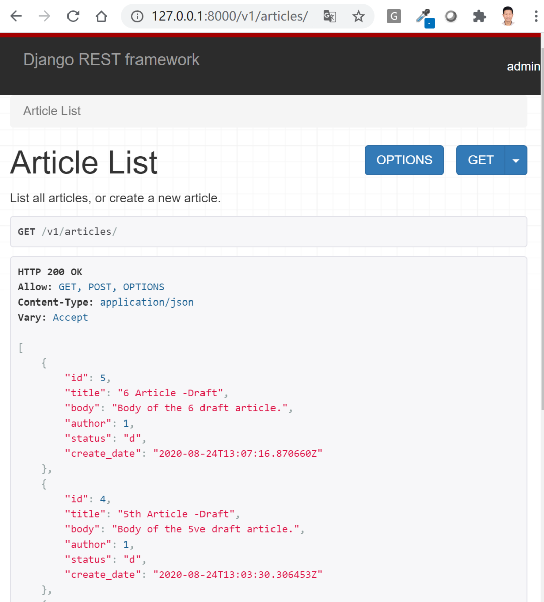

# 基于类的视图APIView, GenericAPIView和视图集(ViewSet)


## 目录


1. TOC
{:toc}

---

在前面的教程中我们介绍了什么是符合RESTful规范的API接口，并以博客为例使用了基于函数的视图(FBV)编写了文章资源的API，并测试了对文章的增删改查。在本篇文章中，我们将使用基于类的视图(Class-based View, CBV)重写之前的接口。如果你还没有阅读前两篇文章，建议先阅读。


## 为什么要使用基于类的视图(CBV)?
一个中大型的Web项目代码量通常是非常大的，如果全部使用函数视图写，那么代码的复用率是非常低的。而使用类视图呢，就可以有效的提高代码复用，因为类是可以被继承的，可以拓展的。特别是将一些可以共用的功能抽象成Mixin类或基类后可以减少重复造轮子的工作。

DRF推荐使用基于类的视图(CBV)来开发API, 并提供了4种开发CBV开发模式。

- 使用基础的`APIView`类
- 使用Mixins类和`GenericAPI`类混配
- 使用通用视图`generics.*`类, 比如`generics.ListCreateAPIView`
- 使用视图集`ViewSet`和`ModelViewSet`

很多人会疑惑，到底哪种CBV开发模式更好? 我们将逐一分析，并在文尾给出答案。本文代码较多，手机上如果竖屏阅读不方便，建议横屏阅读。

## 使用基础APIView类

DRF的APIView类继承了Django自带的View类, 一样可以按请求方法调用不同的处理函数，比如get方法处理GET请求，post方法处理POST请求。不过DRF的APIView要强大得多。它不仅支持更多请求方法，而且对Django的request对象进行了封装，可以使用request.data获取用户通过POST, PUT和PATCH方法发过来的数据，而且支持插拔式地配置认证、权限和限流类。

现在我们可以使用APIView类重写我们之前的函数视图了。

```python
# blog/views.py
# 使用基础APIView类

from rest_framework.views import APIView
from django.http import Http404
from .models import Article
from .serializers import ArticleSerializer

class ArticleList(APIView):
    """
    List all articles, or create a new article.
    """
    def get(self, request, format=None):
        articles = Article.objects.all()
        serializer = ArticleSerializer(articles, many=True)
        return Response(serializer.data)

    def post(self, request, format=None):
        serializer = ArticleSerializer(data=request.data)
        if serializer.is_valid():
            # 注意：手动将request.user与author绑定
            serializer.save(author=request.user)
            return Response(serializer.data, status=status.HTTP_201_CREATED)

        return Response(serializer.errors, status=status.HTTP_400_BAD_REQUEST)

class ArticleDetail(APIView):
    """
    Retrieve, update or delete an article instance.
    """
    def get_object(self, pk):
        try:
            return Article.objects.get(pk=pk)
        except Article.DoesNotExist:
            raise Http404

    def get(self, request, pk, format=None):
        article = self.get_object(pk)
        serializer = ArticleSerializer(article)
        return Response(serializer.data)

    def put(self, request, pk, format=None):
        article = self.get_object(pk)
        serializer = ArticleSerializer(instance=article, data=request.data)
        if serializer.is_valid():
            serializer.save()
            return Response(serializer.data)
        return Response(serializer.errors, status=status.HTTP_400_BAD_REQUEST)

    def delete(self, request, pk, format=None):
        article = self.get_object(pk)
        article.delete()
        return Response(status=status.HTTP_204_NO_CONTENT)
```

或许你已经注意到，这段代码跟之前基于函数的视图差别并不大。最大不同的是我们不需要在对用户的请求方法进行判断。该视图可以自动将不同请求转发到相应处理方法，逻辑上也更清晰。

现在我们还需要修改应用的url配置, 让其指向新的基于类的视图。注意：类视图需要调用`as_view()`的方法才能在视图中实现查找指定方法, 比如GET请求执行get方法。

```python
# blog/urls.py
from django.urls import re_path
from rest_framework.urlpatterns import format_suffix_patterns

from . import views

urlpatterns = [
    # re_path(r'^articles/$', views.article_list),
    # re_path(r'^articles/(?P<pk>[0-9]+)$', views.article_detail),
    re_path(r'^articles/$', views.ArticleList.as_view()),
    re_path(r'^articles/(?P<pk>[0-9]+)$', views.ArticleDetail.as_view()),
]

urlpatterns = format_suffix_patterns(urlpatterns)
```

如果不出意外，发送GET请求到v1/articles/你将看到同样的内容。



## 用Mixin类和GenericAPI类混配

使用基础的APIView类并没有大量简化我们的代码。如果你仔细地观察，你还会发现与增删改查操作相关的代码包括返回内容对所有模型几乎都是一样的。比如你现在需要对文章类别Category模型也进行序列化和反序列化，你只需要复制Article视图代码，将Article模型改成Category模型, 序列化类由`ArticleSeralizer`类改成`CategorySerializer`类就行了。

对于这些通用的增删改查行为，DRF已经提供了相应的Mixin类。Mixin类可与`generics.GenericAPI`类联用，灵活组合成你所需要的视图。

现在来使用Mixin类和`generics.GenericAPI`类重写我们的类视图。

```ruby
# blog/views.py
# 使用Generic APIView & Mixins
from rest_framework import mixins
from rest_framework import generics

class ArticleList(mixins.ListModelMixin,
                  mixins.CreateModelMixin,
                  generics.GenericAPIView):
    queryset = Article.objects.all()
    serializer_class = ArticleSerializer

    def get(self, request, *args, **kwargs):
        return self.list(request, *args, **kwargs)

    def post(self, request, *args, **kwargs):
        return self.create(request, *args, **kwargs)
```
我们现在需要花些时间研究下这段代码，看看到底发生了什么。

**GenericAPIView 类继承了APIView类，提供了基础的API视图。它对用户请求进行了转发，并对Django自带的request对象进行了封装。不过它比APIView类更强大，因为它还可以通过`queryset`和`serializer_class`属性指定需要序列化与反序列化的模型或queryset及所用到的序列化器类。**

这里的 `ListModelMixin` 和 `CreateModelMixin`类则分别引入了`.list() `和` .create() `方法，当用户发送get请求时调用Mixin提供的list()方法，将指定queryset序列化后输出，发送post请求时调用Mixin提供的create()方法，创建新的实例对象。

DRF还提供`RetrieveModelMixin`, `UpdateModelMixin`和`DestroyModelMixin`类，实现了对单个对象实例的查、改和删操作，如下所示：

```ruby
class ArticleDetail(mixins.RetrieveModelMixin,
                    mixins.UpdateModelMixin,
                    mixins.DestroyModelMixin,
                    generics.GenericAPIView):
    queryset = Article.objects.all()
    serializer_class = ArticleSerializer

    def get(self, request, *args, **kwargs):
        return self.retrieve(request, *args, **kwargs)

    def put(self, request, *args, **kwargs):
        return self.update(request, *args, **kwargs)

    def delete(self, request, *args, **kwargs):
        return self.destroy(request, *args, **kwargs)
```

或许你现在要问已经有get, post, delete等方法了，为什么mixin类引入的方法要以list, create, retrieve, destroy方法命名呢? 这是因为请求方法不如操作名字清晰，比如get方法同时对应了获取对象列表和单个对象两种操作，使用list和retrieve方法后则很容易区分。另外post方法接受用户发过来的请求数据后，有时只需转发不需要创建模式对象实例，所以post方法不能简单等于create方法。

新的ArticleList视图类看似正确，但其实还有一个问题。 我们定义的序列化器ArticleSeralizer类并不包含author这个字段的，这是因为我们希望在创建article实例时我们将author与request.user进行手动绑定。在前面的例子中我们使用`serializer.save(author=request.user)`这一方法进行手动绑定。

现在使用mixin类后，我们该如何操作呢？ 答案是重写`perform_create`方法，如下所示：

```ruby
class ArticleList(mixins.ListModelMixin,
                  mixins.CreateModelMixin,
                  generics.GenericAPIView):
    queryset = Article.objects.all()
    serializer_class = ArticleSerializer

    def get(self, request, *args, **kwargs):
        return self.list(request, *args, **kwargs)

    def post(self, request, *args, **kwargs):
        return self.create(request, *args, **kwargs)

    # 将request.user与author绑定。调用create方法时执行如下函数。
    def perform_create(self, serializer):
        serializer.save(author=self.request.user)
```

`perform_create`这个钩子函数是`CreateModelMixin`类自带的，用于执行创建对象时需要执行的其它方法，比如发送邮件等功能，有点类似于Django的信号。类似的钩子函数还有UpdateModelMixin提供的`perform_update`方法和DestroyModelMixin提供的`perform_destroy`方法。

## 使用通用视图Generics.\*类

将Mixin类和GenericAPI类混配，已经帮助我们减少了一些代码，但我们还可以做得更好，比如将get请求与mixin提供的list方法进行绑定感觉有些多余。幸好DRF还提供了一套常用的将 Mixin 类与 GenericAPI类已经组合好了的视图，开箱即用，可以进一步简化我们的代码，如下所示：

```python
# generic class-based views
from rest_framework import generics

class ArticleList(generics.ListCreateAPIView):
    queryset = Article.objects.all()
    serializer_class = ArticleSerializer

    # 将request.user与author绑定
    def perform_create(self, serializer):
        serializer.save(author=self.request.user)

class ArticleDetail(generics.RetrieveUpdateDestroyAPIView):
    queryset = Article.objects.all()
    serializer_class =ArticleSerializer
```

顾名思义，`generics.ListCreateAPIView`类支持List、Create两种视图功能，分别对应GET和POST请求。`generics.RetrieveUpdateDestroyAPIView`支持Retrieve、Update、Destroy操作，其对应方法分别是GET、PUT和DELETE。

寥寥几行，实现了我们所有想要的功能，神不神奇? 

其它常用generics类视图还包括`ListAPIView`, `RetrieveAPIView`, `RetrieveUpdateAPIView`等等。你可以根据实际需求使用，为你的API写视图时只需要定义`queryset`和`serializer_class`即可。

## 使用视图集ViewSet

使用通用视图generics类后视图代码已经大大简化，但是`ArticleList`和`ArticleDetail`两个类中`queryset`和`serializer_class`属性依然存在代码重复。使用视图集可以将两个类视图进一步合并，一次性提供List、Create、Retrieve、Update、Destroy这5种常见操作，这样`queryset`和`seralizer_class`属性也只需定义一次就好, 这就变成了视图集(viewset)。

如下所示：

```python
# blog/views.py
from rest_framework import viewsets

class ArticleViewSet(viewsets.ModelViewSet):
    # 用一个视图集替代ArticleList和ArticleDetail两个视图
    queryset = Article.objects.all()
    serializer_class = ArticleSerializer
    
    # 自行添加，将request.user与author绑定
    def perform_create(self, serializer):
        serializer.save(author=self.request.user)
```

使用视图集后，我们需要使用DRF提供的路由router来分发urls，因为一个视图集现在对应多个urls，而不像之前的一个url对应一个视图函数或一个视图类。

```python
# blog/urls.py
from django.urls import re_path
from rest_framework.urlpatterns import format_suffix_patterns
from . import views
from rest_framework.routers import DefaultRouter

router = DefaultRouter()
router.register(r'articles', viewset=views.ArticleViewSet)

urlpatterns = [
    # re_path(r'^articles/$', views.ArticleList.as_view()),
    # re_path(r'^articles/(?P<pk>[0-9]+)$', views.ArticleDetail.as_view()),
]
# urlpatterns = format_suffix_patterns(urlpatterns)
urlpatterns += router.urls
```

你或许又要问了，一个视图集对应List、Create、Retrieve、Update、Destroy这5种操作。有时候我只需要其中的一种或几种操作，该如何实现呢？答案是在`urls.py`中指定方法映射即可，如下所示：

```python
# blog/urls.py

from django.urls import re_path
from rest_framework.urlpatterns import format_suffix_patterns
from . import views

# from rest_framework.routers import DefaultRouter
# router = DefaultRouter()
# router.register(r'articles', viewset=views.ArticleViewSet)

article_list = views.ArticleViewSet.as_view(
    {
        'get': 'list',
        'post': 'create'
    })

article_detail = views.ArticleViewSet.as_view({
    'get': 'retrieve', # 只处理get请求，获取单个记录
})


urlpatterns = [
    re_path(r'^articles/$', article_list),
    re_path(r'^articles/(?P<pk>[0-9]+)$', article_detail),
]

urlpatterns = format_suffix_patterns(urlpatterns)
```

另外DRF还提供了`ReadOnlyModelViewSet`这个类，它仅支持list和retrive这两个可读的操作，如下所示：

```python
from rest_framework import viewsets

class UserViewSet(viewsets.ReadOnlyModelViewSet):
    """
    ReadOnlyModelViewSet仅提供list和detail可读动作
    """
    queryset = Article.objects.all()
    serializer_class = ArticleSerializer
```

Django视图集viewset代码最少，但这是以牺牲了代码的可读性为代价的，因为它对代码进行了高度地抽象化。另外urls由router生成，不如自己手动配置的清楚。

## 小结

本文使用了DRF提供的多种基于类的API视图的重写了文章资源API。那么这几种方式到底哪种更好呢? 答案是各有利弊。小编个人认为大家只需掌握以下三种方式即可：

- 基础的API类：可读性最高、代码最多、灵活性最高。当你需要对的API行为进行个性化定制时，建议使用这种方式。
- 通用generics类：可读性好、代码适中、灵活性较高。当你需要对一个模型进行标准的增删查改全部或部分操作时建议使用这种方式。
- 使用视图集viewset: 可读性较低、代码最少、灵活性最低。当你需要对一个模型进行标准的增删查改的全部操作且不需定制API行为时建议使用这种方式。

至于mixin类和GenericAPI的混用，这个和generics类没什么区别，大家不看也罢。

使用CBV类可以简化代码，增加重用，在很多情况下我们还需要重写父类的方法，比如`get_queryset`, `get_serializer_class`方法以实现特殊的功能。


原创不易，转载请注明来源。我是大江狗，一名Django技术开发爱好者。您可以通过搜索【<a href="https://blog.csdn.net/weixin_42134789">CSDN大江狗</a>】、【<a href="https://www.zhihu.com/people/shi-yun-bo-53">知乎大江狗</a>】和搜索微信公众号【Python Web与Django开发】关注我！


