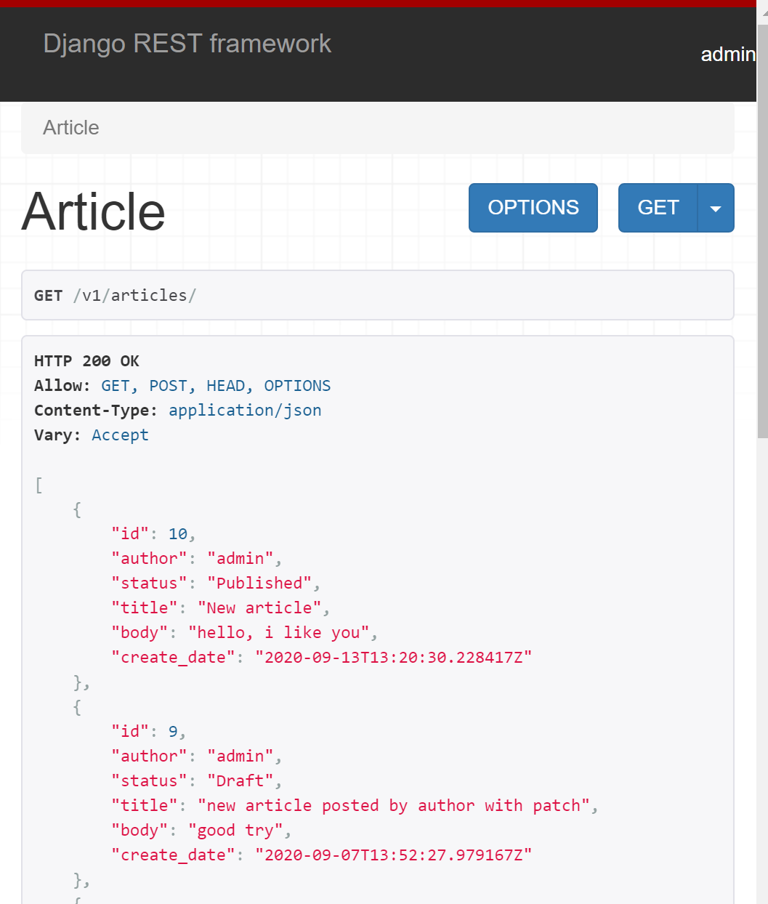
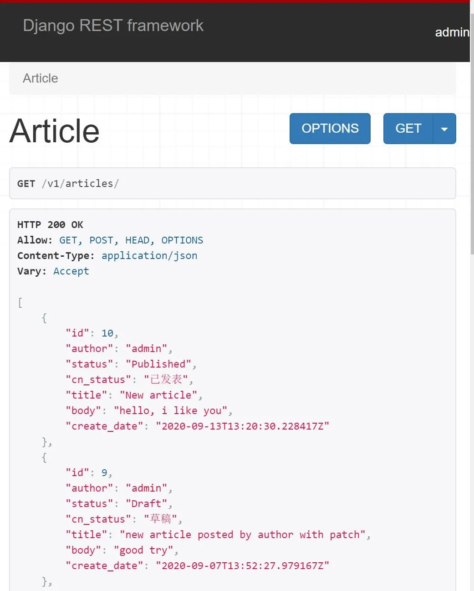
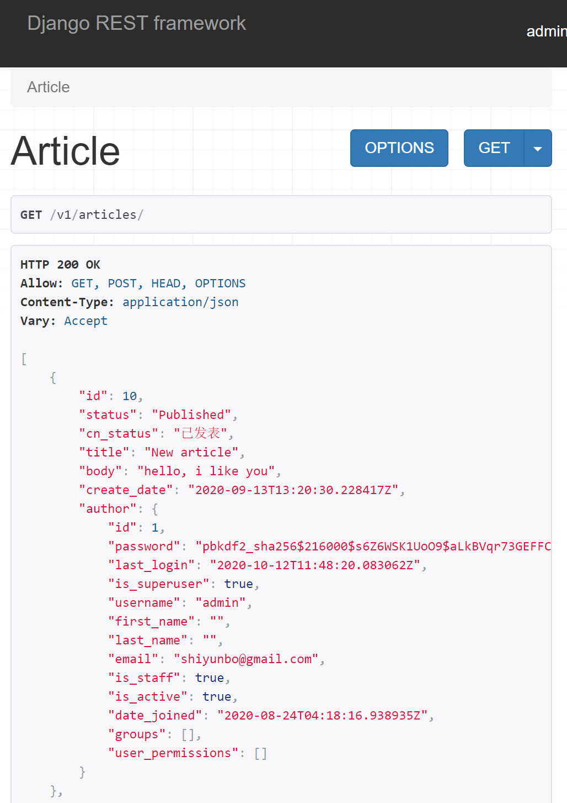
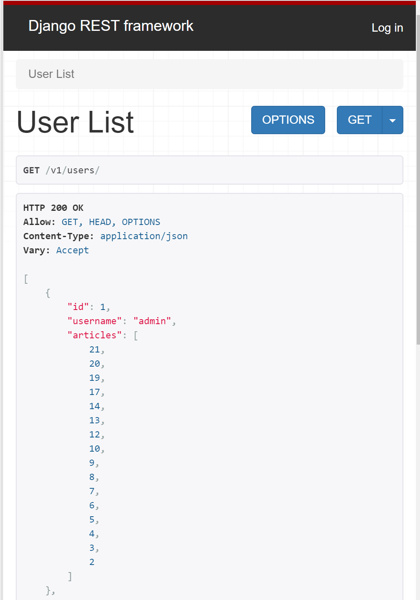
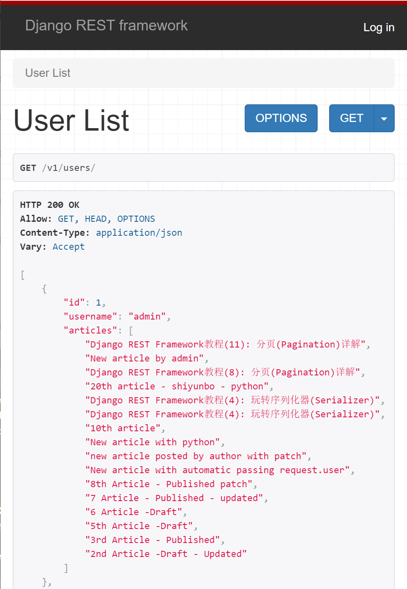
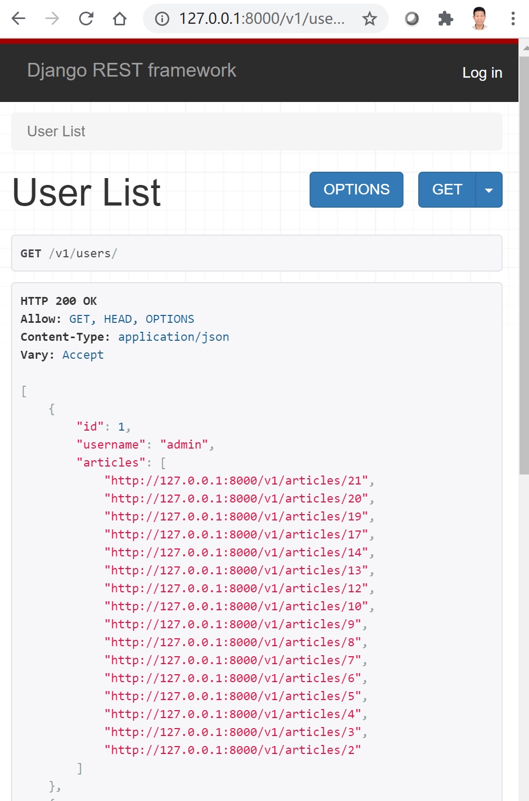

# 玩转序列化器(Serializer)


## 目录


1. TOC
{:toc}

---
在前面的文章中我们以博客为例，自定义了一个简单的 `ArticleSerializer` 类, 并分别以函数视图(FBV)和基于类的视图(CBV)编写了博客文章列表资源和单篇文章资源的API。在本文中，我们将玩转DRF的序列化器，教你如何修改序列化器，控制序列化后响应数据的输出格式, 如何在反序列化时对客户端提供过来的数据进行验证(validation)以及如何动态加载或重写序列化器类自带的方法。


## 准备工作

我们的Article模型和自定义的序列化器`ArticleSerializer`类分别如下所示。
```python
# blog/models.py
class Article(models.Model):
    """Article Model"""
    STATUS_CHOICES = (
        ('p', 'Published'),
        ('d', 'Draft'),
    )

    title = models.CharField(verbose_name='Title (*)', max_length=90, db_index=True)
    body = models.TextField(verbose_name='Body', blank=True)
    author = models.ForeignKey(User, verbose_name='Author', on_delete=models.CASCADE, related_name='articles')
    status = models.CharField(verbose_name='Status (*)', max_length=1, choices=STATUS_CHOICES, default='s', null=True, blank=True)
    create_date = models.DateTimeField(verbose_name='Create Date', auto_now_add=True)


    def __str__(self):
        return self.title
```

我们最初的`ArticleSerializer`如下所示：
```python
# blog/serializers.py
class ArticleSerializer(serializers.ModelSerializer):


    class Meta:
        model = Article
        fields = '__all__'
        read_only_fields = ('id', 'author', 'create_date')
```

我们自定义的序列化器`ArticleSerializer`类包括了Article模型的所有字段，但由于我们不希望用户自行修改`id`, `author`和`create_date`三个字段，我们把它们设成了仅可读`read_only_fields`。如果你的其它代码正确，当你发送GET请求到/v1/articles, 我们可以看HTTP=200 OK的字样和如下json格式的文章列表数据。
```bash
[GET] http://127.0.0.1:8000/v1/articles
```


在这里你可以看到序列化后输出的json格式数据里author字段输出的是用户id，而不是用户名，status输出的是p或者d，而不是输出Published或Draft这样的完整状态，这显然对用户不是很友好的。这时我们就要修改序列化器，改变序列化后的数据输出格式，接下来我们将介绍几种常用的方式。

## 改变序列化器的输出

### 指定source来源

打开`blog/serializers.py`，新建两个可读字段`author和status`字段，用以覆盖原来Article模型默认的字段，其中指定author字段的来源(source)为单个author对象的username，status字段为`get_status_display`方法返回的完整状态。

```python
class ArticleSerializer(serializers.ModelSerializer):
    author = serializers.ReadOnlyField(source="author.username")
    status = serializers.ReadOnlyField(source="get_status_display")

    class Meta:
        model = Article
        fields = '__all__'
        read_only_fields = ('id', 'author', 'create_date')
```

这时你应该可以看到想要的输出数据格式了，是不是很赞?


这个看似完美，但里面其实有个错误。我们定义了一个仅可读的status字段把原来的status字段覆盖了，这样反序列化时用户将不能再对文章发表状态进行修改（原来的status字段是可读可修改的）。一个更好的方式在`ArticleSerializer`新增一个为`full_status`的可读字段，而不是简单覆盖原本可读可写的字段。

```python
class ArticleSerializer(serializers.ModelSerializer):
    author = serializers.ReadOnlyField(source="author.username")
    full_status = serializers.ReadOnlyField(source="get_status_display")

    class Meta:
        model = Article
        fields = '__all__'
        read_only_fields = ('id', 'author', 'create_date')
```

### 使用SerializerMethodField方法

上面例子中文章状态status都是以Published或Draft英文字符串表示的，但是如果你想在输出的json格式数据中新增`cn_status`字段，显示中文发表状态。但cn_status本身并不是Article模型中存在的字段，这时你应该怎么做呢？答案是使用`SerializerMethodField`，它可用于将任何类型的数据添加到对象的序列化表示中, 非常有用。

再次打开blog/serializers.py，新建`cn_status`字段，类型为SerializerMethodField，然后再自定义一个`get_cn_status`方法输出文章中文发表状态即可。

```python
class ArticleSerializer(serializers.ModelSerializer):
    author = serializers.ReadOnlyField(source="author.username")
    status = serializers.ReadOnlyField(source="get_status_display")
    cn_status = serializers.SerializerMethodField()

    class Meta:
        model = Article
        fields = '__all__'
        read_only_fields = ('id', 'author', 'create_date')

    def get_cn_status(self, obj):
        if obj.status == 'p':
            return "已发表"
        elif obj.status == 'd':
            return "草稿"
        else:
            return ''
```

这时的输出数据是不是让人赏心悦目？



不过需要注意的是`SerializerMethodField`通常用于显示模型中原本不存在的字段，类似可读字段，你不能通过反序列化对其直接进行修改。

### 使用 to_representation方法

除了指定source和自定义序列化方法，`to_representation()` 也允许我们改变序列化的输出内容, 给其添加额外的数据。

假设我们有如下一个文章模型(Article)：


```python
from django.contrib.auth.models import User
from django.db import models

class Article(models.Model):
    title = models.CharField(max_length=256)
    body = models.TextField()
    liked_by = models.ManyToManyField(to=User)
    
    def __str__(self):
        return self.title
```
每个文章资源有 `title`, `body`和` liked_by`  三个字段。`liked_by` 代表喜欢该文章的用户对象id列表。

我们的序列化器`ArticleSerializer`类如下所示：

```python
from rest_framework import serializers
from .models import Article

class ArticleSerializer(serializers.ModelSerializer):
    class Meta:
        model = Article
        fields = '__all__'
```


如果我们使用上面序列化器去序列化单篇文章资源，我们将得到如下输出数据：

```json
{
   "id": 1,
   "title": "DRF advanced tutorials",
   "body": "This is a good example.",
   "liked_by": [
      2,
      3,
      4
   ]
}
```


现在如果我们希望给上面输出数据添加一个`total_likes`点赞总数的字段，我们只需要在序列化器类里重写`to_representation`方法。

```python
from rest_framework import serializers
from .models import Article


class ArticleSerializer(serializers.ModelSerializer):
    class Meta:
        model = Article
        fields = '__all__'
        
    def to_representation(self, value):
        # 调用父类获取当前序列化数据，value代表每个对象实例ob
        data = super().to_representation(value)
        # 对序列化数据做修改，添加新的数据
        data['total_likes'] = value.liked_by.count()
        return data
```

现在使用新的序列化器类去序列化单篇文章资源，我们将得到如下输出结果。`to_representation() `方法改变了我们序列化的输出，并传递了额外的数据。

```json
{ 
   "id": 1,
   "title": "DRF advanced tutorials",
   "body": "This is a good example.",
   "liked_by": [
      2,
      3,
      4
   ],
   "total_likes": 3
}
```

### 使用嵌套序列化器

我们文章中的author字段实际上对应的是一个User模型实例化后的对象，既不是一个整数id，也不是用户名这样一个简单字符串，我们怎样显示更多用户对象信息呢? 其中一种解决方法是使用嵌套序列化器，如下所示：

```python
class UserSerializer(serializers.ModelSerializer):

    class Meta:
        model = User
        fields = ('id', 'username', 'email')

class ArticleSerializer(serializers.ModelSerializer):
    author = UserSerializer() # required=False表示可接受匿名用户，many=True表示有多个用户。
    status = serializers.ReadOnlyField(source="get_status_display")
    cn_status = serializers.SerializerMethodField()

    class Meta:
        model = Article
        fields = '__all__'
        read_only_fields = ('id', 'author', 'create_date')

    def get_cn_status(self, obj):
        if obj.status == 'p':
            return "已发表"
        elif obj.status == 'd':
            return "草稿"
        else:
            return ''
```

展示效果如下所示：


此时发送GET请求展示文章列表资源是没问题的，但如果你希望发送POST请求到v1/articles/提交新文章你将会收到author字段是required的这样一个错误。为了使我们代码正确工作，我们还需要手动指定`read_only=True`这个选项。尽管我们在Meta选项已经指定了author为`read_only_fields`, 但使用嵌套序列化器时还需要重新指定一遍。

```nginx
 author = UserSerializer(read_only=True)
```

### 设置关联模型深度

另一个解决方式是不使用嵌套序列化器，通过设置关联模型的深度depth(通常1-4）实现, 如下所示：

```python
class ArticleSerializer(serializers.ModelSerializer):
    # author = UserSerializer(read_only=True) 注释
    status = serializers.ReadOnlyField(source="get_status_display")
    cn_status = serializers.SerializerMethodField()

    class Meta:
        model = Article
        fields = '__all__'
        read_only_fields = ('id', 'author', 'create_date')
        depth = 1 # 注意这里
        
    def get_cn_status(self, obj):
        if obj.status == 'p':
            return "已发表"
        elif obj.status == 'd':
            return "草稿"
        else:
            return ''
```

展示效果如下。这种方法虽然简便，但使用时要非常小心，因为它会展示关联模型中的所有字段。比如下例中连密码password都展示出来了，显然不是我们想要的。



前面我们介绍的都是如何通过修改序列化器来控制输出数据的展现形式。下面我们将着重看下如何在反序列化时对客户端提供过来的数据进行验证(validation)以及如何重写序列化类自带的的save和update方法。由于官方文档中有更好的例子，我们将会使用这些案例。

### 序列化日期和时间
上面例子中日期和时间都序列化成了ISO格式的时间字符串，这个一般够用了，因为前端拿到这个格式可以转成本地时间格式。但你希望在后端就设置好格式，只需要通过format这个参数设置就好了。
```python
 create_date = serializers.DateTimeField(format="%Y-%m-%d %H:%M:%S", required=False, read_only=True)
```

## 关系序列化

前面我们对文章模型进行了序列化，显示了每篇文章详情及其对应作者信息。这个很好理解，因为author本来就是Article模型中的一个字段。现在反过来要对用户信息进行序列化，要求返回信息里包含用户信息及所发表的文章列表，但用户User模型没有article这个字段，这时应该怎么做呢？ 答案就是使用Django REST Framework提供的关系序列化方法。

### PrimaryKeyRelatedField

我们的序列化器UserSerlializer类如下所示：

```
class UserSerializer(serializers.ModelSerializer):
    articles = serializers.PrimaryKeyRelatedField(many=True, read_only=True)

    class Meta:
        model = User
        fields = ('id', 'username', 'articles',)
        read_only_fields = ('id', 'username',)
```

返回结果如下所示。你可以看到用户信息，及其发表文章的id列表。



如果我们希望文章列表不以id形式展现，而是直接体现文章title呢? 答案是StringRelatedField。

### StringRelatedField

修改我们的`UserSerializer`, 如下所示：

```python
class UserSerializer(serializers.ModelSerializer):
    articles = serializers.StringRelatedField(many=True, read_only=True)

    class Meta:
        model = User
        fields = ('id', 'username', 'articles',)
        read_only_fields = ('id', 'username',)

```

返回结果如下所示。`StringRelatedField`会直接返回每篇文章对象通过`__str__`方法定义的字段。



### HyperlinkedRelatedField

有时我们希望更进一步，不仅仅提供每篇文章的id或title列表，而是直接提供每篇文章对应的url列表，这样访问每个url可以获得更多关于文章的信息。这时就可以使用`HyperlinkedRelatedField`，它需要接收一个view的别名(本例为`article-detail`)。

再次修改我们的UserSerializer, 添加如下代码：

```python
class UserSerializer(serializers.ModelSerializer):
    articles = serializers.HyperlinkedRelatedField(
        many=True,
        read_only=True,
        view_name='article-detail'
    )

    class Meta:
        model = User
        fields = ('id', 'username', 'articles',)
        read_only_fields = ('id', 'username',)
```

返回结果如下所示：



## 数据验证 (Validation)

在反序列化数据时，必需对用户提交的数据进行验证。在尝试访问经过验证的数据或保存对象实例之前，总是需要显示地调用 `is_valid()`方法。如果发生任何验证错误，`.errors` 属性将包含表示结果错误消息的字典，如下所示：

```kotlin
serializer = CommentSerializer(data={'email': 'foobar', 'content': 'baz'})
serializer.is_valid()
# False
serializer.errors
# {'email': [u'Enter a valid e-mail address.'], 'created': [u'This field is required.']}
```
字典中的每个键都是字段名称，值是与该字段对应的任何错误消息的字符串列表。

`.is_valid()` 方法使用可选的 `raise_exception` 标志，如果存在验证错误，将会抛出 `serializers.ValidationError` 异常。

这些异常由 REST framework 提供的默认异常处理程序自动处理，默认情况下将返回 `HTTP 400 Bad Request` 响应。

```python
# 如果数据未通过验证，返回400
serializer.is_valid(raise_exception=True)
```

在DRF中编写序列化类时，你可以进行字段级别和对象级别的验证，还可以使用自定义验证器或使用DRF提供的验证器。

### 字段级别验证 (Field-level validation)

您可以通过向您的 `Serializer` 子类中添加 `.validate_<field_name>` 方法来指定自定义字段级的验证。这些类似于 Django 表单中的 `.clean_<field_name>` 方法。这些方法采用单个参数，即需要验证的字段值。

您的 `validate_<field_name>` 方法应该返回已验证的值或抛出 `serializers.ValidationError` 异常。例如：

```python
from rest_framework import serializers

class ArticleSerializer(serializers.Serializer):
    title = serializers.CharField(max_length=100)

    def validate_title(self, value):
        """
        Check that the article is about Django.
        """
        if 'django' not in value.lower():
            raise serializers.ValidationError("Article is not about Django")
        return value
```

**注意**：如果在您的序列化器上声明了 `<field_name>` 的参数为 `required=False`，那么如果不包含该字段，则此验证步骤不会发生。

### 对象级别验证 (Object-level validation)

要执行需要访问多个字段的任何其他验证，请添加名为 `.validate()` 的方法到您的 `Serializer` 子类中。此方法采用单个参数，该参数是字段值的字典。如果需要，它应该抛出 `ValidationError` 异常，或者只返回经过验证的值。例如：

```python
from rest_framework import serializers

class EventSerializer(serializers.Serializer):
    description = serializers.CharField(max_length=100)
    start = serializers.DateTimeField()
    finish = serializers.DateTimeField()

    def validate(self, data):
        """
        Check that the start is before the stop.
        """
        if data['start'] > data['finish']:
            raise serializers.ValidationError("finish must occur after start")
        return data
```

### 验证器 (Validators)

序列化器上的各个字段都可以包含验证器，通过在字段实例上声明，例如：

```python
def title_gt_90(value):
    if len(value) < 90:
        raise serializers.ValidationError('标题字符长度不低于90。')

class Article(serializers.Serializer):
    title = seralizers.CharField(validators=[title_gt_90])
    ...
```

DRF还提供了很多可重用的验证器，比如`UniqueValidator`,`UniqueTogetherValidator`等等。通过在内部 `Meta` 类上声明来包含这些验证器，如下所示。下例中会议房间号和日期的组合必须要是独一无二的。

```python
class EventSerializer(serializers.Serializer):
    name = serializers.CharField()
    room_number = serializers.IntegerField(choices=[101, 102, 103, 201])
    date = serializers.DateField()

    class Meta:
        # Each room only has one event per day.
        validators = UniqueTogetherValidator(
            queryset=Event.objects.all(),
            fields=['room_number', 'date']
        )
```

## 重写序列化器的create和update方法
假设我们有个Profile模型与User模型是一对一的关系，当用户注册时我们希望把用户提交的数据分别存入User和Profile模型，这时我们就不得不重写序列化器自带的create方法了。下例演示了如何通过一个序列化器创建两个模型对象。

```python
class UserSerializer(serializers.ModelSerializer):
    profile = ProfileSerializer()

    class Meta:
        model = User
        fields = ('username', 'email', 'profile')

    def create(self, validated_data):
        profile_data = validated_data.pop('profile')
        user = User.objects.create(**validated_data)
        Profile.objects.create(user=user, **profile_data)
        return user
             
```

同时更新两个关联模型实例时也同样需要重写update方法。

```python
def update(self, instance, validated_data):
        profile_data = validated_data.pop('profile')
        profile = instance.profile
        
        instance.username = validated_data.get('username', instance.username)
        instance.email = validated_data.get('email', instance.email)
        instance.save()

        profile.is_premium_member = profile_data.get(
            'is_premium_member',
            profile.is_premium_member
        )
        profile.has_support_contract = profile_data.get(
            'has_support_contract',
            profile.has_support_contract
         )
        profile.save()


        return instance
```

因为序列化器使用嵌套后，创建和更新的行为可能不明确，并且可能需要相关模型之间的复杂依赖关系，REST framework要求你始终显式的编写这些方法。默认的 `ModelSerializer` `.create()` 和 `.update()` 方法不包括对可写嵌套表示的支持，所以我们总是需要对create和update方法进行重写。

## 动态加载序列化器类

有时你在类视里不希望通过通过`serializer_class`指定固定的序列化器类，而是希望动态的加载序列化器，你可以重写`get_serializer_class`方法，如下所示：

```python
class UserViewSet(CreateModelMixin,
                  RetrieveModelMixin,UpdateModelMixin,viewsets.GenericViewSet):
    
    # 这个就不需要了
    #serializer_class = XXXSerializer

    def get_serializer_class(self):
        if self.action == 'create':
            return CustomSerializer1
        elif self.action == 'list':
            return XXXSerializer
        return CustomSerializer1
```

## 小结

- 改变序列化输出数据的格式可以通过指定字段的source来源，使用SerializerMethodField和to_representation方法以及使用嵌套序列化器。
- 反序列化时需要对客户端发送的数据进行验证。你可以通过自定义validate方法进行字段或对象级别的验证，你还可以使用自定义的validators或DRF自带的验证器。
- 当你使用嵌套序列化器后，多个关联模型的创建和更新的行为并不明确，你需要显示地重写create和update方法。

下篇我们将重点介绍Django REST Framework教程(5)：认证 (Authentication) 。

原创不易，转载请注明来源。我是大江狗，一名Django技术开发爱好者。您可以通过搜索【<a href="https://blog.csdn.net/weixin_42134789">CSDN大江狗</a>】、【<a href="https://www.zhihu.com/people/shi-yun-bo-53">知乎大江狗</a>】和搜索微信公众号【Python Web与Django开发】关注我！

