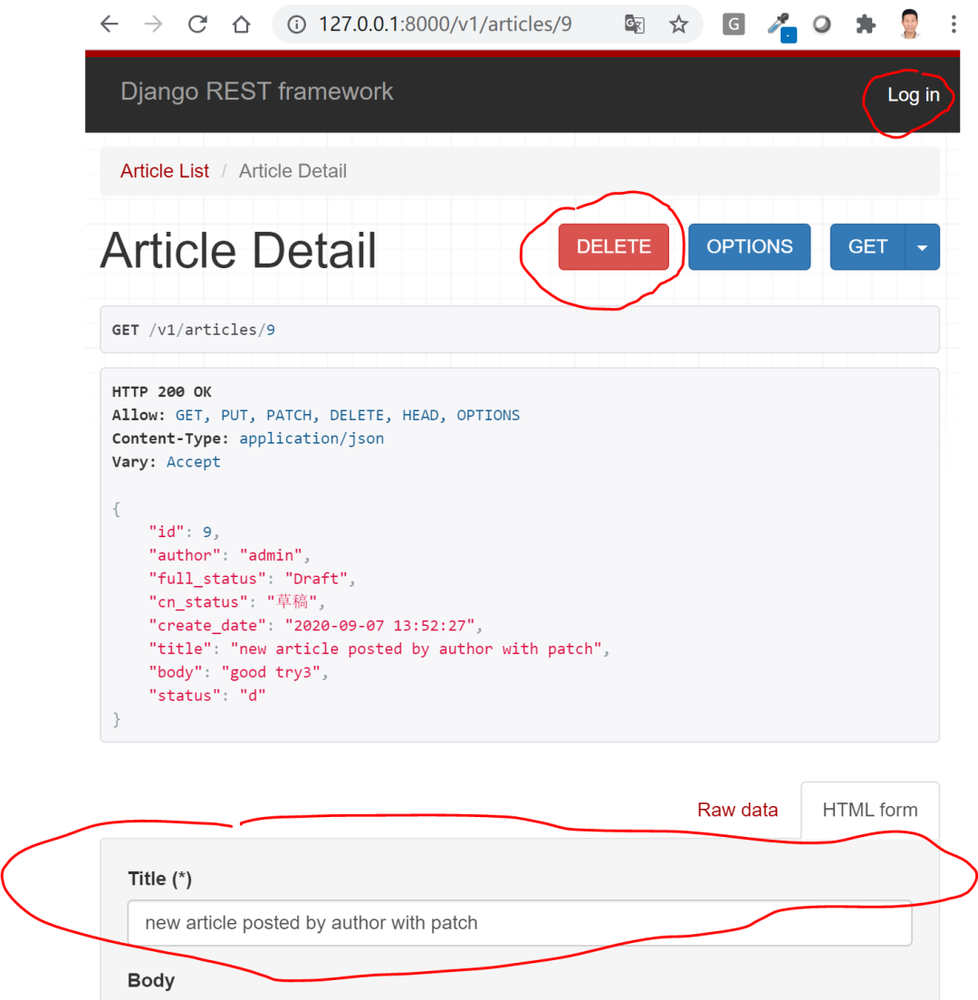
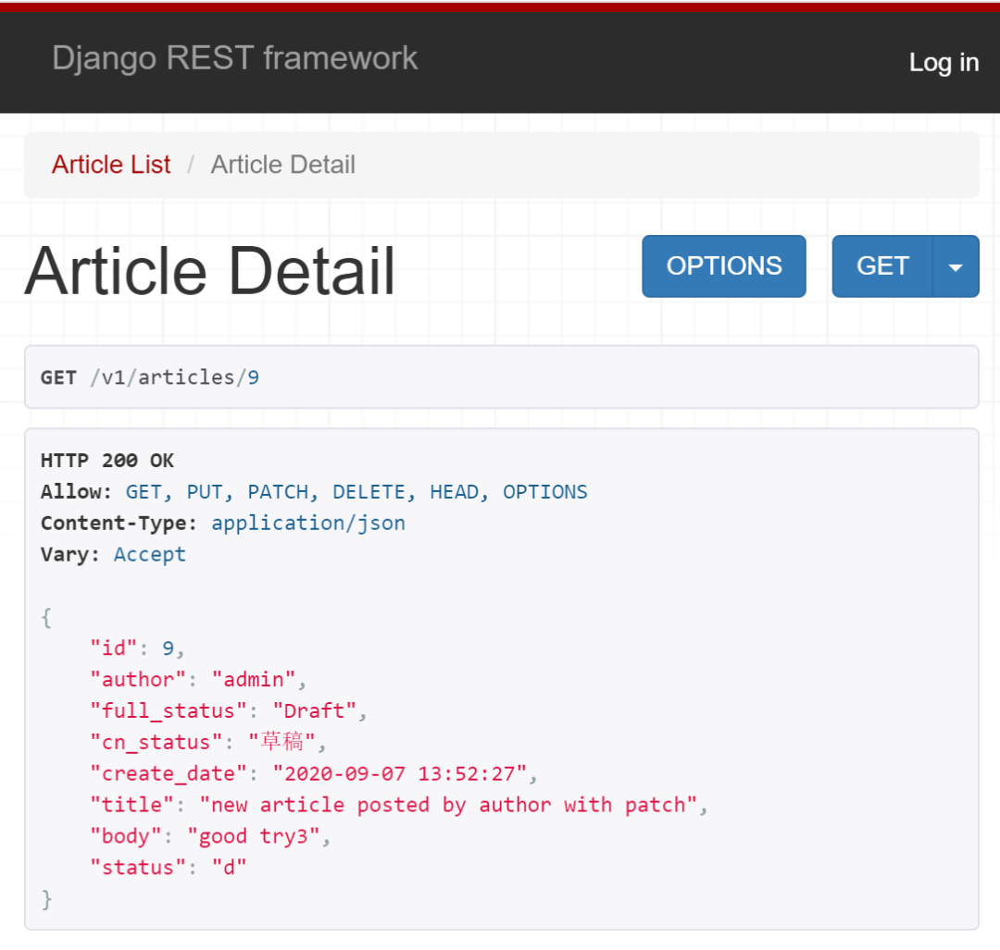
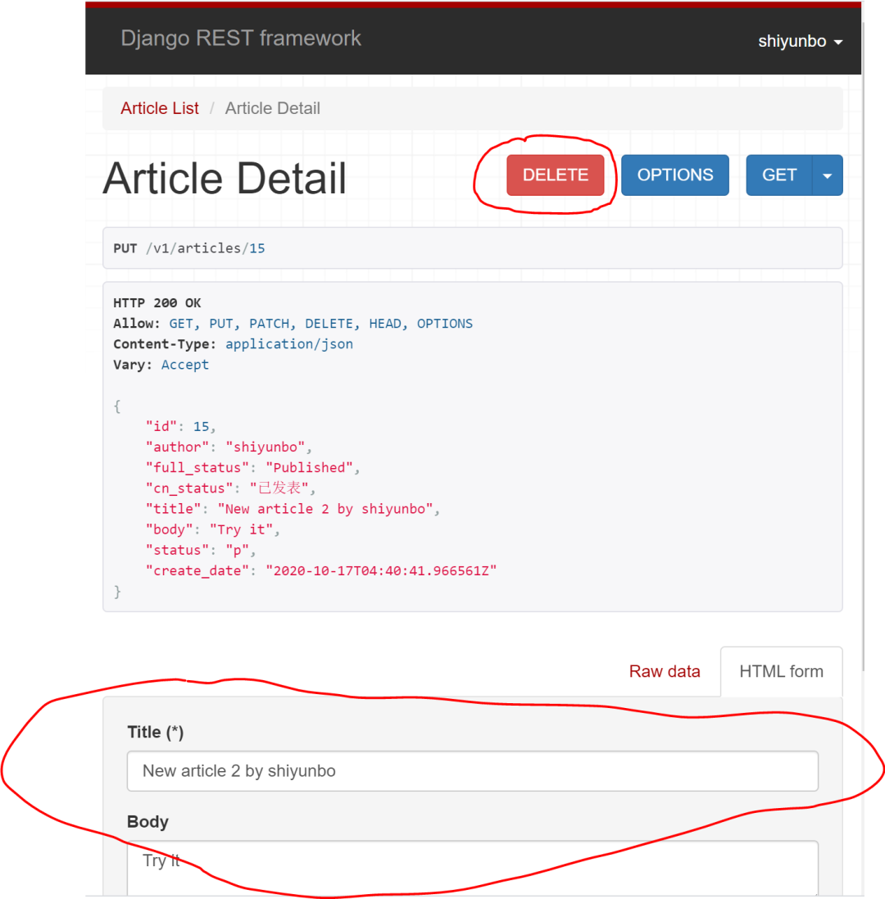
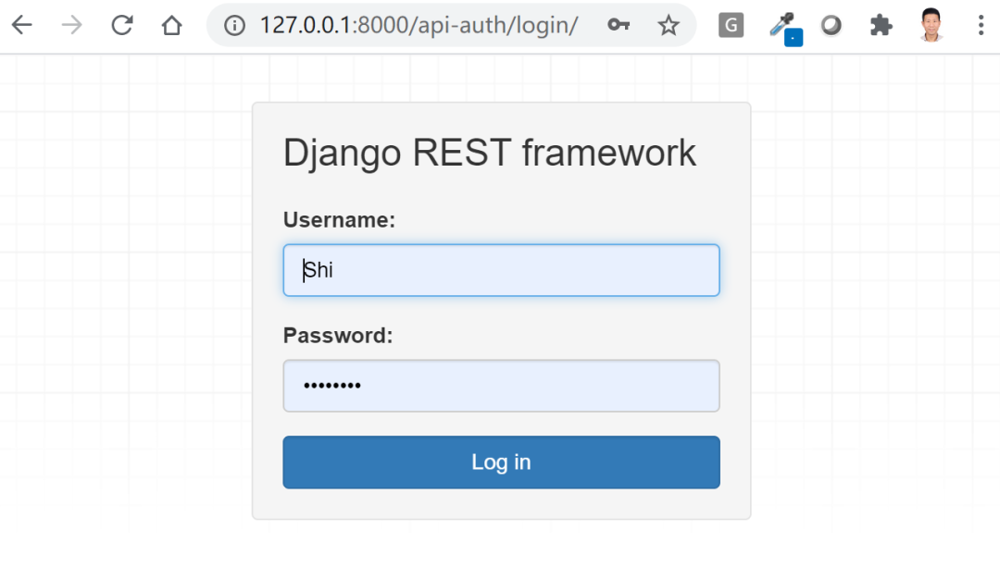

# 认证与权限


## 目录


1. TOC
{:toc}

---

在前面教程中我们以博客为例，使用DRF开发了博客文章资源API，支持客户端以各种请求方式对文章资源进行增删查改。然而目前的 API 对谁可以新增、编辑或删除文章资源(Article)没有限制，我们本例中希望通过基本的认证(Authentication)与权限(Permission)来实现一些更实用的功能：

- 只有经过身份验证的用户可以创建article文章(匿名用户不允许通过POST提交新文章)。
- 未经身份验证的请求应具有完全只读访问权限。
- 单篇article资源始终与创建者相关联，只有 article 的创建者可以更新或删除它。

## 认证与权限的区别

认证(Authentication)与权限(Permission)不是一回事。认证是通过用户提供的用户ID/密码组合或者Token来验证用户的身份。权限(Permission)的校验发生验证用户身份以后，是由系统根据分配权限确定用户可以访问何种资源以及对这种资源进行何种操作，这个过程也被称为授权(Authorization)。

无论是Django还是DRF, 当用户成功通过身份验证以后，系统会把已通过验证的用户对象与request请求绑定，这样一来你就可以使用`request.user`获取这个用户对象的所有信息了。

接下来我们就要开始动手解决文初提出的3个问题了。

## 前情回顾

在前面的教程中我们编写ArticleList和ArticleView两个基于类的视图(如下所示)。前者如果收到GET请求会返回文章资源列表，如果收到POST请求则添加文章；后者如果收到GET请求就返回单篇文章资源，如果收到PUT或DELETE请求，就对文章资源进行修改或删除。

```python
from rest_framework import generics


class ArticleList(generics.ListCreateAPIView):
    queryset = Article.objects.all()
    serializer_class = ArticleSerializer
    # 由于ArticleSerializer中author字段仅为可读，需手动关联
    def perform_create(self, serializer):
        serializer.save(author=self.request.user)


class ArticleDetail(generics.RetrieveUpdateDestroyAPIView):
    queryset = Article.objects.all()
    serializer_class =ArticleSerializer
```

以上两个视图其实是有很大问题的，因为任何用户包括匿名用户也可以对文章资源进行修改。比如当你访问单篇文章资源时，你不仅可以看到红色的delete按钮和修改文章内容的表单，而且可以在未登录的情况对它们进行操作。
```bash
【GET】127.0.0.1:8000/v1/articles/9
```


## 给视图添加权限

在Django传统视图开发中你可能会使用`@login_required`和`@permission_required`这样的装饰器要求用户先登录或进行权限验证。在DRF中你不需要做，这是因为REST framework 包含许多默认权限类，我们可以用来限制谁可以访问给定的视图。在这种情况下，我们需要的是 `IsAuthenticatedOrReadOnly` 类，它将确保经过身份验证的请求获得读写访问权限，未经身份验证的请求将获得只读读的权限。

现在修改我们的视图(`blog/views.py`)，添加如下代码:

```python
from rest_framework import generics
from rest_framework import permissions
from .permissions import IsOwnerOrReadOnly

class ArticleList(generics.ListCreateAPIView):
    queryset = Article.objects.all()
    serializer_class = ArticleSerializer
    permission_classes = (permissions.IsAuthenticatedOrReadOnly,)

    # 手动绑定
    def perform_create(self, serializer):
        serializer.save(author=self.request.user)


class ArticleDetail(generics.RetrieveUpdateDestroyAPIView):
    queryset = Article.objects.all()
    serializer_class =ArticleSerializer
    permission_classes = (permissions.IsAuthenticatedOrReadOnly,)
```

此时再访问文章资源列表或单篇文章资源时，你会看到红色的delete按钮和添加修改表单都已消失。
```bash
【GET】127.0.0.1:8000/v1/articles/9
```


当你重新登录验证身份后，你又可以看到delete按钮和修改表单了，如下所示：


哦，你可能会问，DRF中用户应该访问哪个url登录验证身份呢? 是admin吗？当然不是admin页面，因为只有管理员才能通过admin页面登录。DRF中你可以将登录页面`api-auth`添加到你的项目urls中，如下所示：

```python
#apiproject/urls.py
from django.contrib import admin
from django.urls import path, include

urlpatterns = [
    path('admin/', admin.site.urls),
    path('v1/', include('blog.urls')),
    path('api-auth/', include('rest_framework.urls')), # 用户登录页面
]
```

然后访问`api-auth/login/`你就可以看到专门的DRF的登录页面了，如下所示：



## DRF自带权限类

除了`IsAuthenticatedOrReadOnly` 类，DRF自带的常用权限类还包括：

- `IsAuthenticated`类：仅限已经通过身份验证的用户访问；
- `AllowAny`类：允许任何用户访问；
- `IsAdminUser`类：仅限管理员访问；
- `DjangoModelPermissions`类：只有在用户经过身份验证并分配了相关模型权限时，才会获得授权访问相关模型。
- `DjangoModelPermissionsOrReadOnly`类：与前者类似，但可以给匿名用户访问API的可读权限。
- `DjangoObjectPermissions`类：只有在用户经过身份验证并分配了相关对象权限时，才会获得授权访问相关对象。通常与django-gaurdian联用实现对象级别的权限控制。

## 自定义权限
大多数情况下，默认的权限类不能满足我们的要求，这时就需要自定义权限了。自定义的权限类需要继承`BasePermission`类并根据需求重写`has_permission(self,request,view)`和`has_object_permission(self,request, view, obj)`方法。你还可以通过`message`自定义返回的错误信息。
```python
from rest_framework import permissions

class CustomerPermission(permissions.BasePermission):
    message = 'You have not permissions to do this.'

    def has_permission(self, request, view):
         ...
    def has_object_permission(self, request, view, obj):
         ...
```

### 示例

之前`IsAuthenticatedOrReadOnly` 类并不能实现只有文章 article 的创建者才可以更新或删除它，这时我们还需要自定义一个名为`IsOwnerOrReadOnly` 的权限类，把它加入到ArticleDetail视图里。

首先我们在blog文件夹下创建`permissions.py`，添加如下代码：
```python
# blog/permissions.py
from rest_framework import permissions

class IsOwnerOrReadOnly(permissions.BasePermission):
    """
    自定义权限只允许对象的创建者才能编辑它。"""
    def has_object_permission(self, request, view, obj):
        # 读取权限被允许用于任何请求，
        # 所以我们始终允许 GET，HEAD 或 OPTIONS 请求。
        if request.method in permissions.SAFE_METHODS:
            return True
        # 写入权限只允许给 article 的作者。
        return obj.author == request.user
```

然后修改我们的视图，`IsOwnerOrReadOnly` 的权限类，把它加入到ArticleDetail视图的`permission_classes`里。这样就完美实现了文初我们想要实现的三个功能。DRF支持权限类的插拔，是不是很帅?

```python
#blog/views.py
from rest_framework import generics
from rest_framework import permissions
from .permissions import IsOwnerOrReadOnly

class ArticleList(generics.ListCreateAPIView):
    queryset = Article.objects.all()
    serializer_class = ArticleSerializer
    permission_classes = (permissions.IsAuthenticatedOrReadOnly,)

    # important
    def perform_create(self, serializer):
        serializer.save(author=self.request.user)

class ArticleDetail(generics.RetrieveUpdateDestroyAPIView):
    queryset = Article.objects.all()
    serializer_class =ArticleSerializer
    permission_classes = (permissions.IsAuthenticatedOrReadOnly, IsOwnerOrReadOnly)
```

## 更多设置权限方式

在前面的案例中，我们都是在基于类的API视图里通过`permission_classes`属性设置的权限类。如果你有些权限是全局或全站通用的，你还可以在settings.py中使用 `DEFAULT_PERMISSION_CLASSES` 全局设置默认权限策略。

例如：

```python
REST_FRAMEWORK = {
    'DEFAULT_PERMISSION_CLASSES': (
        'rest_framework.permissions.IsAuthenticated',
    )
}
```

如果未指定，则此设置默认为允许无限制访问：

```python
'DEFAULT_PERMISSION_CLASSES': (
   'rest_framework.permissions.AllowAny',
)
```

如果你习惯使用基于函数的视图编写API，你可以按如下方式给你的函数视图添加权限。

```python
from rest_framework.decorators import api_view, permission_classes
from rest_framework.permissions import IsAuthenticated
from rest_framework.response import Response

@api_view(['GET'])
@permission_classes((IsAuthenticated, ))
def example_view(request, format=None):
    content = {
        'status': 'request was permitted'
    }
    return Response(content)
```
**注意**：当你通过类属性或装饰器设置新的权限类时，视图会覆盖` settings.py` 中设置的默认权限。

## 小结

本文以博客为例介绍了如何使用Django REST Framework自带的权限类，如何自定义权限类及如何配置权限类实现了对用户访问API资源进行控制。本文中我们使用了默认的基于session机制的用户认证机制，下篇中我们将重点介绍DRF的认证机制，并把重点放在Token认证上。


原创不易，转载请注明来源。我是大江狗，一名Django技术开发爱好者。您可以通过搜索【<a href="https://blog.csdn.net/weixin_42134789">CSDN大江狗</a>】、【<a href="https://www.zhihu.com/people/shi-yun-bo-53">知乎大江狗</a>】和搜索微信公众号【Python Web与Django开发】关注我！

