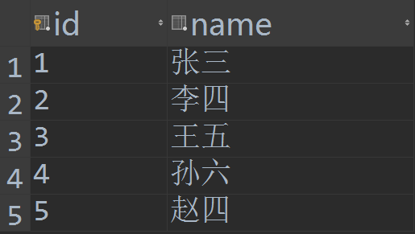
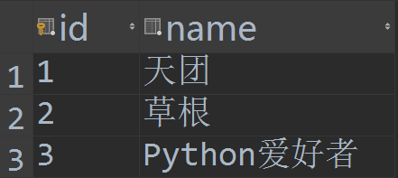
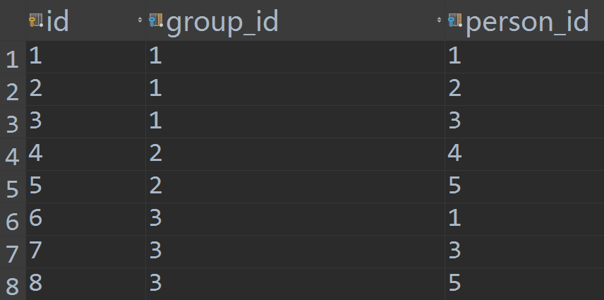
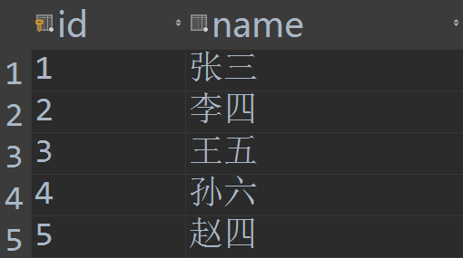
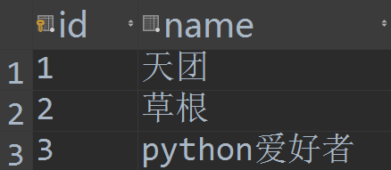
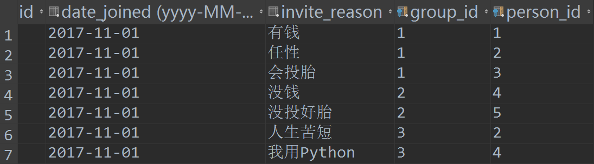

* * *

对于 ManyToMany 字段，Django 采用的是第三张中间表的方式。通过这第三张表，来关联 ManyToMany 的双方。下面我们根据一个具体的例子，详细解说中间表的使用。

## 一、默认中间表

首先，模型是这样的：

```python
class Person(models.Model):
    name = models.CharField(max_length=128)

    def __str__(self):
        return self.name

class Group(models.Model):
    name = models.CharField(max_length=128)
    members = models.ManyToManyField(Person)

    def __str__(self):
        return self.name
```
在 Group 模型中，通过 members 字段，以 ManyToMany 方式与 Person 模型建立了关系。

让我们到数据库内看一下实际的内容，Django 为我们创建了三张数据表，其中的 app1 是应用名。


然后我在数据库中添加了下面的 Person 对象：



再添加下面的 Group 对象：



让我们来看看，中间表是个什么样子的：



首先有一列 id，这是 Django 默认添加的，没什么好说的。然后是 Group 和 Person 的 id 列，这是默认情况下，Django 关联两张表的方式。如果你要设置关联的列，可以使用 to_field 参数。

可见在中间表中，并不是将两张表的数据都保存在一起，而是通过 id 的关联进行映射。

## 二、自定义中间表

一般情况，普通的多对多已经够用，无需自己创建第三张关系表。但是某些情况可能更复杂一点，比如如果你想保存某个人加入某个分组的时间呢？想保存进组的原因呢？

Django 提供了一个`through`参数，用于指定中间模型，你可以将类似进组时间，邀请原因等其他字段放在这个中间模型内。例子如下：

```python
from django.db import models

class Person(models.Model):
    name = models.CharField(max_length=128)
    def __str__(self): 
        return self.name

class Group(models.Model):
    name = models.CharField(max_length=128)
    members = models.ManyToManyField(Person, through='Membership')
    def __str__(self): 
        return self.name

class Membership(models.Model):
    person = models.ForeignKey(Person, on_delete=models.CASCADE)
    group = models.ForeignKey(Group, on_delete=models.CASCADE)
    date_joined = models.DateField()        # 进组时间
    invite_reason = models.CharField(max_length=64)  # 邀请原因
```

在中间表中，我们至少要编写两个外键字段，分别指向关联的两个模型。在本例中就是‘Person’和‘group’。 这里，我们额外增加了‘date_joined’字段，用于保存人员进组的时间，‘invite_reason’字段用于保存邀请进组的原因。

下面我们依然在数据库中实际查看一下（应用名为 app2）：


注意中间表的名字已经变成 “app2_membership” 了。





Person 和 Group 没有变化。



但是中间表就截然不同了！它完美的保存了我们需要的内容。

## 三、使用中间表

针对上面的中间表，下面是一些使用例子（以欧洲著名的甲壳虫乐队成员为例）：
### 通过中间表创建多对多的关联

```python
ringo = Person.objects.create(name="Ringo Starr")
paul = Person.objects.create(name="Paul McCartney")
beatles = Group.objects.create(name="The Beatles")
m1 = Membership(person=ringo, group=beatles,
...     date_joined=date(1962, 8, 16),
...     invite_reason="Needed a new drummer.")
m1.save()

beatles.members.all()
<QuerySet [<Person: Ringo Starr>]>
ringo.group_set.all()
<QuerySet [<Group: The Beatles>]>
#note: Membership是自定义中间表,对中间表进行保存相关联的两个表中的对象,此时通过中间表将多对多的关系保存到数据库中
m2 = Membership.objects.create(person=paul, group=beatles,
...     date_joined=date(1960, 8, 1),
...     invite_reason="Wanted to form a band.")


beatles.members.all()
<QuerySet [<Person: Ringo Starr>, <Person: Paul McCartney>]>
```
### 不通过中间表正向创建多对多的关联

可以使用 add(), create(), 或 set() 创建关联对象，只需指定 `through_defaults` 参数：

```python
beatles.members.add(john, through_defaults={'date_joined': date(1960, 8, 1)})
beatles.members.create(name="George Harrison", through_defaults={'date_joined': date(1960, 8, 1)})
beatles.members.set(\[john, paul, ringo, george], through_defaults={'date_joined': date(1960, 8, 1)})
```

### 不通过中间表正向删除多对多的关联

也可以直接创建中间模型实例。并且如果自定义中间模型没有强制设定 `(model1, model2)` 对的唯一性，调用 `remove()` 方法会删除所有中间模型的实例：
```python
Membership.objects.create(person=ringo, group=beatles,
...     date_joined=date(1968, 9, 4),
...     invite_reason="You've been gone for a month and we miss you.")
beatles.members.all()
<QuerySet [<Person: Ringo Starr>, <Person: Paul McCartney>, <Person: Ringo Starr>]>
# remove 方法同时删除了两个 Ringo Starr
beatles.members.remove(ringo)
beatles.members.all()
<QuerySet [<Person: Paul McCartney>]>
```

clear() 方法能**清空所有**的多对多关系。

```python
# 甲壳虫乐队解散了
beatles.members.clear()
# 删除了中间模型的对象
Membership.objects.all()
<QuerySet []>
```

一旦你通过创建中间模型实例的方法建立了多对多的关联，你立刻就可以像普通的多对多那样进行查询操作：

```python
# 查找组内有Paul这个人的所有的组（以Paul开头的名字）
>>> Group.objects.filter(members__name__startswith='Paul')
<QuerySet [<Group: The Beatles>]>
```

可以使用中间模型的属性进行查询：

```python
# 查找甲壳虫乐队中加入日期在1961年1月1日之后的成员
>>> Person.objects.filter(
... group__name='The Beatles',
... membership__date_joined__gt=date(1961,1,1))
<QuerySet [<Person: Ringo Starr]>
```

可以像普通模型一样使用中间模型：

```python
>>> ringos_membership = Membership.objects.get(group=beatles, person=ringo)
>>> ringos_membership.date_joined
datetime.date(1962, 8, 16)
>>> ringos_membership.invite_reason
'Needed a new drummer.'

```

```python
>>> ringos_membership = ringo.membership_set.get(group=beatles)
>>> ringos_membership.date_joined
datetime.date(1962, 8, 16)
>>> ringos_membership.invite_reason
'Needed a new drummer.'
```

这一部分内容，需要结合后面的模型query，如果暂时看不懂，没有关系。
* * *

对于中间表，有一点要注意（在前面章节已经介绍过，再次重申一下），默认情况下，中间模型只能包含一个指向源模型的外键关系，上面例子中，也就是在 Membership 中只能有 Person 和 Group 外键关系各一个，不能多。否则，你必须显式的通过`ManyToManyField.through_fields`参数指定关联的对象。参考下面的例子：

```python
from django.db import models

class Person(models.Model):
    name = models.CharField(max_length=50)

class Group(models.Model):
    name = models.CharField(max_length=128)
    members = models.ManyToManyField(
    Person,
    through='Membership',
    through_fields=('group', 'person'),
    )

class Membership(models.Model):
    group = models.ForeignKey(Group, on_delete=models.CASCADE)
    person = models.ForeignKey(Person, on_delete=models.CASCADE)
    inviter = models.ForeignKey(
    Person,
    on_delete=models.CASCADE,
    related_name="membership_invites",
    )
    invite_reason = models.CharField(max_length=64)
```
